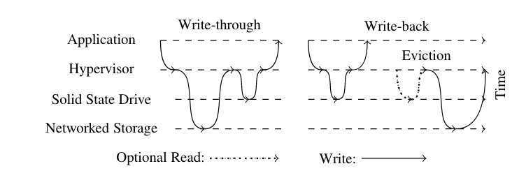
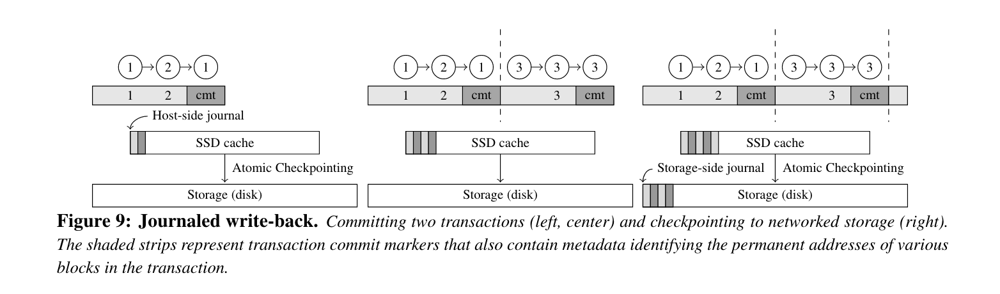
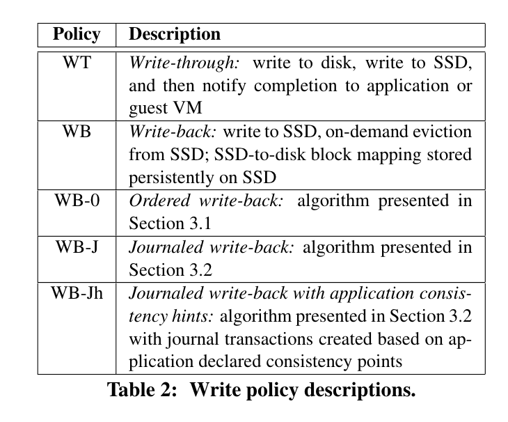
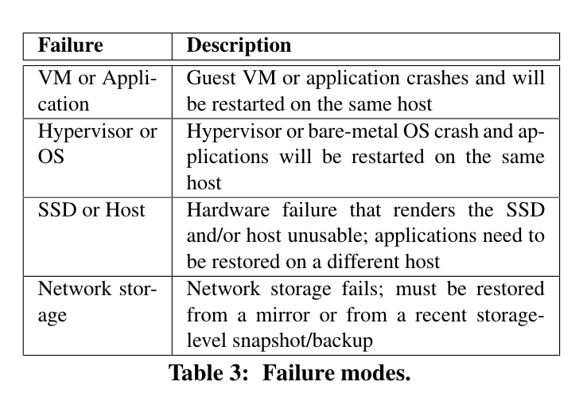
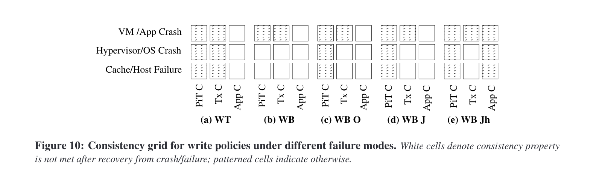
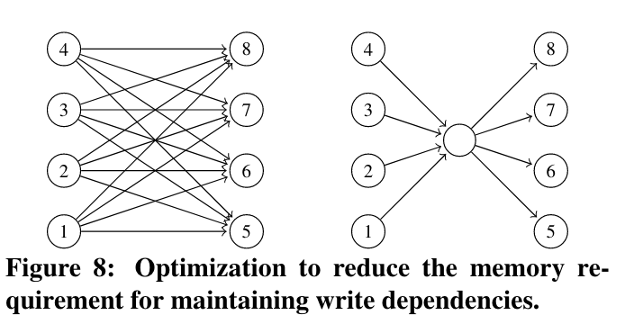
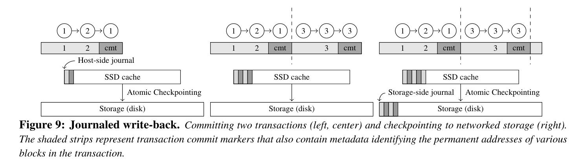

> Under host and/or host-flash failures, these policies do result in data staleness (i.e., loss of recent updates) at the network storage. They thus apply only to applications which can tolerate a non-zero RPO. Journaled write-back additionally allows for a straightforward implementation of application-level storage consistency,astricterformof consistency than the transactional consistency provided by write-through

主要我存疑的是, 单纯的同步写, 保序之后, 是否上层的业务一定不会死? 丢失内存中的数据, 是否就之前的写入依旧是可用的?
按照上面文件系统的那种表达, 只要落盘了的, 那就确实有效

但是如果是没有完成刷盘, 局部落盘的情况下, 能否有效, 就可能确实得看上层的写入方式了.

如果这个ssd的写入也存在局部落盘情况, 那这个一致性,不就又得靠上层的文件系统自身的WAL/fsck等机制来自行修复保障? 

如果走到这个情况, 那可能就不满足崩溃一致性了吧?

按照这段的意思, 就是journaled writeback完成的这个功能实现. 但是单纯不感知业务的话, 做不到才对呀.

所以是在librbd层实现了对应的journal的,而不是现有的直接读写rados对象那种形式了.

至少有一层journal, 那确实可以保障上层业务能够访问到的确实一定是完整的flush过的. 而不会是局部的

TODO: 具体源码实现待后续了.

### 一致性分析, 故障模式

论文中都有提到.

* 时间点一致性(PiT C)
* 事务一致性(Tx C)
* 应用一致性/应用组一致性(App C)

### Ordered writeback

> 另一种方法是利用 I/O 请求之间的实际依赖关系信息。理想情况下，应用程序或文件系统可以为缓存提供准确的依赖项信息。我们为块层接口开发的解决方案的当前版本旨在在操作系统或虚拟机管理程序中无缝工作。它基于完成问题排序不变量的保守概念在线构建动态依赖关系图。完成问题排序不变要求，如果原始请求流中区块 A 的完成时间早于区块 B 的发布时间，则 B 依赖于 A，否则不依赖于 A。遵循此不变性，缓存可以并行逐出所有独立块，而不管其完成时间的顺序如何。

基本上就是拓扑排序了. 但是节点关系复杂, 引入虚节点来简化

> 发布和完成操作在计算上并不昂贵，但内存使用，尤其是链接的数量，对于 n 块的缓存大小可以增长到 n2 4 个链接。这种不受欢迎的特性是初步版本效率低下的重要来源。我们找到了一种简单有效的优化方法，可以通过使用虚拟节点来大幅降低这种链接的复杂性。该优化在固定数量的节点之后插入虚拟节点，以吸收由于任何代表过去写入完成的节点而导致的所有完成问题排序依赖性。图 8 显示了左侧带有独立集 {1, 2, 3, 4} 和 {5, 6, 7, 8} 的原始依赖图，右侧显示了带有附加虚拟节点 D 的优化图。注意优化如何减少边数从 16 到 8。我们的解决方案没有明确检测如图 8 所示的高依赖性情况，而是在每 100 次 I/O 完成后简单地插入一个虚拟节点。因此，如果依赖图因为链接复杂度较低而不需要此优化，则优化会引入 1% 的链接复杂度开销，但在最佳情况下，此优化可以按数量级减少链接数量（例如，1002只有 200 个链接）。在实践中，这种启发式方法为我们评估系统的工作负载带来了出色的内存节省。总之，有序回写缓存满足我们最初目标的一个子集：I、II 和 III。由于在逐出到网络存储时需要保留原始写入流，因此无法合并缓存中的写入。接下来，我们讨论一种改进的写缓存策略，它成功地满足了所有四个目标。

### Journaled writeback

> 顺序写回通过在缓存逐出期间对网络存储强制实施与原始写流中相同的更新顺序来实现一致性。但是，这种方法有两个缺点：首先，每个块写入都必须转储到网络存储，其次，同一块的所有脏副本都必须保留在缓存中，从而浪费宝贵的缓存空间。日志式回写通过允许在缓存中进行写合并来解决这两个缺点。

>日志回写将存储从一个一致状态移动到下一个一致状态，这通常反映一次更新集合而不是单个更新。基本思想是在日志事务中的持久缓存中使用成批更新分组，并以原子方式将这些事务检查点指向网络存储。这由一个日志支持，用于在日志事务中对主机端 SSD 缓存中的所有更新进行分组；最近的更新总是对主机端日志中的当前事务进行。一旦当前事务达到预定义的大小或年龄，以先达到者为准，它就会被提交并创建一个新事务并将其标记为当前事务。提交标记包括元数据，指示网络存储中的块地址，用于事务中要使用的各个条目检查点时间。事务在后台检查点到网络存储。图 9 说明了提交和检查两个事务的过程，其中包括对 {1, 2} 和​​ {3} 的更新。第一个事务包括对块 1 的两个更新和对块 2 的一个更新；第二个包括对块 3 的三个更新；但是，每个更新仅反映为每个已提交事务中的一个副本。然后，这些事务自动检查点连接到网络存储，以便网络存储始终代表某个时间点的数据的一致版本。 [1]

> 主机端日志可以有多个未检查点事务，允许事务提交率独立于事务检查点率。我们发现这种解耦对于支持使用主机端闪存的突发写入非常有用，同时限制了不会导致 SSD 不可用的故障模式下的数据丢失量。可以为平均写入带宽和 IOPS 使用量而不是峰值配置网络存储。最重要的是，这种设计通过允许在单个事务中进行写入合并来减少网络存储（如果有）的 1Addressing 跨主机数据依赖性，从而进一步将 SSD 性能与网络存储性能分离，这超出了本工作的范围。在网络存储中写入 I/O 流量。最后，由于检查点是一个释放缓存空间的急切过程，因此写入通常不会因缓存逐出而阻塞。对于日志事务到网络存储的原子检查点，日志写回实现了一个原子组写接口，类似于逻辑磁盘 [10, 14] 使用额外日志的接口，我们以后将其称为存储端日志。在我们的实现中，存储端日志是一个内存中的日志，旨在与 NVRAM 一起使用。这种 NVRAM 通常在中高端网络存储阵列中可用。基于 NVRAM 的内存日志消除了为原子组更新招致额外存储 I/O 的需要。

#### 3.2.2 存储崩溃一致性

> 从主机的角度来看，检查点开始于检查点开始命令、块列表及其要写入的数据，以及检查点结束命令。启动命令由存储器通过启动 NVRAM 中的日志条目来解释。接下来，块更新列表在日志条目中暂存，但在读取时不可访问。在结束命令接收之前读取这些块地址将返回块的先前版本。 end 命令以原子方式使主机可用的块更新列表并将条目标记为检查点。更新的块在后台写入存储；完成后，NVRAM 日志条目将被删除。如果出现导致 SSD 无法使用的主机级故障，主机端日志将被简单地丢弃。网络存储中的内存日志确保它保持陈旧但一致的状态。如果在主机级崩溃后可以访问 SSD，则会通过检查未提交的事务来重放主机端日志。

3.2.3 dual staleless 状态
> 主机端崩溃后，系统可能处于两种可能的状态：（i） 恢复时无法访问主机端缓存，因为主机端 SSD 出现故障，或者正常运行时间要求强制使用备用硬件，或 （ii） 恢复时可以访问主机端缓存。如果主机缓存不可访问， 存储的最新状态是网络存储中的状态。如果主机缓存可访问，则存储的最新状态是网络存储和主机端缓存内容的组合。在这两种情况下，两种不同的陈旧结果成为可能。在前一种情况下，过期取决于主机端日志事务被检查点的频率：频繁的检查点会导致较低的过期。只有事务中在发生故障之前经过检查点处理的数据才能在网络存储中使用。对于后一种情况，我们假设事务提交比检查点更频繁地发生。在这种情况下，主机端日志重播未提交事务后的网络存储过期时间取决于事务的提交频率：频繁提交会导致过期率降低。如果包含这些更新的最后一个事务未提交到主机日志，则对主机的最后几个更新将丢失。
> 