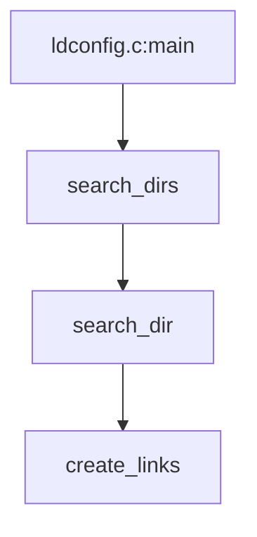

下载src.rpm方式

deletes the user from the utmp(5) file of current users and records the logout in the wtmp file

之前在看Systemd的时候就提到utmp和wtmp是毒瘤，我之前以为这两个只是用来记录命令记录的，看来比这要可怕的多啊？和登入有关？

getty的控制登入

pam 是用来控制用户会话的，包括用户的资源限制，也就是这里的 ulimit 的，还有变量控制、密码认证等

systemd 并不会用到 pam 的 env、limits 等模块，所以平时用来控制资源的 /etc/security/limits.conf，控制环境变量的 /etc/environment 等文件，对于 systemd 的服务并不起作用

不过 systemd 会通过 pam_systemd.so 模块将 PAM 中的会话注册到 user.slice 中并进行相应的操作，
还有就是将会话中的进程放置到当前会话的 CGroup 控制组中，实现会话资源的统一管理

## 启动控制 

BIOS runs self-check
BIOS loads the boot sector and executes it
Bootloader like grub or lilo is executed
Bootmenu is shown (optional)
Kernel is loaded
Initial RAM disk is loaded
Kernel is executed
Kernel executes init
init executes, depending on your distro, version and configuration

SysV init scripts or
systemd or
upstart
The sense of all these programs is to start services like

dbus that allows communication between applications so that one application can call functions from another running application. This is something usually not visible to users, e.g. an application calling the window manager to put its own window into focus
login that allows users to log in on the CTRL_ALT_F* terminals. Login's process as seen by ps -A will in case of systemd be systemd-logind (may again vary by distribution)
udev that has a lot of names, e.g. for me I find it with ps -A as systemd-udevd. It assigns e.g. the device handles in /dev/ to devices that you connect, e.g. a USB disk
cron that will execute commands based on a time table in /etc/crontab, and also has a "@reboot" feature to start commands on boot.


## 高可用层次结构

* 架构层（传递心跳、集群事务信息）
* 成员关系层（承上启下，监控底层心跳，随时重建集群状态，维持数据一致性）
* 资源调度层（集群资源管理器，实现资源的调度分配）（Cluster Resource Manager)
* 应用层 

## 容器技术

现在应该主流的是docker贡献作为基础的cri containerd吧？

docker应该只是作为OCI标准中的容器运行时在工作了把，只是一套生态旧的比较完整。（名字完整叫做dockershim)

docker是作为容器引擎工作的。

CNCF网站上可以看到开发进度

all.devstats.cncf.io


katacontainer可以类似qemu一样有一个hypervisorceng

容器内也有不少gRPC接口

## bin环境变量搜索顺序

考虑到的几个关键词是

* 可执行文件的默认时间在bash初始化期间, 所以同一个bash内, 不会因为在搜索路径里新放了个包, 然后就自动被加载出来? 似乎不对, 只要即可改了, 就即可生效了?

# ubuntu/debian查找最近安装的包

cat /var/log/dpkg.log | grep installed


## Reference
1. https://blog.packagecloud.io/eng/2015/04/20/working-with-source-rpms/


# 对接串口

## Connecting to Linux console through UART-USB converter

```

ls /dev/ttyUSB*
apt install minicom

minicom -b 115200 -D /dev/ttyUSB0 -s

# enter `Serial port setup`, press `F` to disable hardware flow control.
# press Enter, choose Exit.


# exit
# press `Ctrl+A, Z, X`, then confirm by pressing Enter.
```

## dterm
``` bash
dterm 115200 8 n 1
```

## screen
``` bash
screen /dev/ttyS0

screen /dev/ttyS0 115200

# exit
# press `Ctrl+a` followed by `K`.
```

## clash代理配置

[Releases · Dreamacro/clash](https://github.com/Dreamacro/clash/releases)

[Releases · Loyalsoldier/geoip](https://github.com/Loyalsoldier/geoip/releases)


[juewuy/ShellClash: One\-click deployment and management of Clash services using Shell scripts in Linux environment](https://github.com/juewuy/ShellClash)

从代理网站下载clash.yaml,

./clash -d ./ -f xxx.yaml

export http_proxy="http://127.0.0.1:7890"
export https_proxy="http://127.0.0.1:7890"
git  config --global http.proxy http://127.0.0.1:7890

``` conf
[Unit]
Description=clash daemon

[Service]
Type=simple
User=root
ExecStart=/opt/clash/clash -d /etc/clash/
Restart=on-failure

[Install]
WantedBy=multi-user.target
```

 systemctl enable clash

TODO:clash能自动选择能用的代理不?

# 系统功能

## 时钟

``` bash
timedatectl
# unix时间戳转换时间
date -d @{timstamp}

```

# gcc 11编译问题

## netperf编译  first defined here

需要`make CFLAGS="-fcommon"`
[Unable to compile on Fedora 32 · Issue \#42 · HewlettPackard/netperf](https://github.com/HewlettPackard/netperf/issues/42)

# 查buffer/cache占用

[Linux查看Buffer&Cache被哪些进程占用\_乱弹世界的博客\-CSDN博客\_查看cache哪个进程占用](https://blog.csdn.net/linxi7/article/details/109078516)

`hcache`


# /etc/alternatives/

chkconfig这个包提供的能力

```
update-alternatives --display python 

update-alternatives --config python   
```

# logrotate 缺陷

这次的提交
[unlink of log file that no longer exists should be handled as a warning only · Issue \#144 · logrotate/logrotate](https://github.com/logrotate/logrotate/issues/144)

# 网络

### 绑定 策略

```

XOR策略
xmit_hash_policy=0 or xmit_hash_policy=layer2
layer2 (0): (source MAC XOR destination MAC) modulo slave count

xmit_hash_policy=2 or xmit_hash_policy=layer3
layer2+3 (2): (((source IP XOR dest IP) AND 0xffff) XOR ( source MAC XOR destination MAC )) modulo slave count

xmit_hash_policy=1 or xmit_hash_policy=layer3+4
layer3+4 (1): ((source port XOR dest port) XOR ((source IP XOR dest IP) AND 0xffff) modulo slave count
```

### 快速扫描 查子网 可用ip

``` bash
nmap -sP 10.192.56.0/24
```

# 挂载 

 mount -t cifs --verbose -o domain=xxx,username=sean10,vers=1.0,dir_mode=0777,file_mode=0777 -l //xxx/20220527pacific_mclcok /nas/nas/cifs


# debuginfo

### /usr/lib/.build-id 目录

[RHEL8 rpmbuild and /usr/lib/\.build\-id \- Red Hat Customer Portal](https://access.redhat.com/discussions/5045161)

这个目录在高版本安装相同的二进制文件的时候, 就是会存在冲突问题的. 

https://github.com/rpm-software-management/rpm/blob/4a9440006398646583f0d9ae1837dad2875013aa/macros.in#L506

这里好像就是已定义的地方. 

[fedora \- What is the purpose of /usr/lib/\.build\-id/ dir? \- Unix & Linux Stack Exchange](https://unix.stackexchange.com/questions/411727/what-is-the-purpose-of-usr-lib-build-id-dir)


# ldconfig 动态链接库软链规则


ldconfig 会自动建软链的操作




``` c
      /* Does this file look like a shared library or is it a hwcap
	 subdirectory?  The dynamic linker is also considered as
	 shared library.  */
      if (((strncmp (direntry->d_name, "lib", 3) != 0
	    && strncmp (direntry->d_name, "ld-", 3) != 0)
	   || strstr (direntry->d_name, ".so") == NULL)
	  && (direntry->d_type == DT_REG
	      || !is_hwcap_platform (direntry->d_name)))
	continue;
```


根据上述代码可知 `lib.*so.*`的匹配规则


> 
/* Read a whole directory and search for libraries.
   The purpose is two-fold:
>    - search for libraries which will be added to the cache
>    - create symbolic links to the soname for each library
> 
>    This has to be done separatly for each directory.
> 
>    To keep track of which libraries to add to the cache and which
>    links to create, we save a list of all libraries.
> 
>    The algorithm is basically:
>    for all libraries in the directory do
>      get soname of library
>      if soname is already in list
>        if new library is newer, replace entry
>        otherwise ignore this library
>      otherwise add library to list
> 
>    For example, if the two libraries libxy.so.1.1 and libxy.so.1.2
>    exist and both have the same soname, e.g. libxy.so, a symbolic link
>    is created from libxy.so.1.2 (the newer one) to libxy.so.
>    libxy.so.1.2 and libxy.so are added to the cache - but not
>    libxy.so.1.1.  */

这段里说的是新的会生成软链, 但是我实际操作, 感觉好像并不遵循modify time, 可能就是按照字典顺序?

确实, `libwc.so_a`和`libwc.so_w`, 生成`libwc.so_w`,  

`libwc.so_z`和`libwc.so_w`, 生成`libwc.so_z`


>  /* Prefer a file to a link, otherwise check which one
		 is newer.  */
	      if ((!is_link && dlib_ptr->is_link)
		  || (is_link == dlib_ptr->is_link
		      && _dl_cache_libcmp (dlib_ptr->name, direntry->d_name) < 0))
		{


 根据这段这里`_dl_cache_libcmp`确实就是比字符串大小, 因为默认这里是按版本号来, 那`ascii`大的就对应更新, 没啥问题.


### 软链的推荐方案: 实现的动态库 指定 功能大版本的soname, 而具体的功能的so, 由对应包制作到大版本的软链. ldconfig负责的soname仅处理实现库到大版本库

> 	  /* If the path the link points to isn't its soname or it is not
	     the .so symlink for ld(1), we treat it as a normal file.
> 
> 	     You should always do this:
> 
> 		libfoo.so -> SONAME -> Arbitrary package-chosen name.
> 
> 	     e.g. libfoo.so -> libfoo.so.1 -> libfooimp.so.9.99.
> 	     Given a SONAME of libfoo.so.1.
> 
> 	     You should *never* do this:
> 
> 		libfoo.so -> libfooimp.so.9.99
> 
> 	     If you do, and your SONAME is libfoo.so.1, then libfoo.so
> 	     fails to point at the SONAME. In that case ldconfig may consider
> 	     libfoo.so as another implementation of SONAME and will create
> 	     symlinks against it causing problems when you try to upgrade
> 	     or downgrade. The problems will arise because ldconfig will,
> 	     depending on directory ordering, creat symlinks against libfoo.so
> 	     e.g. libfoo.so.1.2 -> libfoo.so, but when libfoo.so is removed
> 	     (typically by the removal of a development pacakge not required
> 	     for the runtime) it will break the libfoo.so.1.2 symlink and the
> 	     application will fail to start.  */
> 
# Reference
1. [Connecting to Linux console \- SomLabs Wiki](https://wiki.somlabs.com/index.php/Connecting_to_Linux_console)
2. [Working with the serial console \- ArchWiki](https://wiki.archlinux.org/title/working_with_the_serial_console)


# 常用编码错误


# history记录ssh地址的行为

以确保通过ssh地址感知用户行为

``` bash
### 设置保存历史命令的文件大小
export HISTFILESIZE=10000000
### 保存历史命令条数
export HISTSIZE=1000000
### 实时记录历史命令，默认只有在用户退出之后才会统一记录，很容易造成多个用户间的相互覆盖。
export PROMPT_COMMAND="history -a"
### 记录每条历史命令的执行时间
export HISTTIMEFORMAT="%Y-%m-%d_%H:%M:%S "

##记录history历史命令 时间 IP等
##export HISTTIMEFORMAT="{\"TIME\":\"%F %T\",\"HOSTNAME\":\"\$HOSTNAME\",\"LI\":\"\$(who -u am i 2>/dev/null| awk '{print \$NF}'|sed -e 's/[()]//g')\",\"LU\":\"\$(who am i|awk '{print \$1}')\",\"NU\":\"\${USER}\",\"CMD\":\""
cat >>/etc/bashrc<<EOF
HISTDIR='/var/log/command.log'
if [ ! -f \$HISTDIR ];then
touch \$HISTDIR
chmod 666 \$HISTDIR
fi
export HISTTIMEFORMAT="{\"TIME\":\"%F %T\",\"IP\":\"\$(ip a | grep -E '192.168|172' | head -1 | awk '{print$2}' | cut -d/ -f1)\",\"LI\":\"\$(who -u am i 2>/dev/null| awk '{print \$NF}'|sed -e 's/[()]//g')\",\"LU\":\"\$(who am i|awk '{print \$1}')\",\"NU\":\"\${USER}\",\"CMD\":\"" 
export PROMPT_COMMAND='history 1|tail -1|sed "s/^[ ]\+[0-9]\+  //"|sed "s/$/\"}/">> /var/log/command.log'
EOF

source /etc/bashrc
echo OK
```