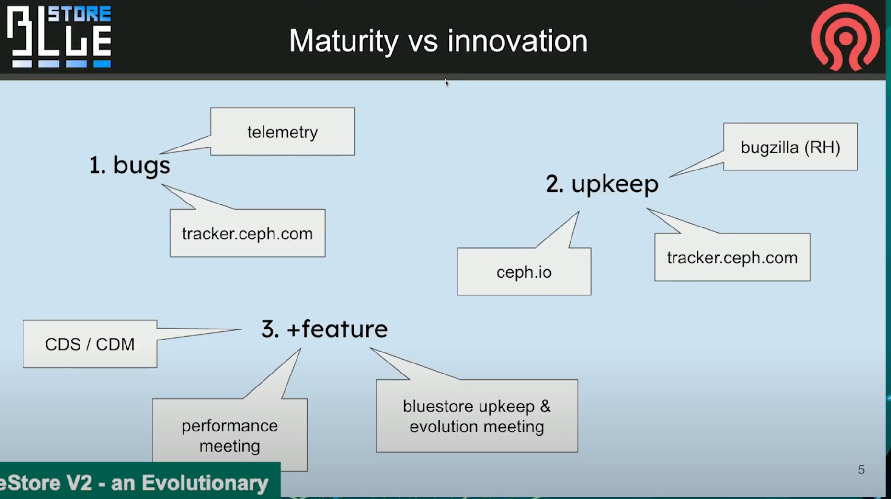

## [BlueStore V2 \- an Evolutionary Step Forward \- Adam Kupczyk, IBM & Mark Nelson, Clyso GmbH \- YouTube](https://www.youtube.com/watch?v=FVUoGw6kY5k)

#### 规划

filestore 在 Pacific 和 Quincy 中被弃用，在 Reef 中被完全移除

bluestore目前暂不知道什么时候会移出, 但是期望是将来seastore能够替代他. 也许会发生一些不可预料的新内容让他变得更好.

#### 成熟 vs 变革

目前, 根据tracker和telemetry的统计, bluestore已经成熟了. 目前进入维护阶段

其中telemetry提供的错误会进入tracker队列的顶端. 而一些只提了单子, 但没有信息的单子就暂时没有办法处理.

更进一步的, 则是在bluestore的performance meeting例会和头脑风暴例会上进行讨论.

#### 3个还会长期阻塞我们的bug单

##### 关于Onode的引用计数, 关于Onode的缓存的assert SIGSEGV

关于Onode的引用计数, 关于Onode的缓存. 很恼人, 不过不够critical, osd自动重启后数据没问题.

问题点
* 引用技术为0时自动清理, 很多版本中都很普遍而且我们甚至无法向后移植它. 
* 在Octopus版本中, 在引入技术为2时, 我们需要额外的操作.
* 除了引用计数外, 还存活在了缓存中. 如果被pinned, 无法修改他. 只有unpined才能修改, 但是unpin依赖lock.

这个问题花了9条PR, 其中4条真的进入的后续版本, 直到Igor真的解决了, 但不是从技术上解决的. 

做了个从缓存中lazy unpining的功能.  所以可以使他正常工作.

我们之所以不能回滚掉他, 是因为基于他有太多内容已经变更.  如果有个解决方案, 我们会考虑, 但是Pacific和Quincy版本的解决方案将有所不同.

##### rocksdb checksum mismatch

rocksdb损坏后, 没有办法还原时, OSD只能重新部署, 没有办法绕过他. 有两个原因

###### 1. direct vs buffed

问题来源非常早, 来源于linux manual中说的不应该同时使用direct和buffered mode. 

我们没有这么做, 但是我们保证打开同一个设备, 但永远不会使用read buffered和read direct读取同一个block device. 除了bluefs log.

这个让我们付出了代价, 当你重启设备/osd, 他启动的非常快事, 你可能无法取得你刚才写到bluefs log上的数据. 其中一些对rocksdb表的更新, 

结果是我们在Nuatilus中注入了另一个问题, 我们修改了bluestore和bluefs只建传输的内存的部分. 目前为止这部分是不可见的. 

###### 2. 

