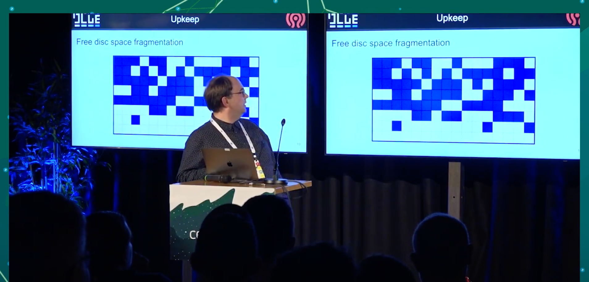

## [BlueStore V2 \- an Evolutionary Step Forward \- Adam Kupczyk, IBM & Mark Nelson, Clyso GmbH \- YouTube](https://www.youtube.com/watch?v=FVUoGw6kY5k)

#### 规划

filestore 在 Pacific 和 Quincy 中被弃用，在 Reef 中被完全移除

bluestore目前暂不知道什么时候会移出, 但是期望是将来seastore能够替代他. 也许会发生一些不可预料的新内容让他变得更好.

#### 成熟 vs 变革

目前, 根据tracker和telemetry的统计, bluestore已经成熟了. 目前进入维护阶段

其中telemetry提供的错误会进入tracker队列的顶端. 而一些只提了单子, 但没有信息的单子就暂时没有办法处理.

更进一步的, 则是在bluestore的performance meeting例会和头脑风暴例会上进行讨论.

#### 3个还会长期阻塞我们的bug单

##### 关于Onode的引用计数, 关于Onode的缓存的assert SIGSEGV

关于Onode的引用计数, 关于Onode的缓存. 很恼人, 不过不够critical, osd自动重启后数据没问题.

问题点
* 引用技术为0时自动清理, 很多版本中都很普遍而且我们甚至无法向后移植它. 
* 在Octopus版本中, 在引入技术为2时, 我们需要额外的操作.
* 除了引用计数外, 还存活在了缓存中. 如果被pinned, 无法修改他. 只有unpined才能修改, 但是unpin依赖lock.

这个问题花了9条PR, 其中4条真的进入的后续版本, 直到Igor真的解决了, 但不是从技术上解决的. 

做了个从缓存中lazy unpining的功能.  所以可以使他正常工作.

我们之所以不能回滚掉他, 是因为基于他有太多内容已经变更.  如果有个解决方案, 我们会考虑, 但是Pacific和Quincy版本的解决方案将有所不同.

##### rocksdb checksum mismatch

rocksdb损坏后, 没有办法还原时, OSD只能重新部署, 没有办法绕过他. 有两个原因

###### 1. direct vs buffed

问题来源非常早, 来源于linux manual中说的不应该同时使用direct和buffered mode. 

我们没有这么做, 但是我们保证打开同一个设备, 但永远不会使用read buffered和read direct读取同一个block device. 除了bluefs log.

这个让我们付出了代价, 当你重启设备/osd, 他启动的非常快时, 你可能无法取得你刚才写到bluefs log上的数据. 其中一些对rocksdb表的更新, 

结果是我们在Nuatilus中引入了另一个问题, 我们修改了bluestore和bluefs只建传输的内存的部分. 目前为止这部分是不可见的. 

TODO: 暂未找到这条PR的单子.

###### 2. 
#### blueFS ENOSPC
[os/bluestore: enable 4K allocation unit for BlueFS by ifed01 · Pull Request \#48854 · ceph/ceph](https://github.com/ceph/ceph/pull/48854)

这个问题今年刚在master分支修复, 会backport到pacific分支, 但尚未完毕, 值得关注.

具体指代的是block 上仍有空间, 但是碎片化, 没有能提供给bluefs的满足对齐要求的空间.

这个问题最早在luminous版本, 我们做了个`flip-flop`触发器, 在block和bluefs之间`gifting`和`reclaiming`数据, 1M对齐显然是可怕的, 因此我们选择了64K 的chunk. 这部分持续了很久, 最终我们现在有个支持4K对齐的bluefs. 

可能有人会问为什么设置一个4K的bluefs chunk 需要这个久. 这是个好问题.

最早创造bluefs的时候, 有一个bluefs启动的4K的超级块. 当启动时, 从一个4K扇区读取重放日志. 如果chunks大小很大, 你的log就不可能会非常大.

但是如果是4K大小的chunks, logs就很有可能被用尽. 很快就可以得到非常零碎的bluefs log. 因此,4k大小时, 只是不适合那个大小.

所以现在, 通过`special trampoline multi-stage booting of bluefs log`可以实现了(待理解, 暂未在PR中找到解释的关键词),  性能在大量碎片时当然不太好, 但是不会再失败了. 不再会有半夜因多个osd bluefs空间不足被叫起来, 不得不去迁移数据的情况.

### 目录

为什么这些很重要, 因为这样我们就有更多时间去给bluestore添加新功能. 

这里有一张完整功能规划的图. 这些如果实现了将提供巨大的质量改进. 其中有一些次要优先级, 但是简单一些的. 

### free disc space fragmentation

#### stupid 分配器

早期我们引入了stupid 分配器, 实际上这个名字我觉得不太好, 功能很简单表现也很不错. 

在我们测试过程中发现他创建了很多碎片, 可用空间碎片化之后, 只能期望你的新对象也是碎片化的, 自然性能就会下降, 甚至会导致bluefs内部空间也无法回收. 

一般在性能下降之前, bluefs就会告诉你空间不足了.

这是个现实中的例子, 可能是你们中的一个集群. 

在固定地点长期运行之后的图 

这个图不是截断的, 就是19个allocation unit. 会看到长期运行之后, 大部分对象都在少数分配单元中.

这张图表达的不是对数也不是线性刻度, 单纯表达的有数量级差异.

之所以这样说, 是因为当时用户需要我们从no space的情况下将数据救回来.

#### bitmap 分配器

然后, 如果你想要你的对象分段像这样连续, 选择bitmap分配器. 但是你的对象会像下面这样, 所以最终并没有性能提升

##### how much fragments there is?

我们真的不知道, 因为有个基于分片数量的wired碎片打分. 这个确实告诉了你bluefs的内部空间条件, 不过现在他不再有用.

所以我们需要一张直方图.不过即便我们有碎片, 也并不是很明显有多少成本. 如果你正在运行RBD, 你是以4MB的块以某种方式碎片化. 他们在不同的时间被覆盖. 如果RBD的对面正在运行任何文件系统, 仍旧是没问题.

如果chunks代表不同的文件, 只要不发生同时读取他们的事情, 你仍旧不会受到碎片的影响.

TODO: why?

当然Romin会抱怨, 在scrub的时候, 所有的对象都是red, 会拖慢scrub的速度.

我认为从这个过程中, 我们会得到一个感觉, 也许应该只修复真正热点的对象的碎片化.

待会会有张关于碎片的幻灯片. 

现在让我讲下其他的主题
#### rocksdb

##### block cache

当我们合并rocksdb给bluestore时, 我们实现了我们自己的block cache , 因为我们需要内存管理. 现在我们的block cache和其他的cache之间循环,这部分要感谢Mark Nelson, 目前这部分是个非常好的动态过程, 对于最热点地区的goals和gifts是最令人难忘的. 

但是似乎有些东西在和block cache运作时令人感到strinky(恶臭的). 在一些情况下我们似乎并没有真正使用block cache , 但是莫名其妙的提供大量相等于Block cache数量的linux page cache可以解决性能问题. 

所以要么是我们错误的实现了它, 我们只是缓存了它, 然后我们并没有在rocksdb想要时, 给回它.

亦或是其他的一些错误导致我们无法归还它. 这个问题已经很长时间了.

##### iterations
为什么block cache非常重要呢? 因为如果不缓存数据, 迭代是慢的. 并且在rocksdb中迭代可能会花很多时间, 并且很多人抱怨甚至到了试图删除空的collection的度.  这个是删除PG的最后一步, 它最后一次尝试遍历只是为了检查是否真的是空的. 当所有内容被删除时, 有很多墓碑, 这些只是thmb stones, 但它仍然需要花很多时间来做这个.

em, 我听到一个好消息, 我认为是时候承认Corey Snyder在改进迭代器方面迈出了非常好的一步.

因为他的一条PR, 使用range iterators, 在大部分场景下, 可以把事情分开进行.

##### collection_list specifially

但如果我们遇到迭代器问题, 我们可能会使用collection_list 的方案来解决它. 

不过暂时还不知道怎么去做他,  不颠覆当前的架构.

因为我们当前确实从把所有内容放在一个地方并使用rocksdb迭代中收益良多.

也许其中一个解决方案可能是用speedb替换rocksbd. speedb有一个模式, 他们告知了我, 我也测试了一下,  姑且让我们假设它正常工作, 当你区分了key 流和 value 流, 它能够做什么?

如果我们把他用在onode collection, 即便我们只有某个范围内的墓碑, 它会是个非常短的表. 它只包含名称, 而名称在rocksdb中可以被很好的压缩. 所以它应该会快得多. 当然这还只是个想法

##### spillover revert
另一个spliiover revert. 溢出是我们很不喜欢的一种情况, 但你有一个非常慢的HDD, 你用nvme/ssd的一部分来给他备份.  这不是一个很好的组合,

