参考对比是TiDB的可观测性

和 阿里云的 数据库自治服务.

学术名词: 自治数据库(Autonomous Database)

perf stat其实算作profiling的工具. profiling在metrics/trace/log里处于什么位置呢?


即 增加, io模型统计 , 以及命中率. 从而知晓业务当前模式


主要思路还是在代码里增加桶, 然后通过桶的平均/最大表现, 得到一个大致的模型. 即p99等数据的桶计算思路

热力图模式非常不错

> 前几天，在 TiDB 4.0 的开发分支中，我们引入了一个新功能叫做：Key Visualizer（下面简称 KeyViz），说起来这个小工具也并不复杂，就是用不同颜色的方框来显示整个数据库的不同位置数据访问频度和流量

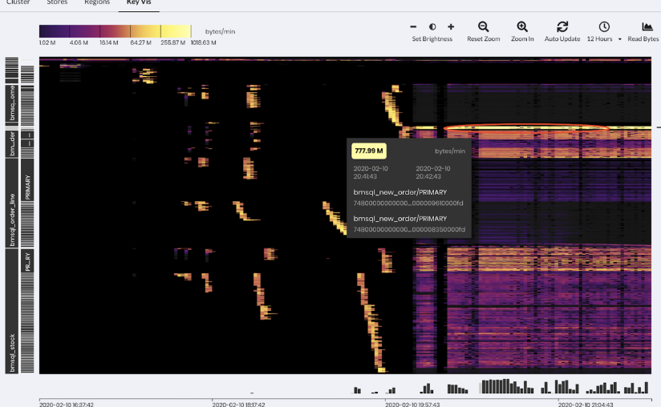

> 所以现在如果有朋友问我，“这个业务适不适合 TiDB？”我只需要通过录制线上流量，或者搭建一个从集群，只需要把 KeyViz 的图给我看一眼，我甚至都不需要压力测试就能判断这个业务是否适合，而且即使不适合，我也能准确的给出修改建议，因为 KeyViz 的图对我的「假设」的可解释性有了很强的支持。

[我眼中的分布式系统可观测性 \| PingCAP](https://cn.pingcap.com/blog/observability-of-distributed-system)


[TiDB 4\.0 新特性前瞻（一）拍个 CT 诊断集群热点问题 \| PingCAP](https://cn.pingcap.com/blog/tidb-4.0-key-visualizer)

[Key Visualizer 概览  \|  Cloud Bigtable 文档  \|  Google Cloud](https://cloud.google.com/bigtable/docs/keyvis-overview?hl=zh-cn)


需要拿一个实例, 比如说平均延时10s, 然后发现当前数据里, 分阶段, 其实和磁盘压力上的延时一比, 属于正常? 

ceph带debug模式, 是否可以考虑? 毕竟事后回溯目前成本偏高, 带来的性能影响是否真的很大?


痛点

TODO: 阿里针对这个设计了统一存储引擎 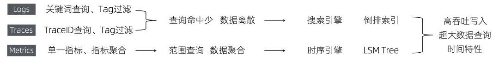


入口的数据量级监控, 对于ceph怎么感知呢?


间歇性开启profiling, 并最好配合自动解读

ceph产品可观测性提升


从全生命周期角度落实解读.


下图比较概括地描述了一个系统的质量观测完整生命周期，大体上可以分为如下四个阶段，并且在每个阶段都有需要特别关注的一些数据和指标：

开发阶段：重点需要关注代码的质量，例如静态代码扫描以及依赖检查会发现潜在的代码缺陷和安全风险，由此我们可以统计千行代码缺陷率或者严重缺陷比例，从而来衡量一个系统的代码质量是否符合要求

测试阶段：在此阶段需要重点关注测试的质量，例如测试覆盖率，以及测试用例的失败率等指标

灰度验证：需要关注系统的稳定性以及不同版本之间的差异，因此也会有一系列的业务指标，例如HTTP Error 比例，不同版本的延迟等指标的对比
线上运行：此时需要重点关注系统的稳定性以及业务的稳定性，因此各种线上的性能指标、业务指标、应用日志、Trace等各种数据都是非常重要的


> DevOps 中的监控支持三个主要的事件管理目标：
> 
> -   对中断、服务降级、错误和未经授权的活动等事件进行**问题检测；**在出现此类问题时发出警报并通过仪表板显示相关数据。
> -   通过回答“什么”和“在哪里”的问题，并提供支持故障排除和根本原因分析的信息来解决问题**。**
> -   通过提供支持增强容量和财务规划、趋势、性能工程和报告的见解，**持续改进软件交付流程。**
> 


## prometheus 

压缩比率低， Prometheus 平均一个数据点可以压缩到 1.37 字节，更加节省空间

查询语言没有 Prometheus 的 PromQL 强大，PromQL 支持 topk、quantile 分布统计、95值、线性回归预测等

## 分级

在 IT 系统的可观察性上，也可以类似划分 6 级：

等级 0：手工分析，依靠基础的 Dashboard、告警、日志查询、分布式链路追踪等方式进行手动告警、分析，也是目前绝大部分公司使用的场景
等级 1：智能告警，能够自动去扫描所有的可观察性数据，利用机器学习的方式去识别一些异常并进行自动告警，免去人工设置 / 调整各种基线告警的工作
等级 2：异常关联 + 统一视图，对于自动识别的异常，能够进行上下文的关联，形成一个统一的业务视图，便于快速的定位问题
等级 3：根因分析 + 问题自愈，自动根据异常以及系统的 CMDB 信息直接定位问题的根因，根因定位准确后那边可以去做问题的自愈。这一阶段相当于是一次质的飞跃，在某些场景下可以在人不用参与的情况下实现问题的自愈。
等级 4：故障预测，故障发生总会有损失，所以最好的情况是避免故障的发生，因此故障预测技术可以更好的来保证系统的可靠性，利用之前积累的一些故障先兆信息做到 “未卜先知”
等级 5：变更影响预测，我们知道绝大部分的故障都是由变更引起的，因此如果能够模拟出每个变更对系统带来的影响以及可能产生的问题，我们就能够提前评估出是否能够允许此次变更。


## 反模式

监控的几个反模式
事后监控，没有把监控作为系统的核心功能
机械式监控，比如只监控cpu、内存等，程序出事了没报警。只监控http status=200，这样数据出错了也没有报警。
不够准确的监控
静态阈值，静态阈值几乎总是错误的，如果主机的CPU使用率超过80%就发出警报。这种检查 通常是不灵活的布尔逻辑或者一段时间内的静态阈值，它们通常会匹配特定的结果或范围，这种模式 没有考虑到大多数复杂系统的动态性。为了更好地监控，我们需要查看数据窗口，而不是静态的时间点。如何在实际场景中使用异常检测？阿里云Prometheus智能检测算子来了
不频繁的监控
缺少自动化或自服务
一个良好的监控系统 应该能提供 全局视角，从最高层（业务）依次（到os）展开。同时它应该是：内置于应用程序设计、开发和部署的生命周期中。


## 推荐策略

许式伟：信噪比高，有故障就报警，有报警就直指根因。

采用合适的精度：应该仔细设计度量指标的精确度，这涉及到监控的成本问题。例如，每秒收集 CPU 负载信息可能会产生一些有意思的数据，但是这种高频率收集、存储、分析可能成本很高。如果我们的监控目标需要高精度数据，但是却不需要极低的延迟，可以通过采样 + 汇总的方式降低成本。例如：将当前 CPU 利用率按秒记录。按 5% 粒度分组，将对应的 CPU 利用率计数 +1。将这些值每分钟汇总一次。这种方式使我们可以观测到短暂的 CPU 热点，但是又不需要为此付出高额成本进行收集和保留高精度数据。

将需要立即处理和可以第二天处理的报警规则区分一下。每个紧急状态的报警的处理都应该需要某种智力分析过程。如果某个报警只是需要一个固定的机械化动作，那么它就应该被自动化。

接警后的第一哲学，是尽快消除故障。找根因不是第一位的。如果故障原因未知，我们可以尽量地保留现场，方便故障消除后进行事故的根因分析。一般来说，有清晰的故障场景的监控报警，都应该有故障恢复的预案。而在那些故障原因不清晰的情况下，消除故障的最简方法是基于流量调度，它可以迅速把用户请求从故障域切走，同时保留了故障现场。


识别趋势: 例如尖刺/均值漂移是DBA最关注的特征，当然例如周期性和趋势线的特征


我们已知的有两类方式：

 

1、基于时间范围内的统计关系：一般的使用习惯是在Metric异常的时间区间里去找到对应时间区间出现异常行为的Traces和Logs，这种方式会依赖对Traces和Logs的聚类分析能力。 

暂时默认, 在不引入新技术的情况下只能是上面这种了.

 

2、基于Label和TraceID关联：基于OpenTelemetry Collector可观测数据采集的框架，我们可以以插件的形式、以Trace Span元数据Label来生成访问指标，也同时将TraceID携带记录到日志的元信息中，这样就能以同样的TraceID或Label维度进行关联查看了。另外当前Prometheus实现了一个exemplar特性可以将Metric与TraceID关联存储，这个设计也挺有意思的


## 可观测性 

阶段 1：了解问题

知道问题正在发生就足以触发补救措施。例如，如果您部署了新版本的服务并且该服务的警报触发器，回滚部署是修复问题的最快途径，而无需了解事件期间的全部影响或诊断根本原因。对系统进行更改是生产问题的最大来源，因此在引入这些更改时了解问题是关键。


成功的关键：

快速警报：缩短问题发生和通知触发之间的时间。
仅向需要采取行动的团队发出范围通知：从一开始就确定问题的范围并将其路由到正确的团队。
提高信噪比：确保警报可操作。
自动化警报设置：自动化或模板化警报可以帮助工程师了解问题，而无需复杂的设置过程。


工具和数据：

警报
指标（本机指标以及从日志和跟踪生成的指标）


阶段 2：对问题进行分类

了解问题的范围可以导致补救。例如，如果您确定只有一个实验组中的客户受到影响，关闭该实验可能会解决问题。

为了帮助工程师对问题进行分类，他们需要能够快速将警报置于了解有多少客户或系统受到影响以及影响程度的上下文中。出色的可观测性使工程师能够对数据进行透视并聚焦上下文数据以诊断问题。


成功的关键：

上下文化仪表板：将警报直接链接到仪表板，不仅显示警报的来源，还显示相关和相关的上下文数据。
高基数支点：允许工程师进一步对数据进行切片和切块，使他们能够进一步隔离问题。
利用现有的检测：总是假设每个用例都经过完美检测是不切实际的，因此能够利用现有的检测很重要，但让它们尽可能地链接以获得最佳的上下文。


工具和数据：

仪表盘
指标
日志


第 3 阶段：了解问题。

对事件进行事后分析通常是一种在扭曲的依赖关系网络中导航并尝试确定您需要与哪个服务所有者合作的练习。

出色的可观测性为工程师提供了直接的视线，将他们的指标和警报与潜在的罪魁祸首联系起来。此外，它还提供了有助于解决潜在问题以防止事件再次发生的见解。


成功的关键：

轻松理解服务依赖项：识别遇到活动问题的服务的直接上游和下游依赖项。
在工具和数据类型之间跳转的能力：对于复杂的问题，您需要在日志和跟踪提供的详细信息与仪表板上指标提供的趋势和异常值之间反复跳转，最好是在单个工具中。
找出根本原因的时间：有时无法避免在事件期间执行根本原因分析，在这些情况下，在警报通知中或在使用仪表板进行分类的过程中显示可能的原因会减少找出根本原因的时间。


工具和数据：

痕迹
日志
指标
仪表盘


结论

出色的可观测性可以带来竞争优势、世界一流的客户体验、更快的创新和更快乐的开发人员。但是组织不能仅通过关注输入和数据（三大支柱）来实现出色的可观测性。通过关注这里概述的三个阶段和结果，团队可以实现可观测性的承诺。


就像现在许多人会把“可观测性”定义为是一个降本增效的好工具，很多相关产品厂商会将“降本增效”作为产品的推广利益点，这让许多开发者认为安装了可观测性平台，就可以降低成本、为业务创造价值。事实上，可观测性工具从来不是一个“便宜”的东西，可观测性平台除了基本的工具投入，还需要有一套完整的数据存储方案，企业自研一套优秀的可观测性解决方案投入成本并不低。以美国企业的可观测性相关投入为例，其会占企业整体 IT 支出的 5%-10%。而且，它的“降本增效”不是短时间内就可以显现出来的，而是通过长时间的应用，为业务提供大量的数据支撑进行技术性优化，从而产生价值。

## 监控与 可观测性 差异


1. 出现问题时，我多久能收到通知？是在用户/客户有不好的体验之前吗？

2. 我如何轻松快速地对问题进行分类并了解其影响？

3. 如何找到根本原因以便解决问题？

**监控告诉我们系统的哪些部分是工作的,可观测性告诉我们那里为什么不工作了.**

> 如果要知道它哪里出了问题，那么就需要在应用内部实现可见性，通过埋点或者是字节码注入的方式，让应用暴露它的业务、性能指标，比如函数的时延、调用次数、调用错误等，借助这些指标再结合旁路分析系统就可以很清晰地展现应用的全貌。

基于监控的运维方式是运用指标和仪表盘来对故障问题进行分类，这是软件行业的普遍做法。在单体应用架构时代，由于系统交互比较简单，数据收集有限，依靠运维人员的经验和直觉来检测系统问题是有意义的。通过监控CPU、内存等资源消耗情况、数据库连接情况和网络传输质量，基本可以定位问题并进行修复。然而，现代应用程序底层系统的复杂性和规模使这种传统方法面临着挑战：分布式系统的交互组件数量众多，可能发生的故障数量和类型也更多； 此外，由于敏捷化开发的需求，分布式系统不断更新迭代，每次更改都可能产生新的故障类型；在分布式环境中，理解当前问题是一项巨大的挑战，主要是因为它比简单的系统产生更多的“未知的未知数”， 由于监控需要“已知的未知数”，因此通常无法充分解决这些复杂环境中的问题。

软件系统“可观测性”的定义是：在无需提前定义或预测调试需求的情况下，可解释系统处于何种状态的能力。可观测性很重要，因为它可以让运维人员更好地控制复杂系统，无需依靠经验或深厚的系统知识来预判问题所在。借助可观测性工具，运维人员可以客观地调查任何问题，找到深层隐藏的问题根因。由此可见，可观测性工具更适合现代的分布式IT系统，由分布式系统复杂性带来的不确定性，可通过可观测性工具得到更好的感知和预测，合理管控IT设备与业务风险。


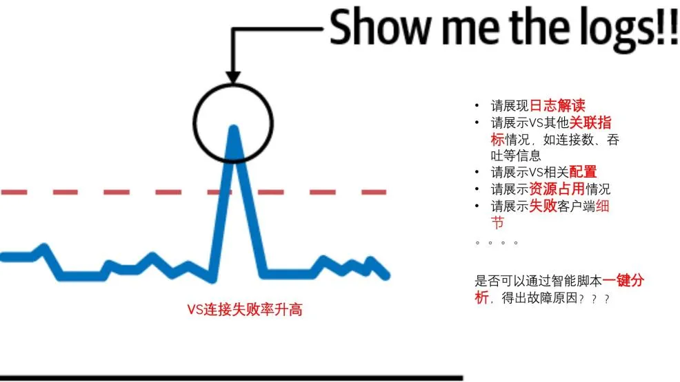


## Profiling 的难点是什么

On-CPU和off-cpu均收集到

thread太多, 难以提取有效信息


[eBPF程序摄像头——力争解决可观测性领域未来最有价值且最有挑战的难题 \- 知乎](https://zhuanlan.zhihu.com/p/583607789)


## offcpu和 OnCpu捕获

4.6以后内核推荐ebpf, 低版本可以继续用perf

``` bash

# perf record -e sched:sched_stat_sleep -e sched:sched_switch \
    -e sched:sched_process_exit -a -g -o perf.data.raw sleep 1
# perf inject -v -s -i perf.data.raw -o perf.data
# perf script -f comm,pid,tid,cpu,time,period,event,ip,sym,dso,trace | awk '
    NF > 4 { exec = $1; period_ms = int($5 / 1000000) }
    NF > 1 && NF <= 4 && period_ms > 0 { print $2 }
    NF < 2 && period_ms > 0 { printf "%s\n%d\n\n", exec, period_ms }' | \
    ./stackcollapse.pl | \
    ./flamegraph.pl --countname=ms --title="Off-CPU Time Flame Graph" --colors=io > offcpu.svg
```

[Linux perf\_events Off\-CPU Time Flame Graph](https://www.brendangregg.com/blog/2015-02-26/linux-perf-off-cpu-flame-graph.html)

[性能分析之off\-cpu \- 知乎](https://zhuanlan.zhihu.com/p/162375221)


Off-CPU 剖析
Off-CPU 剖析适用于由非高 CPU 使用率引起的性能问题。例如，当一个服务中有太多的线程时，使用 off-CPU 剖析可以揭示出哪些线程花费了更多的时间进行上下文切换。

我们提供两个维度的数据汇总。

切换次数：一个线程切换上下文的次数。当线程返回到 CPU 时，它完成了一次上下文切换。开关次数较多的线程栈会花费更多时间进行上下文切换。
切换持续时间：一个线程切换上下文所需的时间。切换持续时间较长的线程栈在 off-CPU 花费的时间较多。
写入访问日志
启用写入
使用与之前 CPU 测试相同的环境和设置，我们进行了 off-CPU 剖析。如下图所示，我们发现访问日志的写入占总上下文切换的 28% 左右。下图中的 __write 也表明这是 Linux 内核中的方法。


### 分析价值:

观察 time 的输出，可以看出 user + sys 不等于 real，这是因为程序并不是总是 CPU 上运行的，还可能因为 IO，Lock 等等原因处于睡眠，等待的状态，这段时间既不算在 user CPU time 也不算在 system CPU time。
• 程序在 CPU 上执行的时间（即 user CPU time  + system CPU time）称为 CPU time（或 on-CPU time）；
• 程序处于睡眠等状态的时间称为 off-CPU time（or blocked time）；
• 程序实际运行的时间称为 wall clock time（挂钟时间）； 
time 的输出 real 对应的概念的是 wall clock time，因此可以看到：
• 对于 IO 密集型的 workload（负载），off-CPU time 是不能忽略的；
• 对于 CPU 密集型 workload（负载），on-CPU time 基本和 wall clock time 相等； 
对于一个给定的线程（Linux 上称为轻量级进程）：wall clock time = CPU time + off CPU time


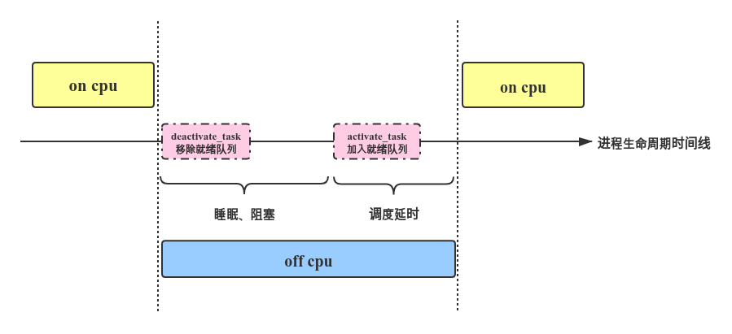

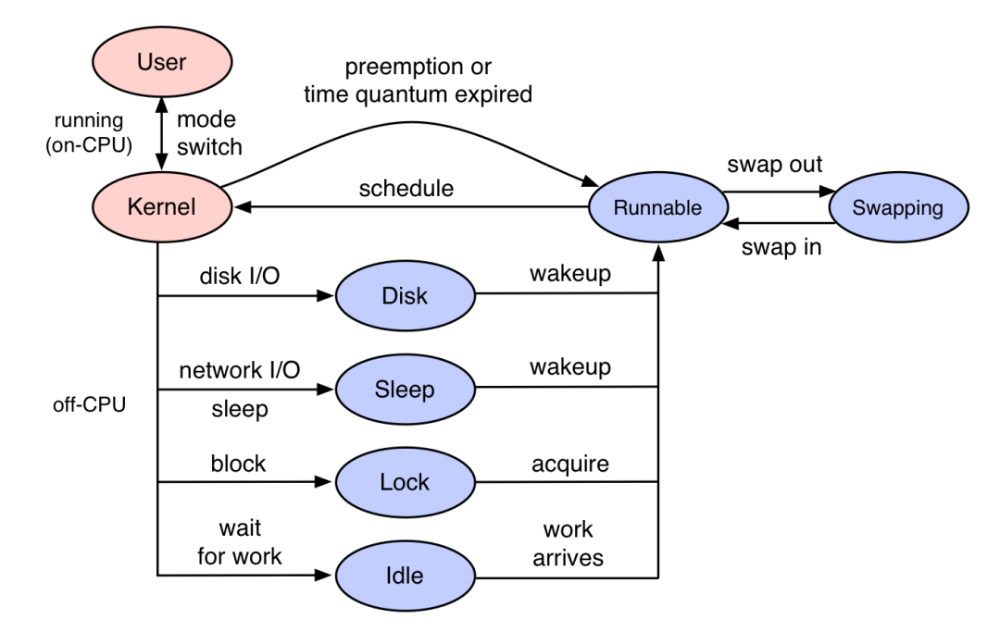


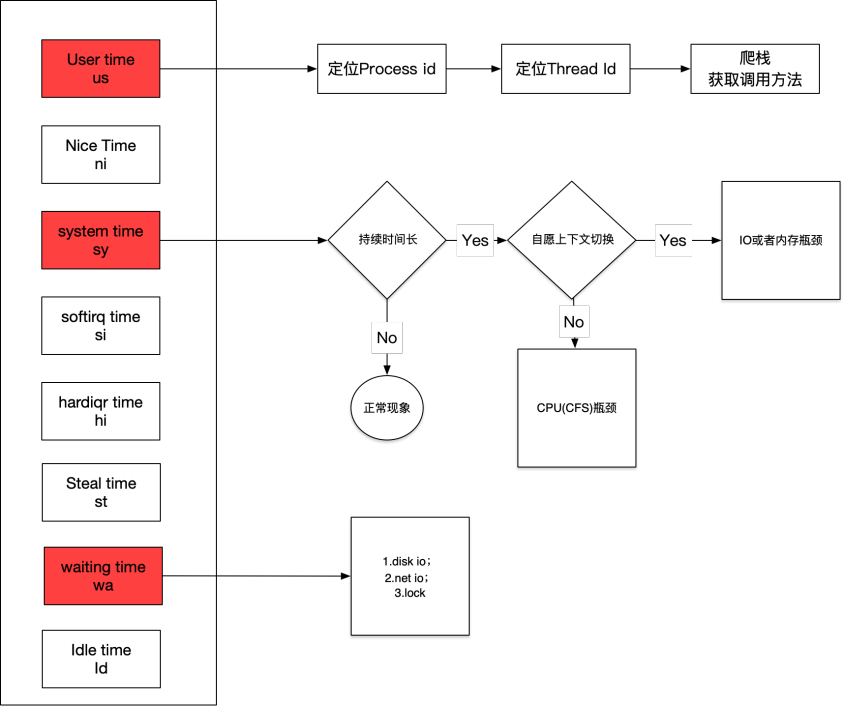


Roadmap
1. 诊断类型增强；（file io，socket io，lock 等等）
2. 聚合能力增强；（merge 和 diff）
3. 查询能力增强；（预处理能力，支持长时间聚合）
4. 火焰图交互增强（StackFrame 表达更多含义，当前仅仅包含一个简单字符串）；
5. RPC tracing 和 profiling 联动；


## 痛点


监控规则无法自适应：基于人为定义的阈值，很大程度上依赖于人的经验，随着系统的演化和业务的发展，这些规则往往不能很好地适应，由此不可避免地导致漏报、误报等问题。无法做到数据的自适应，因此需要人为介入，不断调整阈值


基于上述的讨论，我们可以大体总结出质量观测的几个痛点：

海量的异构数据：在系统开发、测试、验证、上线等各个阶段产生了大量的日志、时序、Trace 等数据，这些数据产生的位置、数据格式、以及存储的位置，都有可能是不一样的。如何从这些数据中快速精准地挖掘出潜在的质量问题比较困难。

依赖规则，缺乏智能：质量监控比较依赖于人的经验，很大程度上受限于人为设定的规则和阈值，无法做到数据自适应，因此无法发挥出真正的数据价值。另一方面就是随着系统的发展和演进，需要大量的人工干涉和不断调整，才能够让监控比较有效。

告警风暴与告警误报：为了不错过细微的问题，我们可能会配置大量的监控，从而导致在完整的软件生命周期中可能产生大量的告警，难以从其中识别出有效信息。另外大量的告警也带了很大程度上的误报问题，从而导致“狼来了”效应，于是真正的问题反而很容易又被忽略掉。这就陷入了恶性循环。

# 可观测性 产品

[parca\-dev/parca: Continuous profiling for analysis of CPU and memory usage, down to the line number and throughout time\. Saving infrastructure cost, improving performance, and increasing reliability\.](https://github.com/parca-dev/parca)


conprof类似 promehteus 一样 存储 protobuf的profile数据并展示.

### [首页 \- 快速实现系统可观测 \- 观测云](https://www.guance.com/)

初步看, 主要还是OpenTelemetry那套?

提供了自定义数据大盘、基础设施监控、日志分析、用户访问监测、应用性能检测、Profiling、云拨测、智能巡检等多种解决方案，力图打造可观测性最佳实践。但是，仅仅是一家或者几家的努力，是远远不够的。


### [应用性能监控全链路版\-火山引擎](https://www.volcengine.com/product/apmplus)


### 阿里云 DAS

今年以来，系统的可观测性概念火了， 其实从数据库自治的角度， 还有一个对偶的概念叫做可控制性。事实上，二者在控制理论中存在严格的对偶关系。可观测性和可控制性两者的有机结合， 才构成了数据库自治的完整链路。


蚂蚁智能监控在设计稳定性架构之初，我们首先应该意识到系统的运行时环境和输入都不会是稳定的。

运行时环境的不稳定 ，主要体现在机器的故障宕机、网络的抖动，或者更极端的机房光纤被挖断、城市自然灾害等客观因素影响。处理这类问题通常从两方面出发：
尽可能地提升系统的容灾等级。例如单点、机房级容灾、城市级容灾等
所有的数据处理流程都应该面向失败进行设计。因为当故障发生后，可能某几个周期的任务已经失败，这时候需要有能力驱动这些任务进行重试
针对系统输入的不确定性 ，我们也分两种情况进行处理：
第一种情况是入口数据的错乱，例如脏配置、脏元数据、不合法的数据类型等，错误的数据流入系统可能会导致不可预期的行为，针对此类问题，我们通常需要在入口处进行校验，拒绝非预期的数据流入系统。
第二种情况是入口数据量级管控，任何系统，其性能都是和容量挂钩的，其设计也都是在一定的性能容量平衡假设下进行的


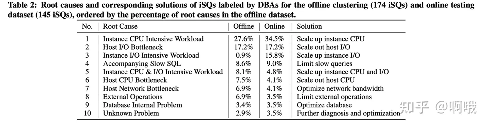

这里的常规解决方案好像是 扩容/限速等措施.


置信度的值会在0-1的区间内，我们设置一个阈值，高于这个阈值我们就认为是相关的。对所有KPI全排列，计算每个KPI对的置信度。在这一部分中，我们考虑到异常的传播来清理KPI异常，并保留源KPI异常。 例如，一个实例的CPU利用率异常通常伴随着该实例的物理机器的CPU利用率异常。因此，这两个kpi在很大程度上是正相关的。如果我们计算置信度，我们可能会得到结果“1”，这表明两个kpi是相互依赖的。因此，我们将排除物理机CPU利用率的所有异常，而保留实例CPU利用率的异常。

通过置信度来识别 因果关系

例如尖刺/均值漂移是DBA最关注的特征，当然例如周期性和趋势线的特征

### [eBPF Profiling \| Open Source Continuous Profiling Platform](https://pyroscope.io/docs/ebpf/)

ebpf的一个捕获实现? 支持了go/python/ruby

## [Kubernetes Monitoring, Application Debug Platform \| Pixie](https://pixielabs.ai/)


# 网易的ceph

主要就是目前我们知道的prometheus, jaeger, 还有原生的那些status接口和daemonperf


[分布式存储可观测性设计 \- 知乎](https://zhuanlan.zhihu.com/p/593114584)


### TiDB PingCap

但是如果是在事后复盘原因的时候，能够有事发之前的 CPU Profile 记录，对于问题的解决和归因会有巨大的帮助，所以一个比较好的方案是：在一个相对短的时间间隔下（比如分钟级）自动的开启 Profiler，自动把诊断结果保存下来，就像定期做一个深度体检记录一样，老的记录定期删除就好了，万一出事，可以快速往前回溯，救命的效率会更高。

另外相信我，做 Profile 其实也不会有什么明显的性能损耗（何况还是间歇性的），这个功能我们叫做：Continuous Profiling，这个功能很实用，也会很快和大家见面。

一个用户的数据库时间分解图样例，远看似青峰叠嶂，绿水隐现。

透过此图，一眼可知系统负载为以读为主的读写混合负载


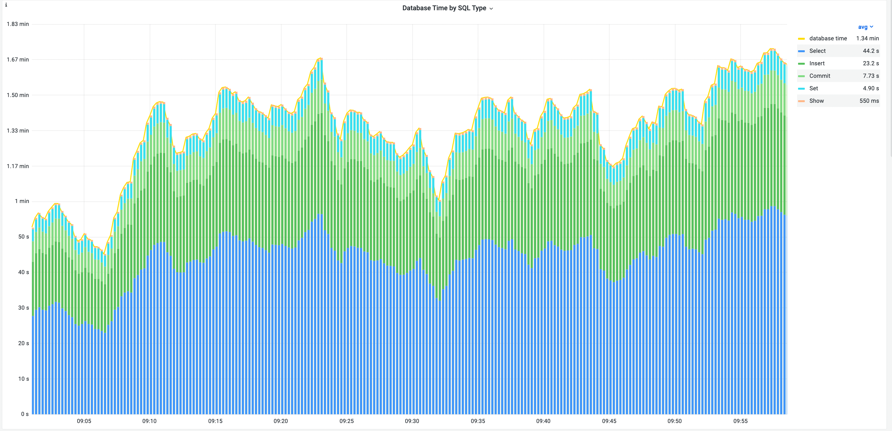


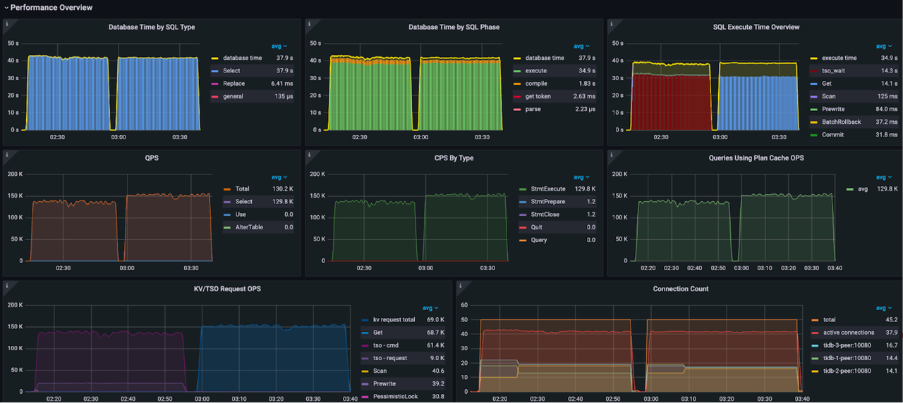


1.  [优化概述](https://docs.pingcap.com/zh/tidb/dev/performance-tuning-overview) ：本文介绍性能优化的基本概念，比如用户响应时间、吞吐和数据库时间，以及性能优化的通用流程。
2.  [优化方法](https://docs.pingcap.com/zh/tidb/dev/performance-tuning-methods) ：本文介绍了基于数据库时间的系统优化方法，以及如何利用 TiDB [Performance Overview 面板](https://docs.pingcap.com/zh/tidb/dev/grafana-performance-overview-dashboard) 进行性能分析和优化。包括面板每个指标的含义，正常指标范围，导致指标异常的常见原因有哪些和常见的调优手段有哪些等。
3.  [优化实践](https://docs.pingcap.com/zh/tidb/dev/performance-tuning-practices) ：TiDB 提供了完善的性能诊断和分析功能，例如 TiDB Dashboard 的 [Top SQL](https://docs.pingcap.com/zh/tidb/dev/top-sql) 和 [Continuous Profiling](https://docs.pingcap.com/zh/tidb/dev/continuous-profiling) 功能，以及 TiDB [Performance Overview 面板](https://docs.pingcap.com/zh/tidb/dev/grafana-performance-overview-dashboard) 。本文介绍如何综合利用这些功能，对同一个 OLTP 负载在七种不同运行场景下的性能表现进行分析和对比，并演示了具体的 OLTP 负载的优化过程，帮助你更快地对 TiDB 的性能进行分析和优化。
[【PingCAP Infra Meetup】No\.145 TiDB 可观测性专场](https://xbeibeix.com/video/BV1yS4y167NF)

做出让人爱不释手的基础软件：可观测性和可交互性 个人理解: 尽可能多的监控，之后就是尽量串起来

我觉得更重要的是，找问题过程中我们使用的工具、老司机的思考过程。作为一个观察者，我看到年轻的同事看着老司机熟练地操作 perf 和在各种各样工具和界面中切换那种仰慕的眼神，我隐约觉得事情有点不对：这意味着这门手艺不能复制。
如果打开 TiDB 的内部 Grafana 就会看到大量这样的指标，得到对系统运行状态的大致图景。更进一步的关键是，这些系统的指标一定要和业务上下文联系在一起才能好用，举例说明，对于一个支持事务的数据库来说，假设我们看到 CPU 线程和 call stack，发现大量的 CPU 时间花在了 wait / sleep / idle 之类的事情上，同时也没有其他 I/O 资源瓶颈，此时，如果只看这些的数字可能会一脸懵，但是结合事务的冲突率来看可能柳岸花明，甚至能直接给出这些 lock 的等待时间都花在了哪些事务，甚至哪些行的冲突上，这对观测者是更有用的信息。
如果我们讨论可观测性脱离了周期，就毫无意义。周期越贴近终端用户的使用场景越实用。譬如，在数据库中，选择单条 SQL 的执行作为周期不如选择事务的周期，事务周期不如应用程序一个请求全链路的周期。其实 TiDB 在很早就引入了 OpenTracing 来追踪一个 SQL 的执行周期内到底调用了哪些函数，花费多少时间，但最早只应用在了 TiDB 的 SQL 层内部（熟悉我们的朋友应该知道我们的 SQL 和存储是分离的），没有在存储层 TiKV 实现，所以就会出现一条 SQL 语句的执行过程往下追到 TiKV 就到了一个断头路；后来我们实现了把 TraceID 和 SpanID 传到了 TiKV 内部这个功能才算初步可用，至少把一个周期的图景变得更加完整了，本来我们打算就止步于此，但是后来发生了一个小事情，某天一个客户说：为什么我的应用访问 TiDB 那么慢？然后我一看 TiDB 的监控，没有啊，SQL 到数据库这边基本都是毫秒就返回了，但是客户说：你看我这个请求也没干别的呀，两边怎么对不上？后来我们把 Tracer 加进来以后才知道客户这边的网络出了点问题。这个案例提醒了我，如果能做到全链路的 Tracing，这里的全链路应该是从业务端请求开始计算，去看待生命周期才有意义。所以在此之后我们在 TiDB 里面通过拓展 Session Variable，能够支持用户将 OpenTracing 协议的 Tracer 信息通过 Session Varible 传入到 TiDB 的体系中，打通业务层和数据库层，能够真正实现的一个全生命周期的跟踪，这个功能也会在很近的未来的版本中和大家见面。
根据我们的经验，结合上面内容，有了完善的 Tracing 系统，大部分的 Debug 过程在 Tracing + Log 就能找到问题的根因。
我在观察老师傅处理问题的时候发现一个特别有意思的现象：有经验的开发者总是能够很快通过观测，决定自己接下来该做什么，不需要查阅资料什么或者等着别人指导，完全处于一个心流的状态（例如在 TiDB 里面看到数据在集群内部分布不均或者有热点，就知道去修改调度策略或者手工 split region），但是新人在这一步总是会卡着，要么去 Google 要么去翻文档，内心 OS：「我看到问题了，然后怎么办？」，如果这个时候，系统能够给一些接下来应该观测哪些指标，或者行动建议，会更加友好，目前能做到这一点的系统不多，如果能做到这一点，相信你的系统已经在可观测性上做得很棒了。把这个点放在可观测性的最后其实是想借着这个话题引出可交互性。
一个优秀的基础软件，在输出负向反馈的时候，最好的做法就是建议开发者接下来该干嘛。遇到真的 Unknown Error 要输出各种帮助 Debug 的上下文信息，最后在错误日志里提示用户到哪个链接提 Github Issue，然后最好在 URL Link 里帮用户把 Issue Title 填好（让用户自己决定是不是发 Issue）。

### kindling [KindlingProject/kindling: eBPF\-based Cloud Native Monitoring Tool](https://github.com/KindlingProject/kindling)

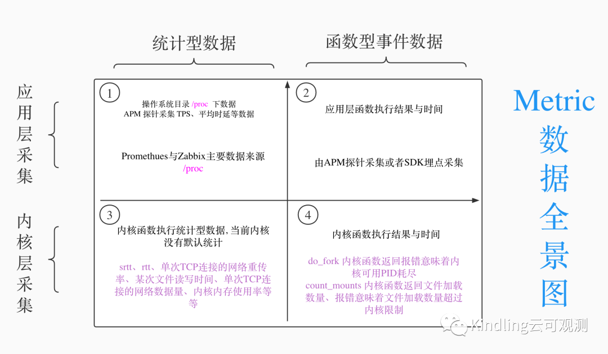


1类型的Metric数据是Linux /proc下数据，Promethues和Zabbix等主流监控数据就来自于/proc 下的统计数据，APM探针也会有部分统计数据如TPS、平均时延、错误率等。

2类型的数据当前是APM产品主要采集的数据，该类型数据大量通过APM trace进行展示，并不是以常规指标形式展示，少部分数据以常规指标形式展示。

3类型的数据，当前该类型数据采集工具缺失，如BCC等工具是作为小工具临时使用，业界并未有监控工具将该部分数据作为可观测性数据7X24小时运行保存展示。

4类型的数据，当前主要还是专家型技术人员通过BCC、Bftrace、Ftrace等工具去获取内核函数执行情况。

当前比较常见的做法是将prometheus的数据和APM trace进行关联，这种方案能解决应用层导致的问题，但是针对云原生环境很多问题如DNS的性能导致业务抖动，共享存储导致业务请求性能发生抖动，代码突然执行慢了等问题排障帮助有限。

针对3与4类型的metric数据，当前主流做法是利用BCC、BFTRACE、Ftrace、Systamp等与内核交互的工具采集数据并输出至console中展示，当前并未有能提供7x24小时运行的可观测方案。主要原因是3与4类型中很多种类数据的数据量是非常大的，而7x24小时运行过程中，绝大多数情况是数据是正常的，保存这些大量正常的数据是浪费存储资源。

****Kindling的解决思路****

**Kindling构建全局拓扑图和排障trace来排查问题，排障trace有别于APM trace，eBPF排障trace只是APM trace中的一个如A->B调用环节。Kindling重点做的事****情就是将3与4类型的数据关联至排障trace当中，通过判断排障trace是否异常，决定该trace的存储，从而实现存储友好的7x24小时运行云原生可观测性工具。**

-   Kindling使用和BCC、Bftrace同样的原理从而得到应用运行环境中3类型与4类型数据，为了能够支持当前国内主流的CentOS7系列（eBPF运行在该类型操作系统默认内核上有技术局限性），Kindling通过构建内核模块的技术获取了同样数据，保证用户在高版本内核上与低版本内核获得同样的体验。
    

-   Kindling 通过分析在同一个socket fd上的read系统调用和wrtie系统调用即可得到应用在处理该socket上请求耗时，并将该次请求与返回封装成排障trace。通过耗时、返回码等业务层语义能够确定每次eBPF排障trace是否异常。在一个socket fd上的read系统调用总时间，可以得到一个请求上的网络request时间，分析一个socket fd上的write系统调用总时间，可以得到一个请求上的网络response时间。将一个socket fd上的最后一个read和第一个write时间差即是程序处理的总时间。将同一个socket fd上三者时间关联在一起看，即可看到请求的耗时的完整分布，得到类似chrome里面下图
    


-   Kindling 获取到的3类型数据与4类型数据通过各种关联手段关联至排障trace，在确定排障trace异常之时能存储该排障trace，同时也存储了3类型数据与4类型数据。该种方式确保了Kindling是可以运行在云原生环境的7X24小时存储友好的可观测性工具。

[Kindling项目目标\-\-利用eBPF技术带来的可观测性的上帝视角\_开源社的博客\-CSDN博客](https://blog.csdn.net/kaiyuanshe/article/details/124811500)


#### 网易伏羲  有落地 kindling

[网易伏羲私有云基于eBPF的云原生网络可观测性探索与实践 \- 腾讯云开发者社区\-腾讯云](https://cloud.tencent.com/developer/news/1026428)


# 草稿


背景:
ceph的监控维度, 仅有实际运行时, ceph daemonperf 方可看到实时的ceph延时/计数器等监控.  在IT相关的部分有prometheus服务的机房下, 历史数据目前仅有原生默认的ceph集群监控及节点监控.  
实际分析时, 发现从历史角度分析维度想分析异常时的数据趋势时, 原生默认数据过少. 节点资源消耗过多能判定异常, 但是无法确认是何消耗过多.


目标收益
1.  可提供源码定位的指标参照, 以定位瓶颈
2. 可快速比较集群各节点/各osd间指标, 发现瓶颈, 比如通过各op阶段, 各op计数器,可快速发现 异常, 可提高人为手动比较差异的效率, 从 天级别 提高到 分钟级别. 甚至提供快速根因告警


目前印象里计划的待办

logging+metrics+trace,目前针对平均下降高/低波动趋势, 通过metrics增强

0. 主要是debug模式的参数有了 . 其次grafana界面有了. 从而拿到全指标的历史数据, 包括ceph各阶段的延时, 及各阶段的计数器 .  亦或是debug分析io链路, 辅佐定位流程.
1. 增加了ceph 进程级的监控, 对
2. 目前指标仅为单osd的, 但是对于大规模集群, 增设将ceph集群的osd, 划分节点为粒度的筛选数据. 而不是手动筛选. 提高筛选效率.
3. 筛选ceph指标中, 通过实际io分析经验, 评估存在异常联动关联指标. 
4. 增加 告警阈值, 从而将监控数据中异常数据 ,快速感知.
	1. 配合基线的io模型的分析/ 性能边界测试, 输出现场现场延时等的阈值.
5. 结合基线, 利用prometheus 的PromQL的数据查询接口, 以支持更强大的历史趋势的感知能力. 比如跨节点数据分析
6. 考虑可配合eBPF, 增强metrics/trace追踪

# 几大维度


* Metric：指标，对系统中某一类信息的聚合统计，比如 QPS、延迟、错误率等。
* Logging：日志，对系统所做行为的一种记录，它是离散的，没有相关性，为了区分这种记录的重要程度，会分级别（DEBUG、INFO、WARN、ERROR、FATAL）。
* Tracing：调用链，它反映的是请求经过某个组件的运行情况，经过组件的数据叫做 Span，Span 可以体现经过组件的状态、一些关键属性和事件、上下文信息。Span 之间通过 Trace ID 关联。
* Profiling：一般叫做 Continuous Profiling，持续分析，它反映的是程序内部的运行状态，比如栈调用、执行时间等。可以把 Profiling 可视化成火焰图方面分析问题。


> 一般来说，基于这些度量处理故障的流程是：Metric → Tracing → Logging → Profiling
> 
> 根据 Metric 配置的告警策略发现问题，基于 Tracing 查看是哪个组件出问题，基于 Logging 查看组件的日志，Profiling 分析组件具体的故障或性能问题。


Metric 我们使用分布式 Prometheus 方案 Cortex，数据模型和 Prometheus 一致
Logging 我们使用 Loki
Tracing 我们使用 Grafana Tempo，Tempo 本身兼容 Zipkin、Jaeger、OpenTelemetry 等协议，所以 Tracing 直接采用 OpenTelemetry 的数据模型
Profiling 的后端实现基本可以复用 Loki，数据模型也和 Logging 类似

最后看 Profiling，数据模型：LabelSet + Timestamp + []byte

Profiling 的数据格式是 protocol buffers，所以用 []byte。


第一，Metric 和 Tracing 融合。

这里要用到 Exemplar，Exemplar 最早被用在 Google 的 StackDriver 中，后面成为了 OpenMetrics 标准的一部分，在应用通过标准 /metrics 端口暴露 Metric 时，Exemplar 信息也会被一起暴露。

Prometheus 目前已支持 Exemplar，Prometheus 通过 /metrics 采集数据时也会把 Exemplar 存储下来，并暴露单独的 API 来获取 Exemplar 信息。


第二，Logging 和 Tracing 融合。

只要使用带有 Tracing 库的 SDK，每个请求都会带上 Trace ID，并把这些 ID 打在日志中。

通过 Trace ID 可以定位到一个唯一的 Tracing， 跳转到 Tracing 系统的 UI 进行查询。

第三，Metric 和 Profiling 融合。

基于 Exemplar，把 Profiling ID 也放入 Exemplar 中，Prometheus 支持存储和查询即可。

至于展示，可以在 Grafana 上开发一个 pprof 的 Panel 插件，这样可以展示 Profiling。

### Continous Profilling

是这两年 在openTelemetry后, 主推的一个定义

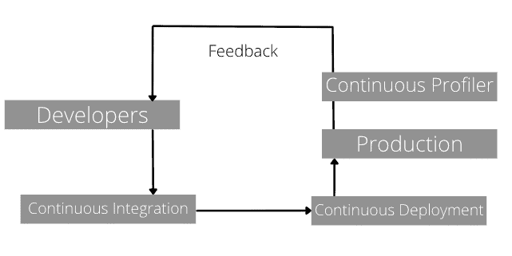


## 可观测性 相比 监控

> 数据可观测性与数据监控有何不同？
> 
> 可观测性通常被称为监控 2.0，但它是监控的一个更大的超集。可观测性更像是工程师的助手，通过考虑系统的深层底层状态来确定系统是否按照设计的方式工作。让我们回顾一下将可观测性与监控区分开来的几点：
> 
> 语境
> 
> 可观测性不仅仅跟踪/监控系统中的给定脉冲。它还考虑了影响功能的那些脉冲的背景。
> 深度
> 
> 监控跟踪系统的表面水平脉冲以了解性能。相比之下，可观测性记录跟踪（或相关事件），建立必要的链接，并整体跟踪系统的深层内部状态。
> 
> 行动
> 
> 虽然监控的输出主要是反映系统性能或资源消耗的数字，但可观测性的输出是行动建议。例如，监控会指出系统已经消耗了 100 GB 的内存。相反，可观测性将说明内存消耗是否是次优的，以及是否需要开发人员的干预来进行优化。
> 
> ML 监控与 ML 可观测性
> 
> 长期以来，可观测性一直是 DevOps 框架的一部分。然而，MLOps 社区对它的需求也越来越明显。此外，随着数据变得越来越复杂，数据管道变得更加复杂且难以跟踪。因此，虽然我们将可观测性集成到机器学习世界中，但定义 ML 监控和 ML 可观测性之间的关键区别很重要。
> 可观测性的核心要素在 ML 可观测性中端到端体现。ML 监控仅收集有关解决方案的高级输出或成功指标（如灵敏度和准确性）的数据。之后，它会根据预编程的阈值发送警报。
> 另一方面，ML 可观测性更深入地研究并寻找记录性能背后的原因。最后，通过评估与验证、测试和传入数据之间的洞察力相关联的数据行为，深入研究根本原因。


> 数据治理挑战
> 
> 数据治理是一门相对较新的学科，因此组织在初始设置阶段面临一些常见挑战。他们之中有一些是：
> 
> 缺乏业务理解
> 
> 数据通常被认为完全由 IT/开发团队拥有和管理。这有一个重大缺陷，因为 IT 团队没有端到端的业务视角，也无法拨打关键电话。因此，当客户提供必要的数据时，甚至在从其他来源收集数据时，数据收集过程中都会出现间隙。
> 由于缺少只有全面的业务团队才能识别的功能，因此数据不是最理想的。除非将业务理解整合起来，否则利益相关者在传达结果时也会存在相当大的差距。
> 
> 无法识别痛点
> 
> 数据治理的工作是解决数据管道中的问题。但是，如果参与者无法确定优先级和痛点，则由于反复试验循环，数据治理标准可能需要更长的时间。
> 
> 缺乏灵活性
> 
> 数据管理通常需要对各种操作进行多次批准。例如，在处理客户端请求时，可能会发现客户端的数据会占用相当大的空间，这超出了可用的硬件限制。这启动了整个层次结构的一系列批准。尽管这是一个简单的过程，但由于对时间的影响很大，因此效率低下。
> 
> 预算限制
> 
> 数据解决方案通常需要复杂的资源，例如内存负载和高处理能力。不幸的是，这些资源可能对团队来说是禁区，特别是在数据团队仍然是新的和不断发展的组织中。为了弥补预算和资源的不足，必须设计一个低于标准的解决方法，这会影响数据生态系统的健康。
> 如果我们深入研究，将会发现许多新的和不同的挑战。每个组织都有不同的个性，面临着各种各样的挑战。关键是要开始并解决问题。
> 
> 数据治理工具
> 
> 在考虑选择哪种数据治理工具时，最好从经济高效且快速的选项开始。因此，可靠的开源解决方案或基于云的平台可以进行繁重的工作，非常适合进行实地测试。繁重的工作包括轻松添加新功能、简单集成、即时可用的硬件或服务器功能等等。
> 让我们看看在缩小数据治理工具范围时应该考虑的一些要点：
> ●提高数据质量：数据治理工具应该在没有干预的情况下清理、优化和验证数据。
> ●无缝管理数据：该工具应集成高效的 ETL（提取转换负载）流程，以便轻松跟踪数据沿袭。
> ●记录数据：文档是任何流程中最被低估的执行者，即使它为团队保留并传递了最大的价值。记录数据是必要的，这样可以提高可重复性、可搜索性、访问性、相关性和连接性。
> ●具有高透明度：该工具应向管理或使用它的任何人提供高透明度。它应该像一个助手一样，通过清楚地指出任务、沟通点和不作为的影响来帮助用户执行任务。
> ●审查数据：数据、数据趋势、访问点和数据健康状况不断变化，需要密切监控。因此，定期审查可以使数据保持最新，并且不会出现看似合理的故障。
> ●捕获数据：数据治理工具应自动发现、识别和捕获关键数据点。
> ●提供敏感的洞察力：数据治理工具应该理解数据并最终提供关键洞察力，帮助构建数据管道的后续步骤。
> 总体而言，在选择数据治理工具时，易用性也应该是主要关注点之一，因为用户和工具之间的高摩擦最终会减慢流程。
> 
## 未来趋势


* **全生命周期可观测性：上下文洞察**
* FinOps: 成本优化——一直到每笔交易的成本——对组织来说将变得越来越重要 
* 安全
* 预防性可观测性
	* ，Uber 开发了一种工具，该工具使用机器学习来识别非常复杂的架构中的潜在性能问题。


## 可观测性方向

* 用户访问监测 RUM
* eBPF
* Profiling
* OpenTelemetry

## 指标

>  最常用的黄金指标有：
> 
> 延迟：延迟是信息的发送方和接收方之间的时间延迟，以毫秒（ms）为单位。其原因通常是由于数据包丢失、网络拥塞和称为 “数据包延迟差异” 的网络抖动。延迟直接影响客户体验，转化为成功请求的延迟和失败请求的延迟。
> 流量：流量是系统上完成的工作量所带来的压力。它通过每秒查询数 (QPS) 或每秒事务数 (TPS) 来衡量。企业通过数量来衡量这一点：关键绩效指标 (KPI) 是在给定时间访问网站的人数。这是与商业价值的直接关系。
> 错误：错误是根据整个系统中发生的错误来衡量的。什么被视为服务错误率的重要指标！有两类错误，显式错误，例如失败的 HTTP 请求（例如，500 个错误代码）。而一个隐含的错误将是一个成功的响应，但与错误的内容或响应时间长。
> 饱和度：饱和度定义了服务的过载程度。它衡量系统利用率，强调资源和服务的整体能力。这通常适用于 CPU 使用率、内存使用率、磁盘容量和每秒操作数等资源。仪表板和监控告警是帮助您密切关注这些资源并帮助您在容量变得饱和之前主动调整容量的理想工具。
> 利用率：虽然不是 “四大金信号” 的一部分，但值得一提；利用率告诉资源或系统有多忙。它以 %（百分比）表示，范围为 0–100%。
> 
# PingCap

通过机器学习或者其他, 快速提取几千张图中, 存在波动的图. 这个实现不依赖机器学习

> 现在都是 DBA 用人眼去观察，故障的判断也是基于人的经验和思考模式。但现在 TiDB 中像这样的指标就已经有几千个了，未来还会有更多。这就意味着靠人去观察这些东西会变得越来越复杂，越来越慢。我们可以用机器去帮你快速地筛选出来，比如 1000 张图中有 10 张图有这种故障，然后你再去观察这 10 张图就可以，帮你节省了大量的时间。
> 
> 在理想的环境下，准确率能达到 70-80%。但如果在现实环境中，你可能认为有些并不是故障，所以这个指标会有一些波动，噪声会很大。


# Reference
1. ebpf会议 [linuxkerneltravel/ebpfConference \- 码云 \- 开源中国](https://gitee.com/linuxkerneltravel/ebpf-conference/tree/master)
2. [大话可观测性 \- 知乎](https://www.zhihu.com/column/c_1605970950708785153)

#  草稿


课题现状


目前基线遇到的比较多起的 疑难问题分析,  猜测复现场景. 年度累计投入分析时间其实超过2人月

具体实例,

mgr内存问题, 缺失profiler工具, 主要是锁引起的问题, 那profiler能发现否? 可能可以, 但是没介入, 姑且不纳入考虑

异常throttle阻塞问题

异步快照问题, 其实应该也是可以通过那个定位发现是正在重构? 不对, 其实没限速的问题, 所以还是从代码逻辑角度

pg_info_t中存储removed_snaps问题

那个tier + cancel_copy那个事, 其实如果perf捕获应该也是比较明显的? 那俩异常的osd?


safeTimer那个有啥发现渠道呢?

云曜 qemu drive-mirror其实有热力图, 和命中率 就能知道了. 

海门公安局  日志服务异常带来的压力大.  通过卷热力图也就知道了

网络等问题, 环境监控指标, 丢包数应该就可以了? 


这几个好像理清逻辑之前没有啥临时方案? 加硬件可能是明确的. 


---

业务模型, 主要是针对下层性能设计优化用的? 不知道对宋老板他们有没有用? 应该是有的?


可追溯性, 目前似乎没有什么大差异?

