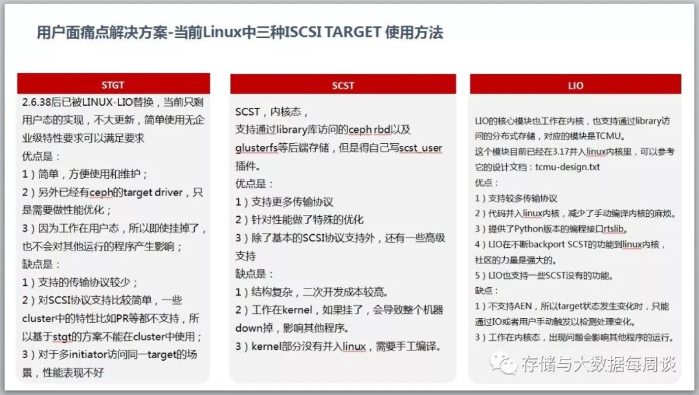
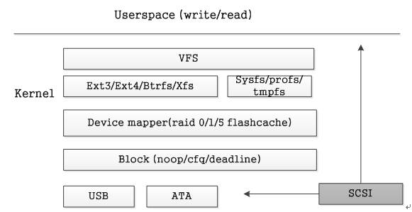
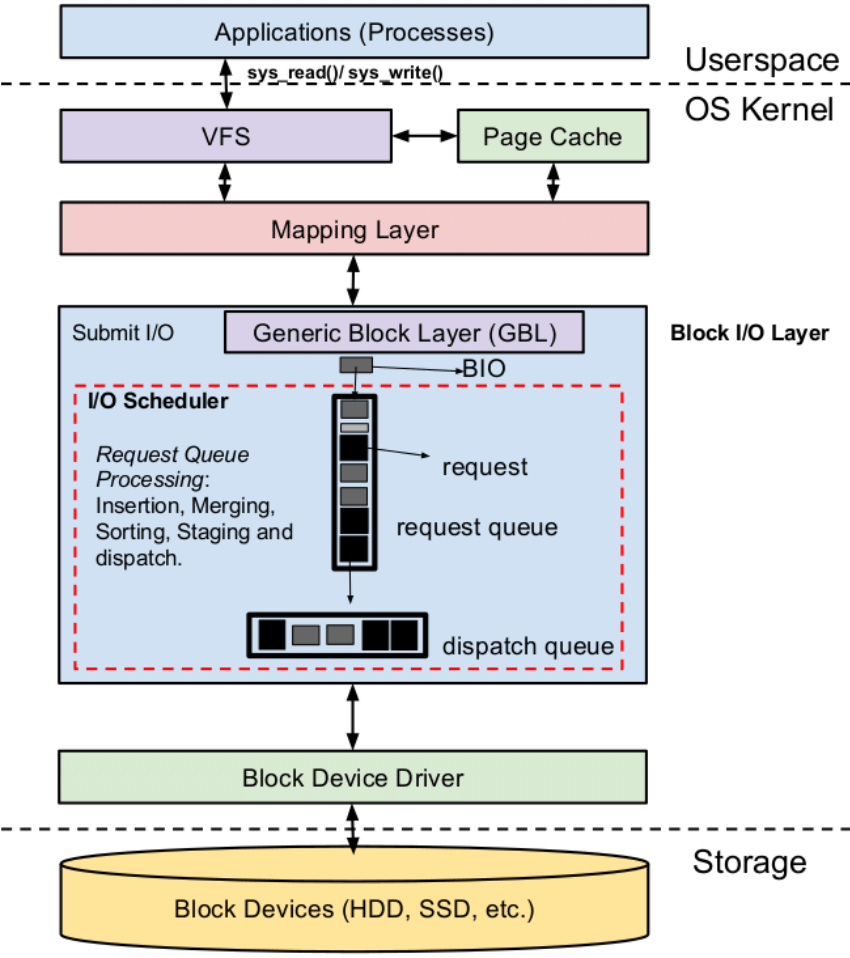
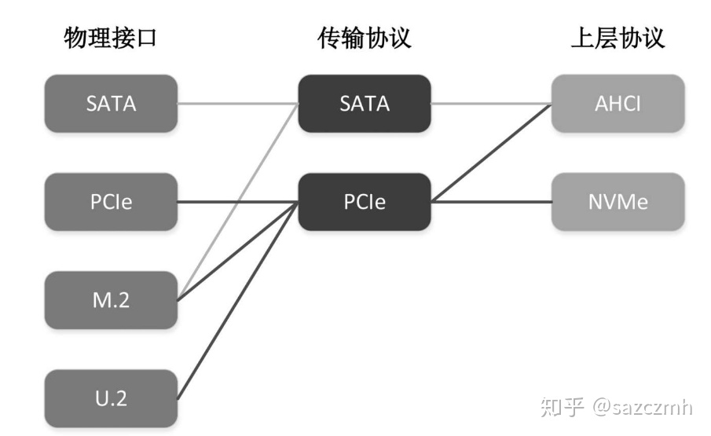

### todo
ceph-fuse是如何将系统调用注册成自己的程序的呢?

* libcephfs 是ceph-fuse通信的内核模块
* ceph-fuse来处理真实的逻辑
  
* 本文提到为了系统实现概念的统一性、设计的一致性以及层次抽象与共用，操作系统将iscsi协议对接到scsi中间层。这种实现对性能的损失有多大？如果我们在device-mapper之下实现又会怎么样
* https://www.kernel.org/doc/html/latest/admin-guide/device-mapper/cache-policies.html
  * kernel的文档

* 磁盘Cache 是否是在硬盘驱动哪层
* avgrq-sz这个东西应该有个上限,  好像是512K
  * [Increasing the maximum I/O size in Linux \| Martins Blog](https://martincarstenbach.wordpress.com/2013/07/03/increasing-the-maximum-io-size-in-linux/)
  * > The default maximum IO size set by Max_Sectors_KB restricts the largest IO size that the OS will issue to a block device. 
  * > Whether you will be issuing IO at this size will depend on the elevator (scheduler) being used, the driver, and the type of IO your applications are issuing. But large reads and writes are often at the maximum IO size.
  * > The answer is to use UDEV.
  * All you need to do is create a file “71-block-max-sectors.rules” under /etc/udev/rules.d/ with the following line.
  * > ACTION==”add|change”, SUBSYSTEM==”block”, RUN+=”/bin/sh -c ‘/bin/echo 1024 > /sys%p/queue/max_sectors_kb’”[^18]
  * – max_sectors_kb
  * – max_hw_sectors_kb

* 这个内核的队列到底有多大. 队列大小. 
* autocork

# FAQ
1. write返回成功数据落盘了吗？
> Buffered IO：write返回数据仅仅是写入了PageCache，还没有落盘。
> 
> Direct IO：write返回数据仅仅是到了通用块层放入IO队列，依旧没有落盘。
> 
> 此时设备断电、宕机仍然会发生数据丢失。需要调用fsync或者fdatasync把数据刷到磁盘上，调用命令时，磁盘本身缓存(DiskCache)的内容也会持久化到磁盘上。
> 
2、write系统调用是原子的吗？
> write系统调用不是原子的，如果有多线程同时调用，数据可能会发生错乱。可以使用O_APPEND标志打开文件，只能追加写，这样多线程写入就不会发生数据错乱。
> 
3、mmap相比read、write快在了哪里？
> mmap直接把PageCache映射到用户态，少了一次系统调用，也少了一次数据在用户态和内核态的拷贝。
> 
> mmap通常和read搭配使用：写入使用write+sync，读取使用mmap。
> 
4、为什么Direct IO需要数据对齐？
> DIO跳过了PageCache，直接到通用块层，而通用块层的IO都必须是块大小对齐的，所以需要用户程序自行对齐offset、length。
> 
5、Libaio的IO栈？
> write()--->sys_write()--->vfs_write()--->通用块层--->IO调度层--->块设备驱动层--->块设备
6、为什么需要 by pass pagecache？
> 当应用程序不满Linux内核的Cache策略，有更适合自己的Cache策略时可以使用Direct IO跳过PageCache。例如Mysql。
> 
7. 为什么需要 by pass kernel？
> 当应用程序对延迟极度敏感时，由于Linux内核IO栈有7层，IO路径比较长，为了缩短IO路径，降低IO延迟，可以by pass kernel，直接使用用户态的块设备驱动程序。例如spdk的nvme，阿里云的ESSD。
> 
8. 为什么需要直接操作裸设备？
> 当应用程序仅仅使用了基本的read、write，用不到文件系统的大而全的功能，此时文件系统的开销对于应用程序来说是一种累赘，此时需要跳过文件系统，接管裸设备，自己实现磁盘分配、缓存等功能，通常使用DIO+Libaio+裸设备。例如Ceph FileStore的Journal、Ceph BlueStore。

9. mmap和direct IO区别
> 
>  系统调用，write会触发用户态/内核态切换？是的。那有没有办法避免这些消耗。这时候该mmap出场了，mmap把page cache 地址空间映射到用户空间，应用程序像操作应用层内存一样，写文件。省去了系统调用开销。
> 
>  那如果继续刨根问底，如果想绕过page cache，直接把数据送到磁盘设备上怎么办。通过open文件带上O_DIRECT参数，这是write该文件。就是直接写到设备上。
> 
>  
> 
> 如果继续较劲，直接写扇区有没有办法。这就是所谓的RAW设备写，绕开了文件系统，直接写扇区，想fdsik，dd，cpio之类的工具就是这一类操作。

10. LIO

> Linux-IO Target在Linux内核中（linux 2.6.38后），用软件实现各种SCSI Target，其支持的SAN技术中所有流行的存储协议包括Fibre Channel（Qlogic，linux3.5）、FCoE（linux3.0）、iSCSI（linux 3.1）、iSER (Mellanox InfiniBand，linux3.10), SRP (Mellanox InfiniBand，linux3.3), USB等，同时还能为本机生成模拟的SCSI设备，以及为虚拟机提供基于virtio的SCSI设备。Linux-IO Target使用户能够使用相对廉价的Linux系统实现SCSI、SAN的各种功能，而不用购买昂贵的专业设备。

11. TCMU+librbd
用户态方案?

TCM targets 运行在内核态，TCMU（TCM in Userspace）是LIO 的用户态实现。

# 网络协议栈
> 传统的网络层数据传输协议栈：
> 
> 　　内核层：硬件中断--->取包分发至内核线程--->软件中断--->内核线程在协议栈中处理包--->处理完毕通知用户层
> 
> 　　用户层：收包-->网络层--->逻辑层--->业务层

# 分布式IO路径


# 存储协议 IO路径
> 存储的接入模块包括协议层接入、Client 模块。协议层就是上面所说的 iSCSI、NFS 等协议，而 Client 模块则负责将上层请求转换成存储系统所能支持的读写请求发送到存储的核心 IO 模块，这些要做的以及可以做东西很多：故障域管理、IO 转发、IO 超时重试、IO 条带化、集群节点视图等，每一个点都很有搞头。接入模块的改造潜力是比较大的，如利用 SPDK 改造 vhost / iSCSI .

这里其实指的就是iSCSI的Target端与下层存储服务的对接了把

> 主节点负责管理元数据和 IO 调度，从节点则负责读写数据，乖乖的干活即可。在没有主从之分的 peer 存储系统中，可管理元数据并不多，并且多集中在接入模块的 Client 中，因为它的元数据多是计算出来的，而集中式存储系统多是查出来的，所以存储系统按照这种方式可以分为计算型和查表型。集中式存储系统的元数据多存于类似 LevelDB 或 RocksDB 的单机存储引擎中。

## iSCSi





## 对于K8S, openstack对接的存储路径
> 常见的 CSI 对接有块存储的 iSCSI、对象存储的 FUSE，还有一些其他比较小众的，比如 ceph 的 rbd、sheepdog 的 sbd 等，这些的原理就是通过注册内核相关的 block device 类型来做的。

[https://runsisi\.com/2018\-12\-26/ceph\-iscsi\-research](https://runsisi.com/2018-12-26/ceph-iscsi-research)

# 工具
## blocktrace

> 第一个字段：8,0 这个字段是设备号 major device ID和minor device ID。
> 第二个字段：3 表示CPU
> 第三个字段：11 序列号
> 第四个字段：0.009507758 Time Stamp是时间偏移
> 第五个字段：PID 本次IO对应的进程ID
> 第六个字段：Event，这个字段非常重要，反映了IO进行到了那一步
> 第七个字段：R表示 Read， W是Write，D表示block，B表示Barrier Operation
> 第八个字段：223490+56，表示的是起始block number 和 number of blocks，即我们常说的Offset 和 Size
> 第九个字段： 进程名
> 
> 其中第六个字段非常有用：每一个字母都代表了IO请求所经历的某个阶段。

> Q – 即将生成IO请求
> |
> G – IO请求生成
> |
> I – IO请求进入IO Scheduler队列
> |
> D – IO请求进入driver
> |
> C – IO请求执行完毕

## iowatcher


# 文件系统IO路径
## 操作系统路径




> 当用户调用了write、read等系统调用陷入内核之后，系统会首先针对关联的file对象找到对应的file system，此处针对后端是否有持久化存储可将众多的file system划分为两类，在此我们关心的是后端对应真实存储的file system，经过了file system层处理之后将所有的数据块划分为了一个个的bio，交给device mapper层处理，device mapper层主要完成逻辑设备到物理设备的映射工作，例如可以将bio按LBA地址分别映射到管理的多个设备上(linear，raid0)，将bio映射到每个设备上（mirror, raid1），或者是提供快照和多路径的功能，再往下是具体的block层，此处会为每个设备提供一个queue，在queue之上使用各种io scheduler(noop/deadline/cfq)进行请求的合并，最后调用各种不同的设备驱动完成服务。SCSI子模块就是这众多驱动中的一种，其他的还有按照协议和总线划分还有USB，ATA等等。





##  VFS Layer
系统调用文件系统的函数, 参数为文件描述符和文件偏移量.

VFS支持的文件系统主要有三种类型：

基于磁盘的文件系统：Ext系列、XFS等。
网络文件系统：NFS、CIFS等。
特殊文件系统：/proc、裸设备等。
VFS主要有四个对象类型(不同的文件系统都要实现)：

superblock：整个文件系统的元信息。对应的操作结构体：struct super_operations。
inode：单个文件的元信息。对应的操作结构体：struct inode_operations。
dentry：目录项，一个文件目录对应一个dentry。对应的操作结构体：struct dentry_operations。
file：进程打开的一个文件。对应的操作结构体：struct file_operations

## 文件系统驱动层
具体的文件系统实现


> 物理页与扇区的对应关系由文件系统定义，文件系统定义了一个内存页(4KB)与多少个块对应，对应关系在格式化磁盘时设定，运行时由buffer_head保存对应关系：[^23]
> 
> 
> linux # cat /proc/slabinfo | grep buffer_head
> buffer_head 12253 12284 104 37 1 : tunables 120 60 8 : slabdata 332 332 0

### NFS
### Ext2
### Ext3
### Ext4
### cephfs (内核)
### NTFS
## Page Cache Layer
> Cache层在内存中缓存了磁盘上的部分数据。

> Page Cache主要用来作为文件系统上的文件数据的缓存来用，尤其是针对当进程对文件有read/write操作的时候。

> 在Linux的实现中，文件Cache分为两个层面，一是Page Cache，另一个Buffer Cache，每一个Page Cache包含若干Buffer Cache。Page Cache主要用来作为文件系统上的文件数据的缓存来用，尤其是针对当进程对文件有read/write操作的时候。Buffer Cache则主要是设计用来在系统对块设备进行读写的时候，对块进行数据缓存的系统来使用。

磁盘Cache有两大功能：预读和回写。预读其实就是利用了局部性原理，具体过程是：对于每个文件的第一个读请求，系统读入所请求的页面并读入紧随其后的少数几个页面（通常是三个页面），这时的预读称为同步预读。对于第二次读请求，如果所读页面不在Cache中，即不在前次预读的页中，则表明文件访问不是顺序访问，系统继续采用同步预读；如果所读页面在Cache中，则表明前次预读命中，操作系统把预读页的大小扩大一倍，此时预读过程是异步的，应用程序可以不等预读完成即可返回，只要后台慢慢读页面即可，这时的预读称为异步预读。任何接下来的读请求都会处于两种情况之一：第一种情况是所请求的页面处于预读的页面中，这时继续进行异步预读；第二种情况是所请求的页面处于预读页面之外，这时系统就要进行同步预读。

回写是通过暂时将数据存在Cache里，然后统一异步写到磁盘中。通过这种异步的数据I/O模式解决了程序中的计算速度和数据存储速度不匹配的鸿沟，减少了访问底层存储介质的次数，使存储系统的性能大大提高。Linux 2.6.32内核之前，采用pdflush机制来将脏页真正写到磁盘中，

Linux 2.6.32内核之后，放弃了原有的pdflush机制，改成了bdi_writeback机制。bdi_writeback机制主要解决了原有fdflush机制存在的一个问题：在多磁盘的系统中，pdflush管理了所有磁盘的Cache，从而导致一定程度的I/O瓶颈。bdi_writeback机制为每个磁盘都创建了一个线程，专门负责这个磁盘的Page Cache的刷新工作，从而实现了每个磁盘的数据刷新在线程级的分离，提高了I/O性能。

回写机制存在的问题是回写不及时引发数据丢失（可由sync|fsync解决），回写期间读I/O性能很差。
### 参数
sysctl -a | grep dirty
> ls -l /proc/sys/vm/dirty_*

``` bash
# ls -l /proc/sys/vm/dirty_*
# 内存可以填充数据的字节数
-rw-r--r-- 1 root root 0 Oct 15 22:05 /proc/sys/vm/dirty_background_bytes
# 内存可以填充脏数据的百分比

-rw-r--r-- 1 root root 0 Sep 26 07:59 /proc/sys/vm/dirty_background_ratio

-rw-r--r-- 1 root root 0 Oct 15 22:05 /proc/sys/vm/dirty_bytes
# 指定仓数据能够存活的时间
-rw-r--r-- 1 root root 0 Oct 15 22:05 /proc/sys/vm/dirty_expire_centisecs
# 可以用脏数据填充的绝对最大系统内存量. 到这个时候, 所有IO会被阻塞
-rw-r--r-- 1 root root 0 Sep 26 07:59 /proc/sys/vm/dirty_ratio
# 指定多长时间pdflush/flush/kdmflush这些进程会唤醒一次, 然后检查是否有缓存需要清理.
-rw-r--r-- 1 root root 0 Oct 15 22:05 /proc/sys/vm/dirty_writeback_centisecs
```

### 查看内存中脏数据
``` bash
$ cat /proc/vmstat | egrep "dirty|writeback"
nr_dirty 106
nr_writeback 0
nr_writeback_temp 0
nr_dirty_threshold 3934012
nr_dirty_background_threshold 1964604
```

##  Generic Block Layer
> 通用块层的主要工作是：接收上层发出的磁盘请求，并最终发出I/O请求。该层隐藏了底层硬件块设备的特性，为块设备提供了一个通用的抽象视图。

> 对于VFS和具体的文件系统来说，块（Block）是基本的数据传输单元，当内核访问文件的数据时，它首先从磁盘上读取一个块。但是对于磁盘来说，扇区是最小的可寻址单元，块设备无法对比它还小的单元进行寻址和操作。由于扇区是磁盘的最小可寻址单元，所以块不能比扇区还小，只能整数倍于扇区大小，即一个块对应磁盘上的一个或多个扇区。一般来说，块大小是2的整数倍，而且由于Page Cache层的最小单元是页（Page），所以块大小不能超过一页的
> 
> 多情况下，数据的传输通过DMA方式

通用块层的核心数据结构是一个称为BIO的描述符，它描述了块设备的IO操作。每个bio结构都包含一个磁盘存储区标识符（存储区中的起始扇区和扇区数目）和一个或多个描述符 与IO操作相关的内存区的段。


## Device Mapper Layer[^15]


##  I/O Scheduler Layer
I/O调度层的功能是管理块设备的请求队列。即接收通用块层发出的I/O请求，缓存请求并试图合并相邻的请求。并根据设置好的调度算法，回调驱动层提供的请求处理函数，以处理具体的I/O请求。

如果简单地以内核产生请求的次序直接将请求发给块设备的话，那么块设备性能肯定让人难以接受，因为磁盘寻址是整个计算机中最慢的操作之一。为了优化寻址操作，内核不会一旦接收到I/O请求后，就按照请求的次序发起块I/O请求。为此Linux实现了几种I/O调度算法，算法基本思想就是通过合并和排序I/O请求队列中的请求，以此大大降低所需的磁盘寻道时间，从而提高整体I/O性能。

常见的I/O调度算法包括Noop调度算法（No Operation）、CFQ（完全公正排队I/O调度算法）、DeadLine（截止时间调度算法）、AS预测调度算法等。

在许多的开源框架如Kafka、HBase中，都通过追加写的方式来尽可能的将随机I/O转换为顺序I/O，以此来降低寻址时间和旋转延时，从而最大限度的提高IOPS。

##  Block Device Driver Layer

驱动层中的驱动程序对应具体的物理块设备。它从上层中取出I/O请求，并根据该I/O请求中指定的信息，通过向具体块设备的设备控制器发送命令的方式，来操纵设备传输数据。

> 俗话说的SCSI协议栈，包括三层，一个是上层的协议驱动，指磁盘驱动，磁带驱动，如果有其他的设备，比如打印机之类的，SCSI打印机和扫描仪也有，很早的时候，这块就是驱动设备了。SCSI Middle 层就是管SCSI指令，下发下来都是在内存里的数据结构，每个OS都不一样，但是如果发到磁盘，发到外面的交换机，必须把它弄成标准化的，因为外面有很多厂商做硬件，你不标准，就没法做了这个硬件，你不能说为每个OS都做一个硬件。这层除了翻译成SCSI指令，这边有SCSI语义，还有管真正的SCSI的处理，比如超时了怎么办这些事情，这是中间层。


　　底下这层是HBA层，首先要有驱动，在HBA上有设备发现的这么一层库，因为传统的SCSI几十年前，那时候只有SCSI这么一种物理硬件，大家可能有人见过，很粗很笨的线缆，后来出现了FC，SAS这些，更快速的、高效的物理链路类型。SCSI协议，如果想跑在这些物理链路类型说，就需要有这么一块代码，这个网络里面，把你对端的SCSI设备发现上来，如果后端改成SAS，这块代码就会往SAS网络上发出一些广播的消息，将设备探测到，然后才生成设备符号。





##  Block Device Layer
硬盘缓存功能等就在硬件内了. 比如最近我们接触的希捷高速缓存.

# 块对象的IO路径.

## 读路径

### 应用态业务程序
### 应用态程序缓存, 命中则提高
### 文件系统层
### 内核态缓存, 命中则提高 page cache?
### 通用块层
### 内核态到块设备之间的驱动, 包含缓存?
### 分层缓存设备
### 元数据分离, 通过高速硬件提高元数据读取性能
### 根据元数据指定的地址, 在低速设备上查询真实速度
### 硬盘预读能力, 如果命中了提高性能

## 写路径

### 应用态业务程序
### 应用态程序缓存, IO聚合, 随机IO转顺序, 或缓存命中直接返回, 存在一致性风险
### 内核态缓 存, IO聚合, 或缓存命中直接返回, 存在一致性风险
### 内核态到块设备, 驱动层面聚合
### 分层缓存设备, 写命中的对象, 则可以直接返回, 免去访问更底层的
### 元数据分离, 如果是小io, 直接落元数据分区所在的高速设备, 如果是低速, 则继续下传
### 硬盘随机写能力, 看硬盘的算法, 是否有缓存进行IO聚合之类的.

# 基于IO路径的优化
采用追加写

从文件中读一些数据时将会需要更多的时间：需要倒序扫描，直到找到所需要的内容。当然在一些简单的场景下也能够保证读操作的性能：

数据是被整体访问，比如HDFS

HDFS建立在一次写多次读的模型之上。在HDFS中就是采用了追加写并且设计为高数据吞吐量；高吞吐量必然以高延迟为代价，所以HDFS并不适用于对数据访问要求低延迟的场景；由于采用是的追加写，也并不适用于任意修改文件的场景。HDFS设计为流式访问大文件，使用大数据块并且采用流式数据访问来保证数据被整体访问，同时最小化硬盘的寻址开销，只需要一次寻址即可，这时寻址时间相比于传输时延可忽略，从而也拥有良好的读性能。HDFS不适合存储小文件，原因之一是由于NameNode内存不足问题，还有就是因为访问大量小文件需要执行大量的寻址操作，并且需要不断的从一个datanode跳到另一个datanode，这样会大大降低数据访问性能。
知道文件明确的偏移量，比如Kafka

LSM    p

小文件合并
小文件合并为大文件后，首先减少了大量元数据，提高了元数据的检索和查询效率，降低了文件读写的I/O操作延时。其次将可能连续访问的小文件一同合并存储，增加了文件之间的局部性，将原本小文件间的随机访问变为了顺序访问，大大提高了性能。同时，合并存储能够有效的减少小文件存储时所产生的磁盘碎片问题，提高了磁盘的利用率。最后，合并之后小文件的访问流程也有了很大的变化，由原来许多的open操作转变为了seek操作，定位到大文件具体的位置即可

文件合并和元数据优化
# 直接IO[^23]
> 当我们以O_DIRECT标志调用open函数打开文件时，后续针对该文件的read、write操作都将以直接I/O(direct I/O)的方式完成；对于裸设备，I/O方式也为直接I/O。
> 
> 直接I/O跳过了文件系统这一层，但块层仍发挥作用，其将内存页与磁盘扇区对应上，这时不再是建立cache到DMA映射，而是进程的buffer映射到DMA。进行直接I/O时要求读写一个扇区(512bytes)的整数倍，否则对于非整数倍的部分，将以带cache的方式进行读写。
> 
> 使用直接I/O，写磁盘少了用户态到内核态的拷贝过程，这提升了写磁盘的效率，也是直接I/O的作用所在。而对于读操作，第一次直接I/O将比带cache的方式快，但因带cache方式后续再读时将从cache中读，因而后续的读将比直接I/O快。有些数据库使用直接I/O，同时实现了自己的cache方式。

# 异步aio
> 队列深度决定了给块设备写I/O的最大并发数，对于Linux系统，默认值为128，一般情况下不建议用户修改此参数。用户可以使用cat命令查询当前块设备队列深度。
> linux-ob3a:~ # cat /sys/block/sdc/queue/nr_requests

# 预读
> 预读量的默认值为512扇区，即256KB。用户可以使用cat命令查询当前块设备预读量。

> linux-ob3a:~ # cat /sys/block/sdc/queue/read_ahead_kb
> 512

# 内存参数
* $ cat /proc/sys/vm/swappiness
  * > vm.swappiness的值的大小对如何使用swap分区是有着很大的联系的。swappiness=0的时候表示最大限度使用物理内存，然后才是 swap空间，swappiness＝100的时候表示积极的使用swap分区，并且把内存上的数据及时的搬运到swap空间里面。linux的基本默认设置为60，也就是说，你的内存在使用到100-60=40%的时候，就开始出现有交换分区的使用。大家知道，内存的速度会比磁盘快很多，这样子会加大系统io，同时造的成大量页的换进换出，严重影响系统的性能，所以我们在操作系统层面，要尽可能使用内存，对该参数进行调整，一般sysctl vm.swappiness=10。
* $ cat /proc/sys/vm/overcommit_memory
  * 内存分配策略
  * linux对大部分申请内存的请求都回复"yes"，以便能跑更多更大的程序。因为申请内存后，并不会马上使用内存。这种技术叫做Overcommit。当linux发现内存不足时，会发生OOM killer(OOM=out-of-memory)。它会选择杀死一些进程(用户态进程，不是内核线程)，以便释放内存
* $ cat /proc/sys/vm/overcommit_ratio

# 前沿趋势


[^26]


> IO出了龙潭又入虎穴，对于基于SATA/SAS SSD的AFA来讲，SCSI层很难绕过，因为这个协议栈太过底层，SCSI指令集异常复杂，协议状态机、设备发现、错误恢复机制等哪一样都够受的，如果抛弃SCSI协议栈自己开发一个新的轻量级SCSI协议栈，那是不切实际的，你会发现倒头来不得不把那些重的代码加回来，因为SCSI体系本身的复杂性已经决定了协议栈实现上的复杂性。
> 然而，如果使用的是PCIE闪存卡或者2.5寸盘的话，那么就可以完全抛弃SCSI协议栈。有些PCIE闪存卡的驱动中包含了自定义的私有协议栈，其中包含了指令集、错误处理、监控等通用协议栈的大部分功能，其直接注册到块层；而NVMe协议栈迅速成了定海神针，
[^27]

# 调试排查[^29]

# Reference
1. [磁盘I/O那些事 \- 美团技术团队](https://tech.meituan.com/2017/05/19/about-desk-io.html)
2. [通用块层 \- 简书](https://www.jianshu.com/p/ce43ec207ac5)
3. [浅谈Linux内核IO体系之磁盘IO \- 知乎](https://zhuanlan.zhihu.com/p/96391501)
4. [打通IO栈：一次编译服务器性能优化实战](https://mp.weixin.qq.com/s?__biz=MzAwMDUwNDgxOA==&mid=2652667287&idx=1&sn=0aa2f82b0f40a68314bf42da872f90d8&chksm=810f3b0ab678b21c6c2a06dbb6f57cba6d55429cb20863179267e0c807146f9aa6f945dbcb64&scene=27#wechat_redirect)
5. [linux io过程自顶向下分析 \- 黑客画家的个人空间 \- OSCHINA \- 中文开源技术交流社区](https://my.oschina.net/fileoptions/blog/3058792)
6. [Linux Storage Stack Diagram \- Thomas\-Krenn\-Wiki](https://www.thomas-krenn.com/en/wiki/Linux_Storage_Stack_Diagram)
7. [MMAP和DIRECT IO区别 \- aitao \- 博客园](https://www.cnblogs.com/zhaoyl/p/5901680.html)
8. [\(79 条消息\) Linux 中 mmap\(\) 函数的内存映射问题理解？ \- 知乎](https://www.zhihu.com/question/48161206)  
9. [\(1\) 磁盘IO瓶颈\_个人文章 \- SegmentFault 思否](https://segmentfault.com/a/1190000021388785)
10. [鸿蒙系统 IO栈和Linux IO栈对比分析\-摩尔芯闻](http://news.moore.ren/industry/247166.htm)
11. [Linux 的IO栈 \- 知乎](https://zhuanlan.zhihu.com/p/39721251)
12. [iscsi:IO操作流程（一）\_我的技术笔记\-CSDN博客](https://blog.csdn.net/lihualoveyou/article/details/78485313)
13. [\(79 条消息\) NVMe 和 AHCI 到底是接口标准还是接口协议？ \- 知乎](https://www.zhihu.com/question/56967013)
14. [SCSI标准分析及linux kernel中scsi\_debug模块实现详解\(1\)\-zhenchengjin\-ChinaUnix博客 \| Forest](https://thickforest.github.io/2015/04/904787940/)
15. [Understanding Device Mapper and Filter Driver](https://www.msystechnologies.com/blog/understanding-device-mapper-and-filter-driver/)
16. [Architecture of Linux Kernel I/O stack \| Download Scientific Diagram](https://www.researchgate.net/figure/Architecture-of-Linux-Kernel-I-O-stack_fig2_317952281)
17. [打造全用户态高可靠高性能的分布式存储系统\-腾讯网](https://new.qq.com/omn/20180127/20180127G0D4OP.html)
18. [Default Maximum IO Size Change in Linux Kernel \| Long White Virtual Clouds](https://longwhiteclouds.com/2016/03/06/default-io-size-change-in-linux-kernel/#:~:text=Some%20people%20may%20have%20noticed,increased%20from%20512KB%20to%201280KB.)
19. [linux \- Why is the size of my IO requests being limited, to about 512K? \- Unix & Linux Stack Exchange](https://unix.stackexchange.com/questions/529529/why-is-the-size-of-my-io-requests-being-limited-to-about-512k)
20. [优化磁盘IO调度方式\_鲲鹏高性能计算解决方案\_调优指南\_IO调优\_华为云](https://support.huaweicloud.com/tngg-kunpenghpcs/kunpenghpcsolution_05_0019.html)
21. [Linux磁盘I/O优化：vm\.dirty\_ratio \- 米扑博客](https://blog.mimvp.com/article/44289.html)
22. [Linux机器内核参数理解\(二\) \- 207矿工的个人空间 \- OSCHINA \- 中文开源技术交流社区](https://my.oschina.net/207miner/blog/2996144)
23. [深入理解linux IO \- 简书](https://www.jianshu.com/p/2ab78406e057)
24. [3\.分布式存储系统的大体架构 \- 知乎](https://zhuanlan.zhihu.com/p/93803888)
25. <大话存储1/2>
26. [冬瓜哥：IO协议栈前沿技术研究动态 \- 存储在线](http://www.dostor.com/article/121638064.html)
27. [存储极客 \| 浅析固态介质在存储系统中的应用方式\-黑科技\-轻阅读\-戴尔易安信\(Dell EMC\)官网](https://www.dellemc-solution.com/light-reading/desc.html?id=150573)
28. [了解IO协议栈](https://www.slideshare.net/mryufeng/io-12278640)