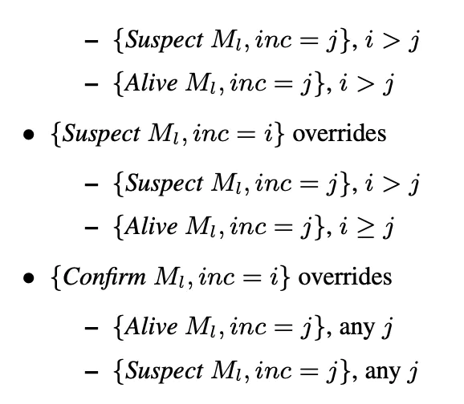

# 论文 <Scalable Weakly-consistent Infection-style process group Membership protocol>

> 
> 可扩展弱一致性感染型进程组成员协议
> 
> 进程组的成员关系协议
> 
> * 可伸缩性
> * 弱一致性
> * 感染性
> 
> 用于分布式系统中进程的健康检测或者说错误检测
> 
> SWIM是通过Gossip实现的Membership保持协议，也就是维护分布式系统节点的状态

# 成员资格协议

> 成员资格协议的可伸缩型和执行效率主要由以下几个方面确定：
> 
> 完备性：是不是每个失效的进程最终都能够检测到？
> 
> 失效节点的检测速度：一个节点失效到它被非失效节点检测到的平均时间间隔是多长？
> 
> 准确性：实际上进程未失效但却被认为是失效的频度（即误判率）是多少？
> 
> 信息量：每个节点生成的网络通信的信息量有多大，它是否也是分布式的？
> 
> 理想情况下，我们需要这样的协议：它一定要完全100%准确，这就意味着可以检测到每一个失效进程，而且不存在任何误判。然而，像分布式系统里的其他协议一样，存在这样的事实：在异步网络上保证100%的完备和准确是不可能的。因此许多成员资格协议（包括SWIM)为了完备性就会降低准确性，同时尽最大可能降低误判率。
> 

# 模块
## Failure Detector, 用于Node失败检测
> 
> 概念：
> 
> T’: 协议周期，2次探测的时间间隔
> k: k个节点
> 该协议中，若Mi检测Mj状态，则先发一个ping包到Mj，若Mj未在超时时间内ack，则Mi随机选择k个节点，发送间接探测ping-req包，k个节点如Mh收到ping-req请求，将会ping Mj并将结果返回给Mi。若任意一个ping-req返回Mj存活，则Mj存活。
> 
> 上述过程，包含3个round-trip的网络过程，Mi->Mj, Mi->Mh, Mh->Mj，所以T’ 要大于3个超时；如T’=1s, timeout=200ms

## Dissemination 模块，用于将Node主动加入、退出或失败的信息传播出去

> 当Mi检测到Mj失败，会利用IP多播等方式，发送一条 failed(Mj) 的消息，收到消息的Node，会把Mj从本地Node表中踢除。

# 思考

所以理论上, 基于这个的linux集群网络稳定性监控机制应该是有的吧.

# Reference
1. [Scalable Weakly \| 大专栏](https://www.dazhuanlan.com/2019/11/04/5dbf34e0e3a3a/)
2. [致远的 BLOG](http://understars.ltd/archives/swim.md
3. [分布式系统中的 SWIM 成员协议 \- OSCHINA \- 中文开源技术交流社区](https://www.oschina.net/translate/swim?cmp))