## [BlueStore V2 \- an Evolutionary Step Forward \- Adam Kupczyk, IBM & Mark Nelson, Clyso GmbH \- YouTube](https://www.youtube.com/watch?v=FVUoGw6kY5k)

#### 规划
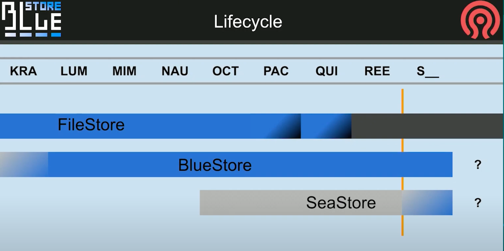

filestore 在 Pacific 和 Quincy 中被弃用，在 Reef 中被完全移除

bluestore目前暂不知道什么时候会移出, 但是期望是将来seastore能够替代他. 也许会发生一些不可预料的新内容让他变得更好.

#### 成熟 vs 变革

目前, 根据tracker和telemetry的统计, bluestore已经成熟了. 目前进入维护阶段

其中telemetry提供的错误会进入tracker队列的顶端. 而一些只提了单子, 但没有信息的单子就暂时没有办法处理.

更进一步的, 则是在bluestore的performance meeting例会和头脑风暴例会上进行讨论.

#### 3个还会长期阻塞我们的bug单

##### 关于Onode的引用计数, 关于Onode的缓存的assert SIGSEGV

关于Onode的引用计数, 关于Onode的缓存. 很恼人, 不过不够critical, osd自动重启后数据没问题.

问题点
* 引用技术为0时自动清理, 很多版本中都很普遍而且我们甚至无法向后移植它. 
* 在Octopus版本中, 在引入技术为2时, 我们需要额外的操作.
* 除了引用计数外, 还存活在了缓存中. 如果被pinned, 无法修改他. 只有unpined才能修改, 但是unpin依赖lock.

这个问题花了9条PR, 其中4条真的进入的后续版本, 直到Igor真的解决了, 但不是从技术上解决的. 

做了个从缓存中lazy unpining的功能.  所以可以使他正常工作.

我们之所以不能回滚掉他, 是因为基于他有太多内容已经变更.  如果有个解决方案, 我们会考虑, 但是Pacific和Quincy版本的解决方案将有所不同.

##### rocksdb checksum mismatch

rocksdb损坏后, 没有办法还原时, OSD只能重新部署, 没有办法绕过他. 有两个原因

###### 1. direct vs buffed

问题来源非常早, 来源于linux manual中说的不应该同时使用direct和buffered mode. 

我们没有这么做, 但是我们保证打开同一个设备, 但永远不会使用read buffered和read direct读取同一个block device. 除了bluefs log.

这个让我们付出了代价, 当你重启设备/osd, 他启动的非常快时, 你可能无法取得你刚才写到bluefs log上的数据. 其中一些对rocksdb表的更新, 

结果是我们在Nuatilus中引入了另一个问题, 我们修改了bluestore和bluefs只建传输的内存的部分. 目前为止这部分是不可见的. 

TODO: 暂未找到这条PR的单子.

###### 2. 
#### blueFS ENOSPC
[os/bluestore: enable 4K allocation unit for BlueFS by ifed01 · Pull Request \#48854 · ceph/ceph](https://github.com/ceph/ceph/pull/48854)

这个问题今年刚在master分支修复, 会backport到pacific分支, 但尚未完毕, 值得关注.

具体指代的是block 上仍有空间, 但是碎片化, 没有能提供给bluefs的满足对齐要求的空间.

这个问题最早在luminous版本, 我们做了个`flip-flop`触发器, 在block和bluefs之间`gifting`和`reclaiming`数据, 1M对齐显然是可怕的, 因此我们选择了64K 的chunk. 这部分持续了很久, 最终我们现在有个支持4K对齐的bluefs. 

可能有人会问为什么设置一个4K的bluefs chunk 需要这个久. 这是个好问题.

最早创造bluefs的时候, 有一个bluefs启动的4K的超级块. 当启动时, 从一个4K扇区读取重放日志. 如果chunks大小很大, 你的log就不可能会非常大.

但是如果是4K大小的chunks, logs就很有可能被用尽. 很快就可以得到非常零碎的bluefs log. 因此,4k大小时, 只是不适合那个大小.

所以现在, 通过`special trampoline multi-stage booting of bluefs log`可以实现了(待理解, 暂未在PR中找到解释的关键词),  性能在大量碎片时当然不太好, 但是不会再失败了. 不再会有半夜因多个osd bluefs空间不足被叫起来, 不得不去迁移数据的情况.

### 目录

为什么这些很重要, 因为这样我们就有更多时间去给bluestore添加新功能. 

这里有一张完整功能规划的图. 这些如果实现了将提供巨大的质量改进. 其中有一些次要优先级, 但是简单一些的. 

### free disc space fragmentation

#### stupid 分配器

早期我们引入了stupid 分配器, 实际上这个名字我觉得不太好, 功能很简单表现也很不错. 

在我们测试过程中发现他创建了很多碎片, 可用空间碎片化之后, 只能期望你的新对象也是碎片化的, 自然性能就会下降, 甚至会导致bluefs内部空间也无法回收. 

一般在性能下降之前, bluefs就会告诉你空间不足了.

这是个现实中的例子, 可能是你们中的一个集群. 

在固定地点长期运行之后的图 

这个图不是截断的, 就是19个allocation unit. 会看到长期运行之后, 大部分对象都在少数分配单元中.

这张图表达的不是对数也不是线性刻度, 单纯表达的有数量级差异.

之所以这样说, 是因为当时用户需要我们从no space的情况下将数据救回来.

#### bitmap 分配器
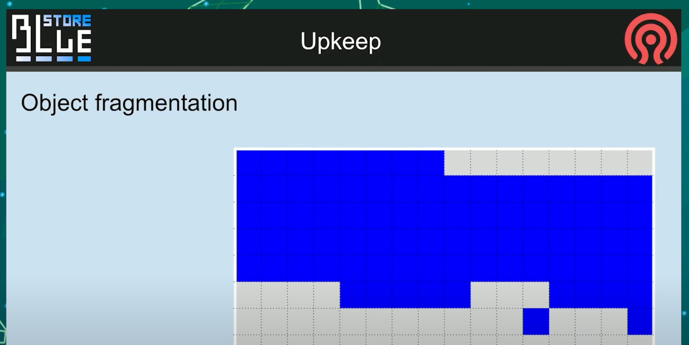

然后, 如果你想要你的对象分段像这样连续, 选择bitmap分配器. 但是你的对象会像下面这样, 所以最终并没有性能提升

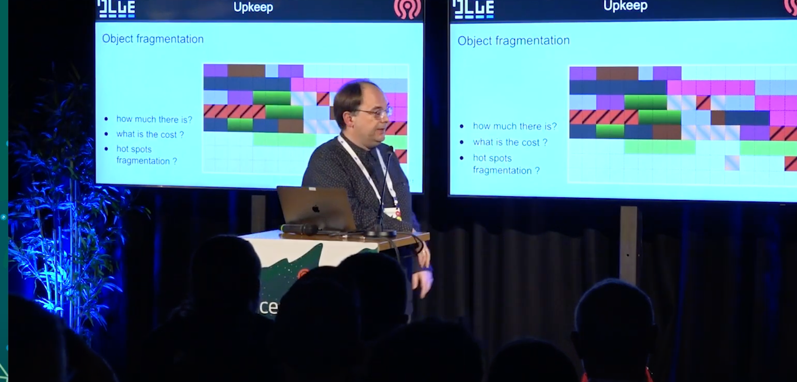

##### how much fragments there is?

我们真的不知道, 因为有个基于分片数量的wired碎片打分. 这个确实告诉了你bluefs的内部空间条件, 不过现在他不再有用.

所以我们需要一张直方图.不过即便我们有碎片, 也并不是很明显有多少成本. 如果你正在运行RBD, 你是以4MB的块以某种方式碎片化. 他们在不同的时间被覆盖. 如果RBD的对面正在运行任何文件系统, 仍旧是没问题.

如果chunks代表不同的文件, 只要不发生同时读取他们的事情, 你仍旧不会受到碎片的影响.

TODO: why?

当然Romin会抱怨, 在scrub的时候, 所有的对象都是red, 会拖慢scrub的速度.

我认为从这个过程中, 我们会得到一个感觉, 也许应该只修复真正热点的对象的碎片化.

待会会有张关于碎片的幻灯片. 

现在让我讲下其他的主题
#### rocksdb

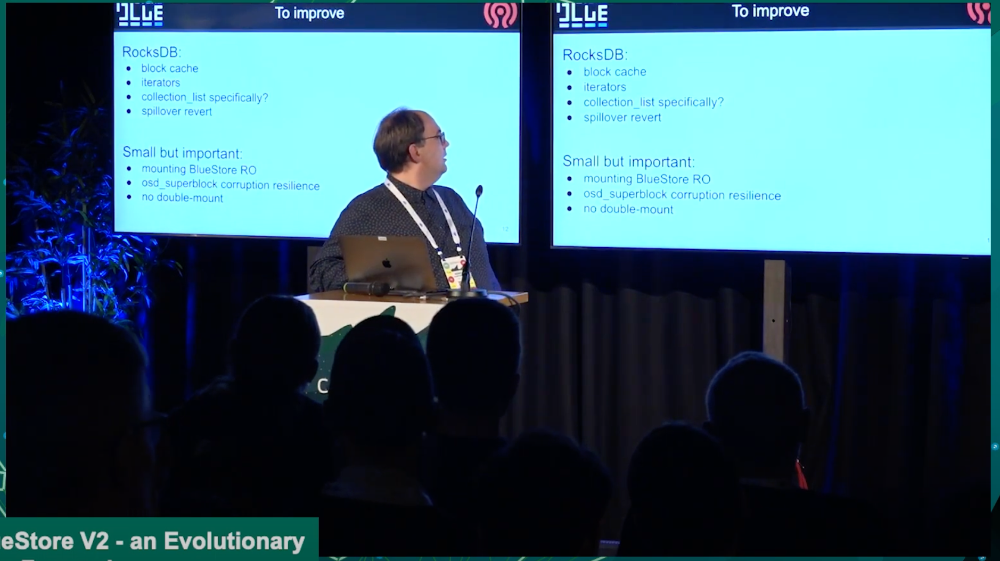

##### block cache

当我们合并rocksdb给bluestore时, 我们实现了我们自己的block cache , 因为我们需要内存管理. 现在我们的block cache和其他的cache之间循环,这部分要感谢Mark Nelson, 目前这部分是个非常好的动态过程, 对于最热点地区的goals和gifts是最令人难忘的. 

但是似乎有些东西在和block cache运作时令人感到strinky(恶臭的). 在一些情况下我们似乎并没有真正使用block cache , 但是莫名其妙的提供大量相等于Block cache数量的linux page cache可以解决性能问题. 

所以要么是我们错误的实现了它, 我们只是缓存了它, 然后我们并没有在rocksdb想要时, 给回它.

亦或是其他的一些错误导致我们无法归还它. 这个问题已经很长时间了.

##### iterations
为什么block cache非常重要呢? 因为如果不缓存数据, 迭代是慢的. 并且在rocksdb中迭代可能会花很多时间, 并且很多人抱怨甚至到了试图删除空的collection的度.  这个是删除PG的最后一步, 它最后一次尝试遍历只是为了检查是否真的是空的. 当所有内容被删除时, 有很多墓碑, 这些只是thmb stones, 但它仍然需要花很多时间来做这个.

em, 我听到一个好消息, 我认为是时候承认Corey Snyder在改进迭代器方面迈出了非常好的一步.

因为他的一条PR, 使用range iterators, 在大部分场景下, 可以把事情分开进行.

##### collection_list specifially

但如果我们遇到迭代器问题, 我们可能会使用collection_list 的方案来解决它. 

不过暂时还不知道怎么去做他,  不颠覆当前的架构.

因为我们当前确实从把所有内容放在一个地方并使用rocksdb迭代中收益良多.

也许其中一个解决方案可能是用speedb替换rocksbd. speedb有一个模式, 他们告知了我, 我也测试了一下,  姑且让我们假设它正常工作, 当你区分了key 流和 value 流, 它能够做什么?

如果我们把他用在onode collection, 即便我们只有某个范围内的墓碑, 它会是个非常短的表. 它只包含名称, 而名称在rocksdb中可以被很好的压缩. 所以它应该会快得多. 当然这还只是个想法

##### spillover revert
另一个spliiover revert. 溢出是我们很不喜欢的一种情况, 但你有一个非常慢的HDD, 你用nvme/ssd的一部分来给他备份.  这不是一个很好的组合,

然后没有空间放你的rocksdb的meta, 它必须使用hdd上的临时空间, 这个不会出问题. 只是非常慢, 问题发生在当他只是个过渡性质的溢出. 因为如果你空间真的多于容量, 那没有什么可以解决的. 但是如果你压缩一个db刚好比你的数据库空间一半大一点. 它可能会溢出到慢速设备, 并且它会在那停留很长一段时间. 因为如果它碰巧是一个非常深的压缩, 影响了很多层级. 你的新SSd文件将驻留很长时间, 而溢出恢复只是简单的从慢速设备移动回来到db的概念. 

正如你们所知, bluefs files可以驻留在这些设备中的任何一个上, 只是物理上执行复制并切换extents到新的形状上, 这部分没问题. 

棘手的部分是如何做出复制什么的决定, 这很困难. 因为我们没有跟踪, 并不区分hot SST tables ,也许叫做SSD tables. 亦或是我期望的情况, 甚至可能是某些部分的一部分SSD tables很热, 与此同时其他表很慢. 但我们可能会忽略它, 只是为了简化一些其他的东西. 

#### Mounting bluestore RO
可能有人会问, 为什么这里会有这个深奥的功能

因为任何原因, bluestore失败时, 你想要救回一些PG数据, 真的很难使用ceph-objectstore-tool来做到这件事.

举例来说, 你进入了一个真的没有空间继续写的情况下, rocksdb需求更多空间, 而你的设备确实没有了. 你不能用ceph-objectstore-tool去挂载rocksdb, 并解压导出数据. 

因为bluestore期望`待定名字`完成所有pending压缩, 不同的权限等等. 所以你被困在了这个点上, 只是想做一点点修改.

所以你想得到一个只读的bluestore, 只需要保持冻结状态, 可以加载到内存里, 在内存里的rocksdb, 从而可以将数据提取到另一个osd的superblock中. 

我期望这件事不会发生在你们身上, 但是确实发生在了很多人身上.

OSD无法启动, 因为OSD写入的第一个对象是OSD超级块,因为对于他来说, 选中它知道他自己的状态并继续是需要的.  有一些技术可以恢复, 不过这部分还是相对困难的, 成功率不是100%.  现在OSD 超级块, 再次感谢Igor, 将位于多个地方, 包括rocksdb本身, 并且代码也变了, 对象通常处在磁盘开头的对象, 现在也可能存在不同的地方.  在大多数环境中, 超级块都处于磁盘头, 因为它需要占用第一个分配单元, 并且它总是被更新, 且他很小. 它总是进入不同的权限路线, 所以它只是被覆盖了, 难怪osd开头的任何损坏都会引起osd的超级块崩溃.

一个我最喜欢的例子是, 你如何下放一个功能, 很长时间以来真的不可能挂载bluestore 2次, 我们使用flock, 管理资源独占锁来实现挂载bluestore 2次. 但当容器化的时候, 它就变得无用了. 因为容器化环境也区分了那些锁, 所以如果你有一个讨厌的情况, 你尝试运行你的容器2次, 你得到它, 并且你的超级块损坏了, 因为其中一个覆盖了第二个, 这也是一个问题我们已经解决了的.

我现在除了locking之外, 我们还使用了额外的方式.

为什么不使用内核级特殊处理, 是因为打开块设备独占, 对于其他所有块设备的工作方式梧桐, 我无法打破它. 如果有人能够打破那个保护, 麻烦告知我.

TODO: osd启动时有peek_meta, 不知道是不是这个

#### To improve (CD)

在CD中, 我们需要清理的, mount/umount顺序是一点, 我们存放可配置的地方bluefs, rocksdb ,RO, 关闭/打开, 读分配. 现在可以简称 free list的清理.

以及Greg实现的一个非常好的功能, 删除rocksdb关于分配的升级. 所以我们现在节省了很多时间在kv sync thread上, 不更新位置.

我真正想做的事一对对检查, 我不知道admin socket 最有可能或者不同的类型, 对我来说, 就是这样, 好奇我需要看看我的元数据是什么样的, 我希望能在运行时关联它, 我不想运行一些调试登记的bluestore只是为了看看对象在磁盘上是如何结构化的, 此时所有osd不得不回复我.

我自己的笔记, 我感兴趣的事我的SharedBlobs是如何拆分, 等等. 

和运行时检查相同, 但是也区分在线或者撩闲. 当然runtime cache/buffers 现在基本上更好, 也很有价值对于碎片化的报告. 

我想要直方图, 以及分裂的热点区域是什么, 碎片化的可能成本是多少. 

#### Defragmentation
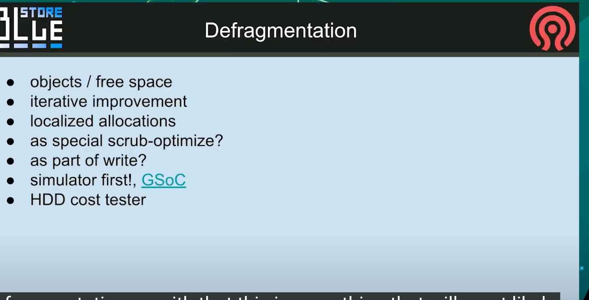

所以这部分是接下来碎片化最有可能完成的事情, 它将包括自由空间的碎片和应该可以再一次运行中完成的对象, 我们正在考虑使用一种算法来迭代的提供一些迭代改进, 我们不希望一个全局的操作来操作OSD每周半小时, 期望它内联的运行, 或者如果我们提供更好的分配器和更好的策略, 我们跳过他, 新的OSD对于现有的部署不会那么碎片化, 也许我们在想, 对于本地化分配会有所帮助. 意味着, 吸纳关系那改一下, 你把可用磁盘空间分配给某些区域, 如果你需要空间, 你想要获得接近分配大小的卡攻坚, 但是你真的想要接近这个对象的空间爱你, 你已经知道对象的所有其他数据, 是否相信他不是这种情况, 我们只是在分配时, 我们不知道请求它的对象在哪里. 我们的想法是即便对于spinner, 如果有个相同的cyliner, 我们仍然大体上还可以紧挨着他.

当然, 对于固态的策略并没有真正发挥作用, 更重要的是落盘可能不是以正确的顺序, 而是由于无论硬盘内部的架构如何, 你都可以一口气读到他. 

以及如何做一些额外特别的scrub优化的一部分来完成, 事实上我们不知道.

目前我们正在和GSoC合作, 我们会创建一个模拟器, 尽可能模拟一些工作集. 想看到运行成年累月之后的垃圾数据之后的表现.

因为很不想bluestore代码对于实验不够好. 你只有实现模拟器才能让我们有可能以最小的成本来测试不同的分配器或则和不同的策略.

最后一个是碰巧针对HDD, 我有一个问题如何通过微调来预测实际延时. 

这是一种模式允许你, 构造删除很多数据, 只更新元数据的集群, 当我想要看看我的硬盘在一年的数据碎片化之后的表现, 我只需要切换模式, 插入真实设备, 他就会执行真实操作, 这样就可以作为真实的长时间运行后的测试工具.

#### Lazy Compression

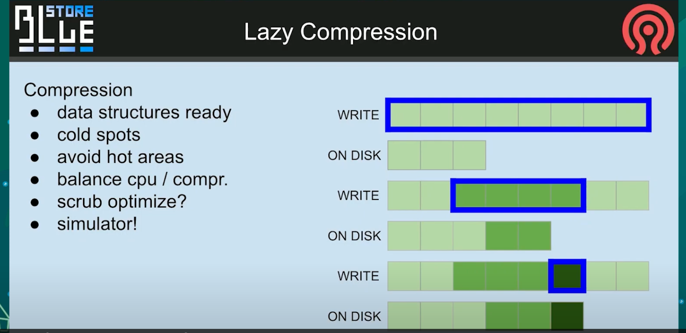

我们可能会抛弃当前的数据结构, 摆脱我们目前的所有缺陷, 并让他离线.

这样我们可以平衡你想要让他使用多少cpu, 选择只有冷数据进行压缩, 这样我们就不再会遇到那种奇怪的情况, 我们应该使用3个分配单元, 但是实际却使用了6个. 这是我们内部组织blob的方式. 这对我们来说更好. 而且在适应之后, 来自前面那一部分的模拟器应该能够给我们预测使用惰性压缩有多好.

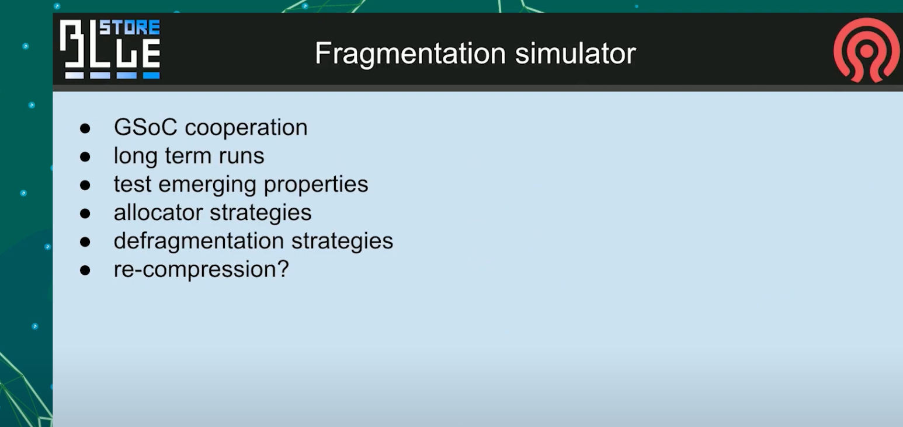

#### custom WAL
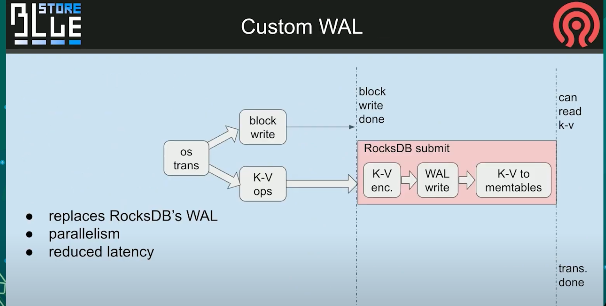

然后以一个额外的概念, 来自Igor. 这是一个自定义WAL, 意味着我们删除了当前场景, rocksdb正在实现一个headlock , 我们在这里有延时. 在这条竖线后面, 我们可以通知用户事务已经结束. 
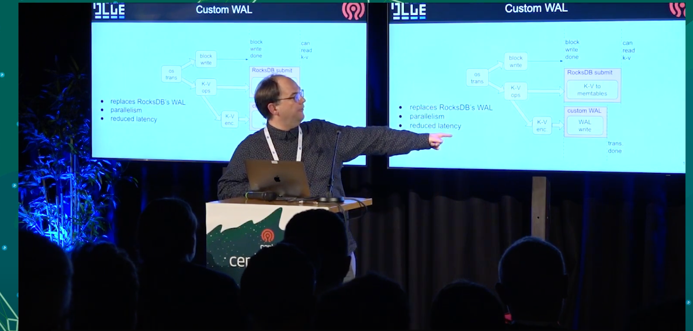

我们可以修改它, 并提供我们自己的WAL日志, 我们在kvsync线程总并行处理主表, 同时我们也可以压缩他. 我们队数据做了一个fdat, 所以他更早的匹配, 是为了发出事务最终完成的信号, 取决于这里写操作可以像读其他任何我可能错的内容一样执行.

这个概念是为了进一步减少经过rocksdb的数据量. 我们将为PG log创建一个特殊通道,而不是像当前那样讲PG log更新作为新的简直更新到rocksdb中, 每个他们都会写入一些特殊的环形对象, 也许带有一个写headlock. 目前这部分还没有决定, 但我们会卸载掉那个关键的东西, 

#### improve Deferred
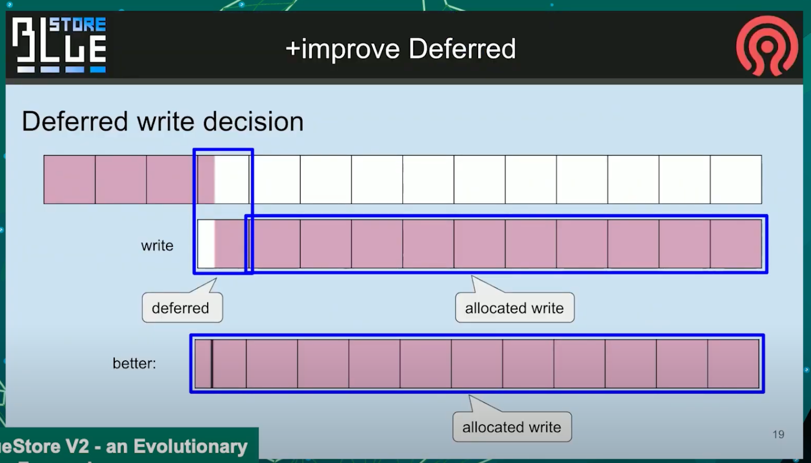

因为我想大家都知道kvsync线程是个关键的部分. 在bluestore中产生延时.

这是个简单的解释, 我们当前的默认机制太粗糙了, 想象一下, 你追加到你已经写了一些数据的对象, 你追加数据, 现在有一个扇区需要被替换, 但是那个进入了不同的机制, 但是所有其他的只是分配, 这是讲不通的. 因为如果你有spinner, 意味着你必须访问2个地方. 但是实际上你可以只访问其中一个地方

#### New Deferred
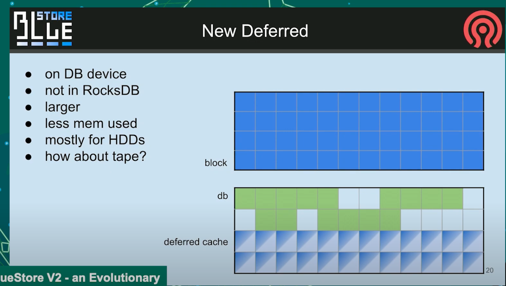

毫无疑问, 这是一个完全不同的东西, 我们正在考虑制作一个新的延迟机制. 不进保留在rocksdb中derred的对象, 那部分应该只保留一部分时间, 不然会不得不被rocksdb写入SST, 产生巨大的写惩罚, 我们想保留一个特殊的延时缓存, 并添加一个长期使用的快速分区, 这样你就可以有10/20/50G的数据, 将你的数据缓存在一个慢速设备中, 我们将允许保留它, 只在有一些迭代过程时, 才触发清理. 这样有序的进行, 好的部分是缓存的任何对象都指向已经分配到某处扇区, 所以没有注入什么奇怪的逻辑.

