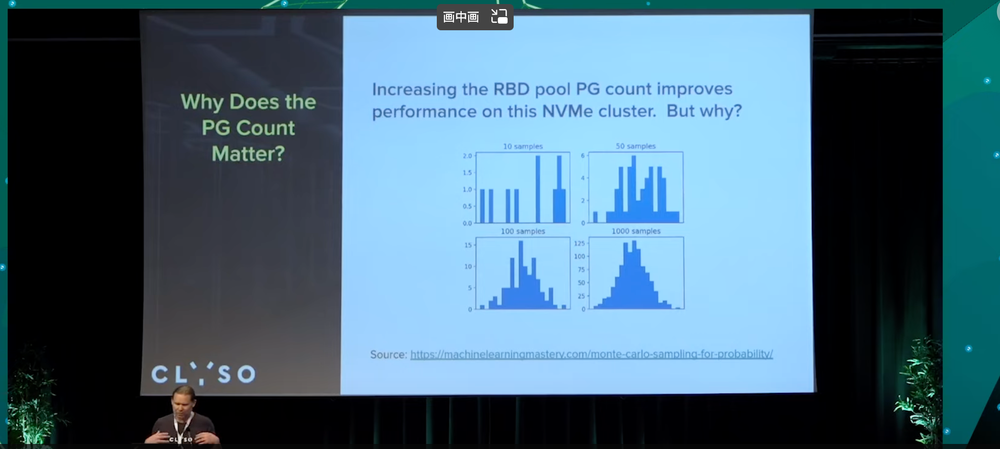
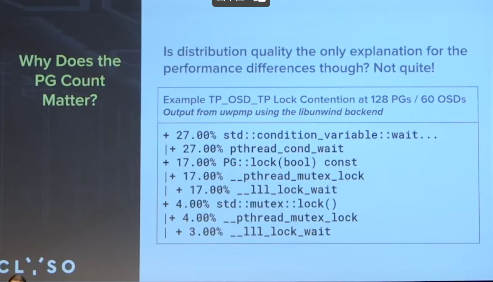
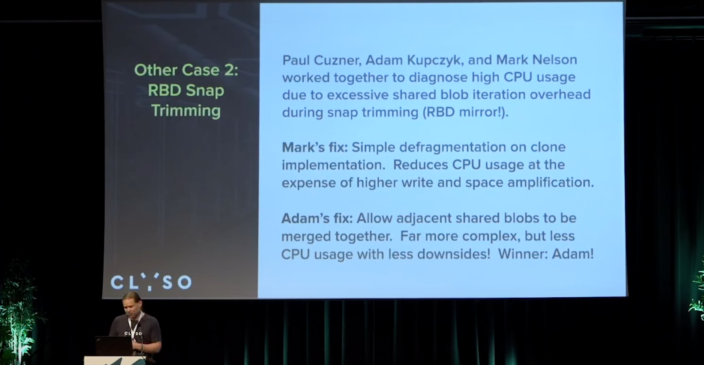
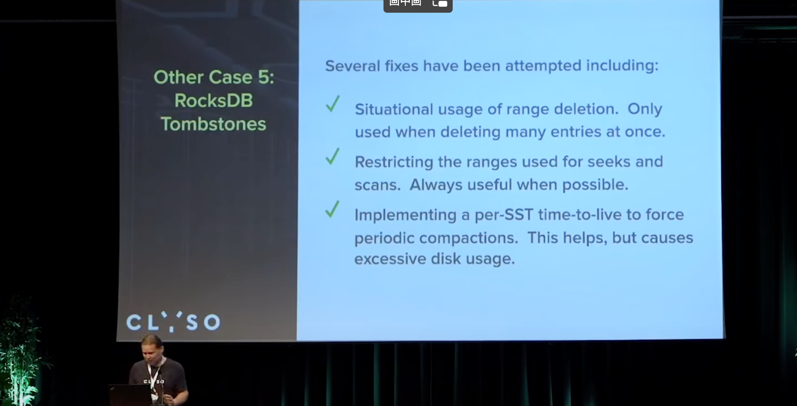
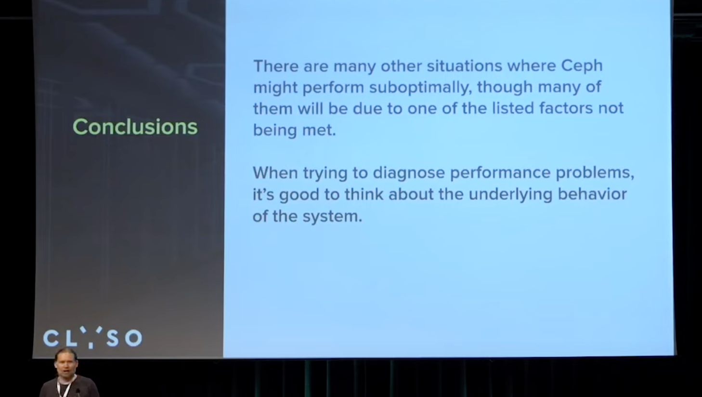
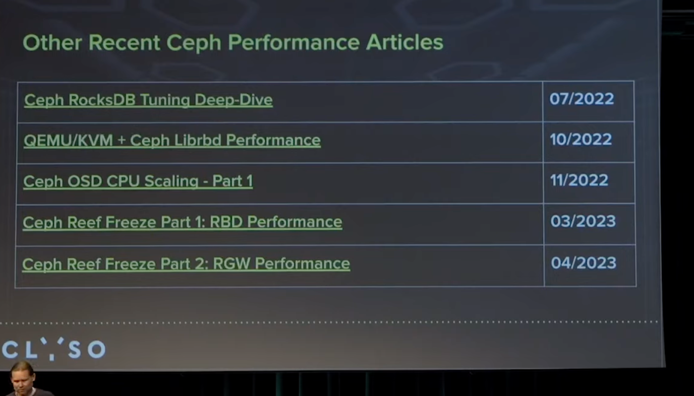

## [Ceph Performance Tuning: From Bluestore to RBD \- Mark Nelson, Clyso GmbH \- YouTube](https://www.youtube.com/watch?v=7D5Bgd5TuYw&list=PLrBUGiINAakPd9nuoorqeOuS9P9MTWos3&index=37)

#### 推荐性能优化时使用工具

#### 当前性能测试, 60个osd, 450W 随机4K读, 平均75K每个osd.

#### 硬件性能如何很关键, 测试过程中升级驱动解决了nvme Q8持续运行性能波动显著下降问题

#### pg数量对性能影响

##### 随机读, 每个osd `8192*3/60=409.6`个pg, 相比正常理解里的100, 差挺多的
##### 随机写, 每个osd`2048*3/60=102.4` , 倒是正常

#### 为什么pg数量有效?

pg数少时的效果似乎与蒙特卡洛算法有关?

> Random distributions look clumpy at low samples counts. Higher PG counts results in a more even workload and data distribution across OSDs. The new primary workload balancer being developed by Josh Salomon and Laura Flores will attempt to improve the distribution even at low PG counts.
>
> Is distribution quality the only explanation for the performance differences though?

主pg的均衡, 有助于在pg数少时提高性能.

#### 如pg争用是pg数外影响性能的一点

### 其他有趣的样例

#### cephfs在多mds, 通过动态子树分区得到了不错的效果

#### RBD Snap Trimming

似乎是在shared-blob上做了一些努力, 碎片整理等? 以及不用遍历所有的元数据了.

#### OSD Threading

> Why does performance level off, then drop, as the number of threads per shard increases? A key point is that there is only 1 messenger thread in this test. With more messenger threads, the effect diminishes.
> 
> shard_lock contention? Possibly. We might spend too much time in notify_one / notify_all with relation to the wait_lock. More testing needed.

主要是msgr线程数也需要考虑匹配. 具体原因还需要更多实验.

#### PGLog/RocksDB Interaction

主要集中在下述2个场景, 针对2个的冲突, 修改了一些rocksdb逻辑, 会在reef版本上车.

###### 针对kv sync, 我们期望尽可能小的memtable(内部实现的跳表), 减少此时rocksdb为了保序消耗的大量cpu,

###### 针对pg log写入到rocksdb head log, pg log本身是期望尽可能短存在的一个东西, 我们不期望触发rocksdb的compact被压缩, 因此期望内存使用越大越好, 使用了big buffer, 期望在flush memtable时, 这些pg log已经被标注tombstone, 已经可以删除, 无需写入数据库. 无需落盘

##### bluestore WAL prototype

期望能达成无需使用rocksdb的 head log, 初步看到效果单OSD 12W

#### RocksDB Tombstones

可能会出现一个情况, 由于迭代大量的删除墓碑, 可能导致osd 心跳超时

##### range deletion 仅需要一次删除大量场景下有效, 4-5年前实验时效果不好, 听说最近有改进, 还没关注

##### 限制搜索和扫描范围, 目前使用有效

##### 强制周期压缩sst, 对磁盘压力大, 且存在引起心跳超时风险. mark开发的一个小PR [\[WIP\] kv/RocksDBStore: Improved RocksDB Settings and Tombstone behavior by markhpc · Pull Request \#47221 · ceph/ceph](https://github.com/ceph/ceph/pull/47221/files)

逻辑比较简单, 只是迭代过程中, 看到一定数量的墓碑, 然后设置了强制压缩条件, 则触发压缩.

###### 在Digital Ocean使用过程中, 对延时有了极大的优化效果.

这个图片是DO提供的, 看延时应该是个非常大压力的hdd集群, 60s 延时

##### David Orman团队在云上运行了一个非常大的集群, 使用了rocksdb的TTL来使用刚才那个patch, 磁盘利用率从90-95%下降到20-25%

#### 总结

#### 提问
##### 自动化调优控制memtables size 是否有助于PGLog/RocksDB Interaction问题?
只修改memtable size 会导致性能下降

但是如果配合同时修改level 0/1等的size大小到恰当好处, 即从memtable->level0->level1控制的很好, 效果应该会很好, 但是这个场景很复杂. 我们后续可以考虑.

##### 检测什么时候你的块设备会开始拖累你的集群性能是否有帮助?

确实有帮助, 值得做.