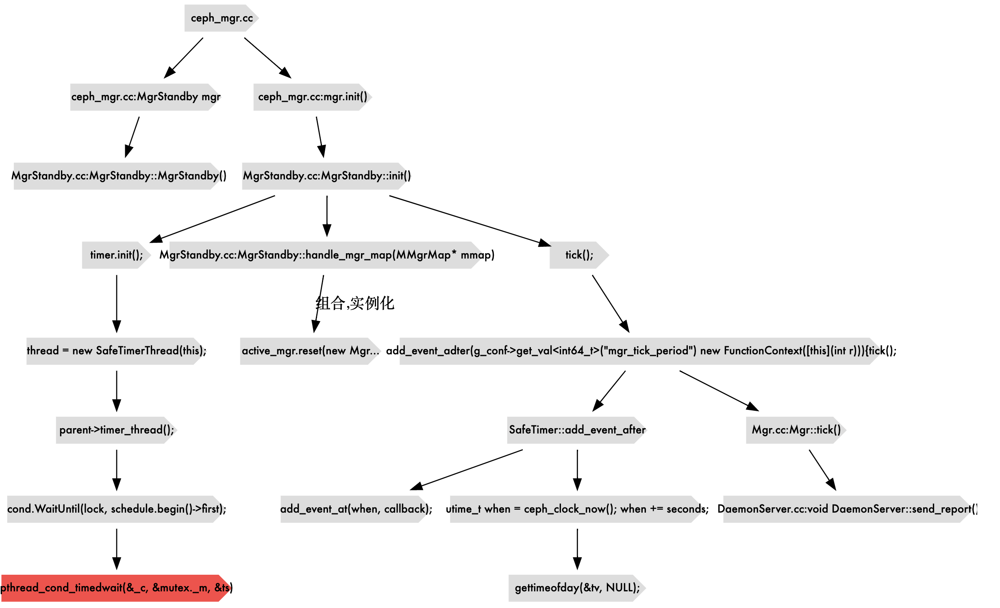
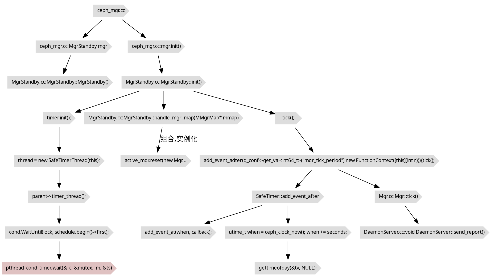

最近遇到这样一个情况，ceph运行环境里时间被修改到以前的时间之后，`ceph -s`和`ceph df`都看不到在这之后创建的资源池了。

在大佬的带领下，得知了这部分数据来源于`ceph-mgr`的`pgmap`例行同步。时间出现变化之后，debug日志里也的确不再出现pgmap的同步日志了。从这个方向找到了入手点。

<!--more-->

## ceph-mgr pgmap日志代码溯源（基于Luminous版本）

根据打开调试信息后, 看到的日志中大量的`pgmap v137057: 565 pgs: 576 active+clean`

搜索日志`pgmap v`，是在`DaemonServer.cc`中调用的`send_report`

### 自底向上




MgrStandby和Mgr是组合关系，MgrStandby里实例化了一个active的Mgr

在触发一次tick之后，还会记录一个事件，好像让下一次触发`timer.add_event_adter(g_conf->get_val<int64_t>("mgr_tick_period") new FunctionContext([this](int r))){ tick();}`的逻辑

对，在`MgrStandby`启动时调用`init`,触发第一次`tick`。之后应该就是这个计时器在工作。

这个`mgr_tick_period`的功能，看看咋工作的，好像只是`std::chrono::seconds`的封装。

这个`mgr_tick_period`应该只是个配置文件，记录多久同步的吧，果然，`ceph daemon`里可以看到是2s一次。

`timer.add_event_after`应该才是重头戏，这里居然是设置的根据时间戳来调用`add_event_at`添加回调的任务……当`timer_thread`执行到`ceph_clock_now`，用`gettimeofday`拿到系统时间，如果当前时间大于设置的时间，就是永远不会触发了?

所以这里存在一个潜在问题，是不是所有使用这个计时器的地方都存在会直接受到这个时钟往回调影响的问题。目前来看定时器应该只有这一个。

## SafeTimer理解

``` c++

class SafeTimer
{
  CephContext *cct;
  Mutex& lock;
  Cond cond;
  bool safe_callbacks; // 是否是safe_callbacks

  friend class SafeTimerThread;
  SafeTimerThread *thread;  //定时器执行线程

  void timer_thread(); //本函数一次检查scheduler中的任务是否到期，其循环检查任务是否到期执行。
  void _shutdown();

  std::multimap<utime_t, Context*> schedule; //目标时间和定时任务执行函数Context
  std::map<Context*, std::multimap<utime_t, Context*>::iterator> events;  //定时任务<-->定时任务在shedule中的位置映射
  bool stopping;     //是否停止

// 下面这个应该才是真实在后台不停刷新检查定时器任务的线程
class SafeTimerThread : public Thread {
  SafeTimer *parent;
public:
  explicit SafeTimerThread(SafeTimer *s) : parent(s) {}
  void *entry() override {
    parent->timer_thread();
    return NULL;
  }
};
```

以ceph-mgr为例，调用顺序是这样的。

`ceph_mgr.cc`里实例化`MgrStandby`，`MgrStandby`实例化`SafeTimer`,然后`ceph_mgr.cc`调用`mgr.init`，里面调用`SafeTimer`实例的`init`，在这里

``` c++
thread = new SafeTimerThread(this);
thread->create("safe_timer");
```

`mgr`的定时器任务就开始周期执行了。根据`safe_callbacks`这把锁的状态决定是否要申请到锁阻塞式执行任务，还是非阻塞式。

时间的触发基于`cond.WaitUnitl(lock, schedule.begin()->first`这个的实现。这个中主要依赖的应该是`pthread_cond_timedwait`这个超时等待接口。似乎有些库里的`sleep`就是通过这个实现的。

`pthread_cond_timedwait()`函数阻塞住调用该函数的线程，等待由cond指定的条件被触发`（pthread_cond_broadcast() or pthread_cond_signal()）`。如果超时了，就可以作为定时器使用。这里传入的是当前的`abstime`。

## 是否可能使用monotonic运行时间，而不是绝对时间？

但是这块我好像看到，这个函数其实是支持传入`monotonic`时钟的，这个时钟开机开始计数，不受外部影响。

根据
``` bash
#man 3 pthread_condattr
DESCRIPTION
     Condition attribute objects are used to specify parameters to the
     pthread_cond_init(3) function.  The pthread_condattr_init() function
     initializes a condition attribute object with the default attributes and
     the pthread_condattr_destroy() function destroys a condition attribute
     object.  The pthread_condattr_getclock() function shall obtain the value
     of the clock attributes object referenced by attr.  The
     pthread_condattr_setclock() function sets the system clock to be used for
     time comparisons to the one specified in clock.  Valid clock values are
     **CLOCK_MONOTONIC** and **CLOCK_REALTIME** (the default).  The
     pthread_condattr_getpshared() function shall obtain the value of the
     process-shared attribute from the attributes object referenced by attr.
     The pthread_condattr_setpshared() function shall set the process-shared
     attribute in an initialized attributes object referenced by attr.

```

可见应该是支持的，但是这个时钟不知道在分布式环境，能不能保证多节点内及时被chrony或者ntp协调一致。根据这个[^5]来看，应该是能通过ntp服务来保障长时间稳定一致的。

## ceph社区是否存在相关思路的方案

根据[^6]的结果来说，`mds`是应用上了这套，也向下移植到了`Luminous`版本。

根据[^7]，在`bluestore`的`perf`上也用上了这个时钟来进行`latency`延时统计。在`Nautilus`版本里增加的功能。

在`Luminous`版本里，我也搜到了这个在[^7]里使用的`coarse_mono_clock::now()`时钟。

根据[^8]，在`Mimic`版本里，好像`mon`也迁移了部分。

根据[^10]，在`Mimic`版本里，`rados bench`也开始使用这个时钟。

所以都只是部分组件已支持, 只是`mgr`没有支持, 目前来看也没有统一迁移到支持的计划. 

官方已提供[common/Timer: use mono\_clock for clock\_t by tchaikov · Pull Request \#39273 · ceph/ceph](https://github.com/ceph/ceph/pull/39273)

## Reference
1. 《Ceph源码分析》
2. [ceph中的SafeTimer类详解\_turou3442的博客\-CSDN博客\_ceph mds 定时器safe\_timer线程cpu占用率高](https://blog.csdn.net/turou3442/article/details/96441221)
3. [ceph中的SafeTimer 用法和分析\_jason的笔记\-CSDN博客\_safe\_timer](https://blog.csdn.net/tiantao2012/article/details/78426276)
4. [linux多线程编程，你还在用sleep么？用pthread\_cond\_timedwait吧 \- shzwork的个人空间 \- OSCHINA](https://my.oschina.net/u/4000302/blog/3040003)
5. [linux \- What is the difference between CLOCK\_MONOTONIC & CLOCK\_MONOTONIC\_RAW? \- Stack Overflow](https://stackoverflow.com/questions/14270300/what-is-the-difference-between-clock-monotonic-clock-monotonic-raw)
6. [Bug \#26959: mds: use monotonic clock for beacon message timekeeping \- fs \- Ceph](https://tracker.ceph.com/issues/26959)
7. [os/bluestore: use the monotonic clock for perf counters latencies by mogeb · Pull Request \#22121 · ceph/ceph](https://github.com/ceph/ceph/pull/22121)
8. [Ceph v14\.2\.0 Nautilus released \- Ceph](https://ceph.io/releases/v14-2-0-nautilus-released/)
9. [mon: a few conversions to monotonic clock by batrick · Pull Request \#18595 · ceph/ceph](https://github.com/ceph/ceph/pull/18595)
10. [tools/rados: use the monotonic clock in rados bench by mogeb · Pull Request \#18588 · ceph/ceph](https://github.com/ceph/ceph/pull/18588)

# 附录
