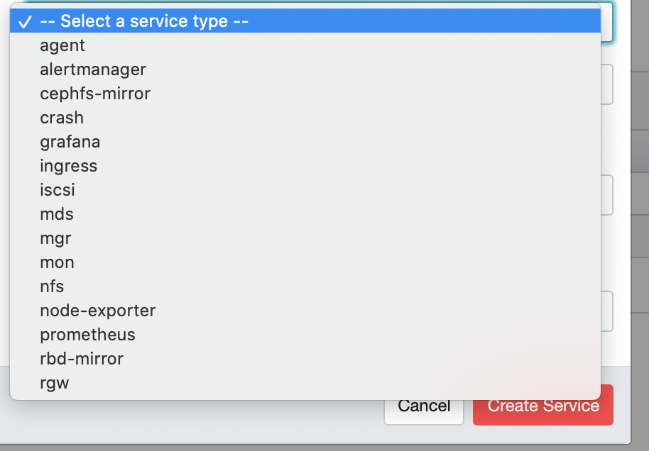

本篇主要是把旧文重新整理一下.


# 定位
目前已经为唯一的非自研的开源对接ceph的, 已将grafana嵌入. 

* 监控/告警
  * 支持大部分想看到的数据
* 实施方面, 对接cephadm? 
  * 那是否对接ceph-ansible? 
    * 不对接, 但是ceph-ansible似乎也对接了cephadm, 作为cephadm的上层统一管理?
  * ceph-orch的能力?
    * [Orchestrator CLI — Ceph Documentation](https://docs.ceph.com/en/latest/mgr/orchestrator/#configuring-the-orchestrator-cli)
    * 根据这里看到的, 对接了cephadm后支持了基本上所有的服务能力
* 提供监控/告警


# dashboard
## 更新背景

> The original Ceph Dashboard that was shipped with Ceph Luminous started out as a simple read-only view into run-time information and performance data of Ceph clusters. It used a very simple architecture to achieve the original goal. However, there was growing demand for richer web-based management capabilities, to make it easier to administer Ceph for users that prefer a WebUI over the CLI.

12版本的定位还是单纯的只读. 后面版本引入了`OpenATTIC`的组件.


> On 9 November 2016, SUSE announced the acquisition of assets relating to the OpenAttic storage management assets from the German IT firm it-novum.[16] OpenAttic was integrated into SUSE Enterprise Storage as a graphical tool to manage and monitor Ceph-based storage clusters. --[SUSE \- Wikipedia](https://en.wikipedia.org/wiki/SUSE#Acquisition_of_OpenAttic)

Suse以前提供`Calamari`的管理页面, 在`Luminos`发布前一年收购了`OpenATTIC`(当时就是提供ceph支持的web UI)替换`Calamari`, 在`Luminous`在2017-08-01发布时, 社区自己也开发了一个只读的`dashboard_v1`.

在`Nautilus`发布时2019-03-19, [The openATTIC project enters maintenance mode \| openATTIC](https://openattic.org/posts/the-openattic-project-enters-maintenance-mode/)在2019-08-22正式宣布,`openATTIC`只做维护, 所有开发直接在上游ceph进行. 实际上, 在`Mimic`版本就开始合入提供这个新的`dashboard`支持了, 只是在`Nautilus`提供了第一个稳定的支持多功能的`dashboard_v2`. [mgr/dashboard\_v2: Initial submission of a web\-based management UI \(replacement for the existing dashboard\) by LenzGr · Pull Request \#20103 · ceph/ceph](https://github.com/ceph/ceph/pull/20103)

2020年末suse在渠道中[SUSE POC \- Dead in the water \- ceph\-users \- lists\.ceph\.io](https://lists.ceph.io/hyperkitty/list/ceph-users@ceph.io/thread/KCDYH55OLK6N46HV6VSDRFRR5W2NX245/)宣布最后一个基于ceph的企业存储版本, 同期收购了`Rancher Labs`, 后续将投入`Longhorn`


TODO: 所以是否suse还在提供dashboard的维护支持?

 dashboard模块负责人 `Ernesto Puerta`, RedHat等人依旧在维护.

`Tatjana Dehler`和`Kiefer Chang`等SUSE成员自20年12月已停止继续提交到ceph中.

另外dashboard/的许可证是否确实是LGPL? 或者AGPL, 导致无法使用?
 
 `Free software (LGPL 2.1).`所以修改是必须遵守的, 要拆分Python和js框架, 不太确认.

grafana在21年修改为AGPL3.0, Grafana 8版本以前还是`Apache 2.0`可以使用

初步来看, 是支持`cephadm`提供的所有能力. 


## API来源
> The dashboard module’s backend code uses the CherryPy framework and implements a custom REST API. 

TODO: 所以是配合mgr提供的API能力, 还是自己重新写的调用呢? 内部走的mgr的rados接口, 只是封装成OpenAPI3.0的协议. `src/pybind/mgr/dashboard/controllers/crush_rule.py`比如这里就可以看到

一个计划做的: crush map的自定义能力. 目前依旧不支持自定义能力.

osd的实施界面, 计划仿2004

[Storage Devices and OSDs Management Workflows — Ceph Documentation](https://docs.ceph.com/en/latest/dev/cephadm/design/storage_devices_and_osds/)
这里的设计也是类2004那种, 需要手动指定db,wal的. 2020年9月时的设计, 目前未更新.

目前的, 看到的主要是将cephadm集成入dashboard



根据service来看, 是将所有进程同等管理?

SUSE的文档基本足够了[About the Ceph Dashboard \| Administration and Operations Guide \| SUSE Enterprise Storage 7](https://documentation.suse.com/ses/7/html/ses-all/dashboard-about.html)
RH也是这个界面的文档[Storage Devices and OSDs Management Workflows — Ceph Documentation](https://docs.ceph.com/en/latest/dev/cephadm/design/storage_devices_and_osds/)
ceph-ansible似乎也对接了cephadm. 具体还没看


# 运行一个带cephadm的dashboard

``` bash
MON=1 MGR=1 OSD=3 MDS=1 ../src/vstart.sh -d -n -x --cephadm -i 0.0.0.0

0.0.0.0不行, 因为这里还设置mon的绑定ip.

# cephadm需要asyncssh
pip3 install asyncssh
# 配置ssh免密
cd ~/.ssh/ && ssh-keygen  
chmod 600 ~/.ssh/id_rsa
cat ~/.ssh/id_rsa.pub >> ~/.ssh/authorized_host
# cephadm需要部署docker或者podman
dnf install docker-ce


ceph config set mgr mgr/dashboard/server_addr 0.0.0.0
ceph mgr module disable dashboard
ceph mgr module enable dashboard
```


------------------

以下为旧文, 当时针对`Luminous`版本分析

## Luminous版本局限功能
### health
### object/data used/capacity
### mon数量监控
### meta services 数量监控
### OSD up, in数量监控
### manager 状态监控
### pool下pg状态, usage, IOPS监控
### cluster log
### 集群角色列表, 每个节点上部署的mon, osd
### OSDS IOPS, 吞吐量, 约25s左右的5次左右的时间窗口的折线图
### ceph原生配置
### rbd mirror
### iSCSI
### 每个pool的rbd size/objects/object size, snap概念
### filesystem.


## 数据时效性
* 疑似还是没有数据库的实时数据
* 但是似乎又支持嵌入`grafana`的图[^2]
  * Nautilus新增的应该.
  * > Additionally, the Ceph Dashboard’s “Block” tab now includes a new “Overall Performance” sub-tab which will display an embedded Grafana dashboard of high-level RBD metrics. This provides a quick at-a-glance view of the overall block workloads’ IOPS, throughput, and average latency. It also displays the top 10 images that are using the highest IOPS and throughput, and as well as the images with the highest request latency.[^1]

## 是否支持页面修改集群?
* mon
  * 不支持扩容节点
  * Nautilus版本的dashboard_v2已支持
* osd
  * 支持mark osd状态
  * 不支持创建osd
  * Nautilus版本dashboard_v2已支持

## 只提供这些展示的设计缘由?[^3]

不知道有没有这个设计的理由, 因为看起来,像是`grafana+prometheus`的历史数据折线图展示并没有出现在这里. 只提供实时信息展示有什么特别的理由吗?


### 状态窗口 
* cluster
  * status
  * hosts
  * monitors
    * running num
    * quorum
  * manager
    * active num
    * standby num
* pools
* block
  * iSCSI
    * running Object Gateways num
* NFS
* Filesystems
  * metadata servers
* Object Gateway
  * running Object Gateways num

### 性能窗口
* client IOPS
* client Throughout
* client Read/write ratio
* recovery throughout
* scrub status 

### 容量窗口
* pools
* raw capacity
* objects
* PGs per OSD
* PG status

### dashboard 账户权限系统
设置各权限账户的增删改查权限.

### 集群具体信息
这里好像`monitors`,`osd`级别都只能看, 从`pool`开始才能做创建修改

* cluster nodes
  * set cluster configuration
* monitors
  * in quorum and not in quorum list.
  * rank
  * public address
  * open sessions
* OSDs
  * name
  * status
  * number of pgs
  * size
  * usage
  * reads/write ops/throughout
  * bluestore performance counter
  * set recovery priority
* watch crush map
* set manager modules
* watch logs
* POOLS
  * add
  * del
  * edit
* RBD
  * add
  * del
  * edit 
  * snapshots
  * iSCSI Gateway
    * add
    * edit
    * del
  * QoS
    * config
  * RBD Mirror
    * config
* NFS Ganesha
  * add
  * view
  * edit
* Filesystems
  * view
* Object Gateways
  * view
  * user
    * add
    * edit
    * del
  * bucket
    * view
    * update
    * del
* manual configuration
  * TLS/SSL
  * self-signed Ceriticates
  * SSO
    * SAML 2.0 protocol.
  * cli control user and roles.

# prometheus + grafana
* 这个在`Nautilus`的版本来看, 基本比较一般.


# Reference
1. [Ceph New in Nautilus: RBD Performance Monitoring \- Ceph](https://ceph.io/rbd/new-in-nautilus-rbd-performance-monitoring/)
2. [Ceph Dashboard \| Administration Guide \| SUSE Enterprise Storage 6](https://documentation.suse.com/ses/6/html/ses-all/ceph-dashboard.html)
3. [Ceph Dashboard — Ceph Documentation](https://docs.ceph.com/en/latest/mgr/dashboard/#enabling-the-embedding-of-grafana-dashboards)