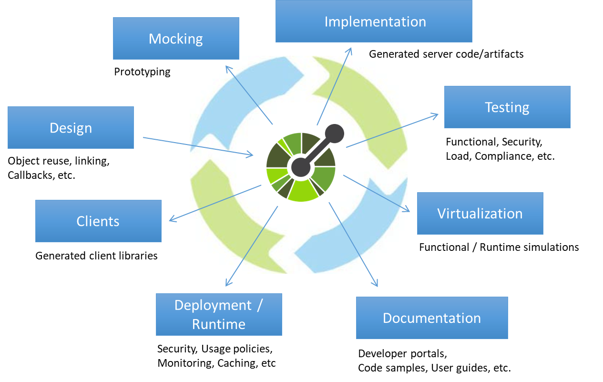

## todo(未理解的问题)
* 既然作为一个规范文档, 那么引导的`example`肯定得提供吧?
  * 提供了之后, 那为什么不能多几个example? 直接做成支持测试框架的呢?
  * 虽然现在测试框架的确支持导入`openAPI`的文档, 但是这些测试框架中需要用的参数数据是另外填写的, 为什么`openAPI`不集成在里面呢?
  * 一个初步的结论: OpenAPI只做规范特定领域的事情, 单元测试及更进一步的测试领域的功能, 应该由测试方面的工具来进行扩展,而不是一揽子全包含了. 也算是一个合理的解答了.

## 概念
> OpenAPI是一种机器可读的接口文件的规范.

基于这个规范的文档可以提供的信息, 将原本需要开源人员处理的工作转移到工具上.

## 主要功能
* 基于规范
  * 生成服务端Stub和客户端代码
  * 构建自动Mock
  * 生成可供开发人员你是用的API文档等
  * 开发人员可以花更少的时间去了解API的底层细节, 只关心API的上层重点即可.
* 基于代码
  * 对于已经有API实现的情况, 可以使用工具从代码中导出OpenAPI规范. 从而生成文档.
  * 当代码版本较多等场景时, 能从对应的代码导出对应的API文档
  * 让代码与文档产生联动关系.
* api文档是本身就要的, openAPI完成的只是直接基于这个工具设计, 测试接口和文档都可以基于这个工具产生了, 写完代码直接就用工具验证, 在调试接口的时候, 测试的文件也跟着变了. 这样文档跟代码具有一致性, 且不需要单独分离写.  openAPI流程上做到了将文档与代码绑定的效果, 只是代码优先还是设计优先就可以侧重各研发者自身了
* 扩展性
  * 完全可以基于这套规范根据自己公司的需求进行扩展开发, 开发出对应的DSL.[^9] 

# 配合postman, 自动化测试
参照下面这篇文章, 其实就可以做到我们想要的效果.
[使用 Postman 测试你的 API\_json](https://www.sohu.com/a/364536895_468635)

[使用Jmeter和Jenkins自动化测试OpenAPI – 小工蚁](https://www.mayi888.com/archives/58943)

ET应该可以做到[API 自动化测试：零代码自动化、数据驱动测试、自动生成报告 \- Eolinker API 全生命周期管理](https://www.eolinker.com/product/auto_test/)这个的程度才对.

# CI

> 非常适合应用单元测试、应用代码覆盖以及做到daily build/tes

# Reference
1. [Open API测试畅想 \- 阿里巴巴一个测试架构师 \- 51Testing软件测试网 51Testing软件测试网\-软件测试人的精神家园](http://www.51testing.com/html/97/13997-88991.html)
2. [使用 Postman 测试你的 API\_json](https://www.sohu.com/a/364536895_468635)
3. [使用Jmeter和Jenkins自动化测试OpenAPI – 小工蚁](https://www.mayi888.com/archives/58943)
4. [OpenAPI Map](https://openapi-map.apihandyman.io/)
5. [OpenAPI：为传统机器构建智能API\-InfoQ](https://www.infoq.cn/article/buqfskxqpcbvlt0azvjk)
6. [使用OpenAPI构建更智能的API \- EOLINEKR BLOG](http://blog.eolinker.com/?p=2485)
7. [API 自动化测试 \- 自动化测试](https://ideasfortester.github.io/mixed-first/api_automation/APIAutomation/)
8. [文档驱动开发模式在 AIMS 中的应用与实践 \- InfoQ 写作平台](https://xie.infoq.cn/article/a9638e8a23cc7359696d1062b)
9. [听说，阿里云给它的 OpenAPI 开发了一套编程语言 \- InfoQ 写作平台](https://xie.infoq.cn/article/4d6e59755c1f78384f79a1753)
10. [聊聊OpenAPI Specification（OAS） \- InfoQ 写作平台](https://xie.infoq.cn/article/534c5217b2a3d59c9cf187fe0)