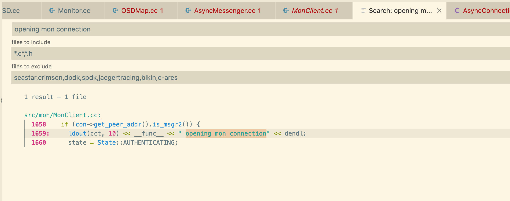

# 支持
## 类似typora的所见即所得插件支持
* 即时渲染
* 有一些unote之类的`web editor`嵌入到`vscode`中打开, 这样的话也算是实现了一个所见即所得的编辑器, 不过不是基于Vscode的倒是了. 不过这种情况下有些vscode配置的快捷键应该还是可以用的.
* 目前基于`markless`自己维护了一个`markless_sean10`. 暂时用起来还是不错的.


## 同义词模糊搜索功能(fuzzy search)
* fzf
  * fuzzy search
  * 只能搜索文件名, 还是有点欠缺的
* 不知道这个模糊搜索能不能做到NLP的水平呢?
* 中文的似乎暂时没有, 别的都是直接基于`fzf`的

## 目录搜索窗口显示搜索结果的行号
*  已经支持了, `search.showLineNumbers`打开这个选项即可, 默认未开

## 是不是有什么功能能够搜索整个目录里所有的todo内容呢?

### todo 不支持根据tag或`priority` folding
根据[Support folding things other than subtasks, like folding by tag · Issue \#85 · fabiospampinato/vscode\-todo\-plus](https://github.com/fabiospampinato/vscode-todo-plus/issues/85), 目前还是缺少API的.

## 搜索窗口 search tab , 在主窗口显示出搜出内容的上下文, 基本类似source insight和clion了

search editor: Default number of context lines

然后触发Open in Editor就可以了.

### (done20220601)目前vscode似乎还没有支持一个当前文件所有搜索项的列表显示的功能
* 以前是通过左侧的全局搜索, 定位到当前文件来进行搜索的.
* 现在通过下述方案即可

>open new search editor to the side



## vim插件使用
### vim覆盖了vscode的`CMD`和`Ctrl`的快捷键
> 可以通过 File -> Preference -> Settings中   vim.useCtrlKeys 选项设置为 false

### vim无法使用系统剪切板
打开设置中的vim的Use System Clipboard


# 窗口之间的焦点切换

> ctrl + M 使用tab键切换焦点模式tab move foucs
> ctrl + ~ 聚焦到TERMINAL(展开/收起TERMINAL)
> ctrl + 聚焦到editor
> Ctrl + Shift + E 资源视图和编辑视图的焦点切换
> Ctrl + Shift + V 预览Markdown文件【编译后】
> Ctrl + K v 在边栏打开渲染后的视图【新建】
cmd+1 主窗口
cmd+2 terminal

## 搜索窗口切换到下一个匹配对象

* F4
* shift+F4 回到上一个

[visual studio code \- vscode key binding for "goto next search result on the search results pane"? \- Stack Overflow](https://stackoverflow.com/questions/39773141/vscode-key-binding-for-goto-next-search-result-on-the-search-results-pane)
## vscode将cursor从左侧搜索窗口切换到主窗口的快捷键是啥? 
`cmt+1`

## 将cursor切换到terminal
cmd+2


# vim
## neovim
据说最多人用的`vim`插件冲突太多, 但是`neovim`就会好转很多.

更换之后, 至少`Ctrl+c`是没有问题的, 在`insert`模式下

### 配置默认insertmode


``` vim
" 添加vim开启默认insert
autocmt WinEnter * startinsert
```

[Setting to open editors in insert mode by default · Issue \#613 · asvetliakov/vscode\-neovim](https://github.com/asvetliakov/vscode-neovim/issues/613)

## vim插件快速打开关闭
```
Command->toggleVim
```
# vscode 插件资源占用排查
* 打开`Help->Process Explorer`,  这里会显示出每个窗口的`CPU`和内存的占用.


# 中文输入markdown时, 需要2次backspace才能删除掉在输入法中的字符
编辑器不会跟随同步删除.

根据[^2]来看,似乎是`electron`和`chromium`的问题. 但是我用的`1.51`的`vscode`还是存在这样的问题呀?为什么关闭了呢?

似乎我升级了下搜狗输入法就好了, 至少5.9.0.11685目前没什么问题.

# 所见即所得插件(markless)

哇, 今天偶然看到的这个插件, 太厉害了, 完全兼容我其他的插件的快捷键, 不需要学习成本, 直接就能享受`typora`的效果.

开发修改

# 关闭回车会触发自动补全, 修改为tab. 避免无需补充时, 不得不补充问题
在`Suggestions`里的`Accept Suggestion On Enter`. 修改为`Off`即可


# 快捷键
快速切换tab, `Option+Cmd+左右方向键`

通过`Cmd+1`等切换主窗口`cursor`.

  

## 主要目的是全键盘控制

### 搜索之后, 如何在搜索结果中切换?
#### cmd+shift+f
则可以通过`F4`和`shift+F4`切换结果

##### 但是好像这个没有像vimimum那种先切换焦点, 等确认了再点击的效果.


#### cmd+f
可以通过`cmd+g`控制

# 中文分词[^4]
因为最近写文字记录比较多, 有时候词写错了, 想快点删的时候只能一个个删, 不像因为单词可以直接删, 就忽然意识到. 现在分词做的这么好了, 理论上这种插件应该已经有了.

果然, 搜到了这个[CJK Word Handler \- Visual Studio Marketplace](https://marketplace.visualstudio.com/items?itemName=SharzyL.cjk-word-handler), 试了下, 还挺好用.

# markdown的`Cmd+B`覆盖了`vscode`的`outline`打开和关闭. 
* 被markdown覆盖掉了怎么办? 我暂时选择删除markdown的这个快捷键


# 自动补全
## TabNine AI自动补全

# git
## gitlens

# remote develop
remote ssh配置环境变量的时候

需要配置一下`~/.profile`, 因为`~/.bashrc`在非交互式窗口不会被初始化. 

# Intelligence

## python
一开始用的`pylance`和`jedi`. 这次看`pyx`代码的时候这俩都不支持, 就换回了`microsoft python`.


## C/C++索引


### compile_commands.json

```
cmake -DCMAKE_EXPORT_COMPILE_COMMANDS=True ..
```
会生成`compile_commands.json`, 放到加载的根目录即可.

[vscode使用compile\_commands\.json \- TruthHell \- 博客园](https://www.cnblogs.com/cong-wang/p/15026530.html)
#### 当在build目录下生成的文件时, 可以通过`--compile-commands-dir=/mnt/qemu/bin/debug/native`指定让clangd搜索该目录下的数据库


#### 针对autoconf等GNU make套件

[rizsotto/Bear: Bear is a tool that generates a compilation database for clang tooling\.](https://github.com/rizsotto/Bear)

通过这个工具可以转换出一部分.


#### CentOS 7/8 可以用2.4.4版本的bear生成compile_commands.json

```
Consolidate compiler generated dependencies of target ear
[100%] Built target ear
Install the project...
-- Install configuration: "Release"
-- Installing: /usr/local/share/doc/bear/COPYING
-- Installing: /usr/local/share/doc/bear/README.md
-- Installing: /usr/local/share/doc/bear/ChangeLog.md
-- Installing: /usr/local/lib64/bear/libear.so
-- Installing: /usr/local/bin/bear
-- Installing: /usr/local/share/man/man1/bear.1
-- Installing: /usr/share/bash-completion/completions/bear
```

### C/C++

#### 手动

在`settings.json`中增加下述
```
"files.exclude": {
      "**/.xxxx": true
},
"search.exclude": {
    "**/.xxxx": true
 },

```

而不用在`c_cpp_properties.json`中增加任何处理.

但是最好创建个这个文件, 好像就能够索引了.

### [clangd \- Visual Studio Marketplace](https://marketplace.visualstudio.com/items?itemName=llvm-vs-code-extensions.vscode-clangd)

安装clangd就能够支持call Hierarchy了. 放弃cpptools就行. 不过似乎需要时linux.

##### No matching member function for call to 'then'

* Candidate template ignored: substitution failure 

不知道为啥, 其他几个目录的代码这里都不报这个错的.

##### TODO:cpu/内存限制


### [MaskRay/ccls: C/C\+\+/ObjC language server supporting cross references, hierarchies, completion and semantic highlighting](https://github.com/MaskRay/ccls)
[ccls 和 vscode 一种在vscode以外的c\+\+方案 \- 知乎](https://zhuanlan.zhihu.com/p/84876003)
> ccls的优势一方面是跳转到定义和代码重命名，这个可以完全放心的交给ccls，clangd经常就无法跨编译单元做这些事情，尤其是在使用clang-tidy修复名字的时候，我曾经失手修改了一个工程根命名空间的名字，体验了ccls的绝对强大（笑;另一方面是基于语义的高亮，高亮种类齐全，基本上有高亮就不需要额外的精力判断词义了，clangd这方面的功能不知道是不是我的问题，始终没有什么作用。
> 
> ccls的劣势主要在补全速度上，这方面比起clangd差了至少一个数量级，工程越大越明显（clangd的自动头文件补全真的牛逼）另一方面加载cache文件，clangd也要快很多，clangd在分析编译的时候似乎会智能判断当前状况。不过ccls可以纠正.和->误用的情况，这里是比clangd强的。clangd集成clang-tidy以及提供代码fix也是ccls没有的功能，不过我认为跳转定义和改名是更加重要的功能
> 
> 总之clangd性能好，ccls功能强。
> 
> 另外，ccls可以指定编译额外的编译参数，这个在mac下非常好用，你可以开启额外的编译检查，或者修复头文件的缺失，clangd就需要手动了，尤其是使用compile_commands.json的时候，ccls可以不管里面的小问题，自己加两个参数，clangd就傻眼了，必须额外指定一次cmake生成compile database

[ccls 和 vscode 一种在vscode以外的c\+\+方案 \- 知乎](https://zhuanlan.zhihu.com/p/84876003)


# highlight
`shift+f8`高亮, 应该类似`SourceInsight`的效果.


## 喜欢过的主题


* Dracula  
  * 深色系
* solarized light
  * 黄色系, 感觉一直用黑色, 有点色散的感觉, 切换成浅色就舒服不少. 
* Eva
  * 找代码高亮主题的时候发现这个还不错.


[VS Code Themes](https://vscodethemes.com/)


## fense code blocks in markdown highlight 支持

这块需要看下markdown渲染时, 到底是插件还是Vscode自身做的highlight, 可以找下, 换个.

试验了下, 切换不同Color Theme就可以切换出不同的渲染效果, 所以应该是在各自的color theme里控制的?

结论: 最后找了个Eva Theme装了下, 高亮的contrast还挺足.


#### 分析方式

通过执行`Ctrl+Shift+P -> Developer: Inspect Editor Tokens and Scopes`


可以看到下图


[Markdown code block highlight consistency \- what is "s" alias \- Stack Overflow](https://stackoverflow.com/questions/71395731/markdown-code-block-highlight-consistency-what-is-s-alias)


##### 代码应该是这块指定的

[vscode/markdown\.tmLanguage\.json at 1a9016d0a4aa0eb98fd6dce3baf1678a3ccc35b9 · microsoft/vscode](https://github.com/microsoft/vscode/blob/1a9016d0a4aa0eb98fd6dce3baf1678a3ccc35b9/extensions/markdown-basics/syntaxes/markdown.tmLanguage.json#L1850)

# container使用

[Developing inside a Container using Visual Studio Code Remote Development](https://code.visualstudio.com/docs/remote/containers)

[Get started with development Containers in Visual Studio Code](https://code.visualstudio.com/docs/remote/containers-tutorial)

## container版本就是在满足的linux开发容器里再装一个vscode-server

## remote版本, 就是单纯的自己选一个编译环境,  然后装好vscode-server的服务器上连接上.

## 插件安装失败, 指定代理地址.

[visual studio code \- VSCode Remote Container \- extensions not installing on dev container using docker\-compose \- Stack Overflow](https://stackoverflow.com/questions/55992660/vscode-remote-container-extensions-not-installing-on-dev-container-using-docke)
mac上的Docker是跑在虚拟机里的, 所以即便设置`--net=host`, 实际上还是和宿主机差一级, 所以这里指定宿主机的内网ip的话, 其实是可以通讯了的.

在`devcontainer.json`里增加下述代理, 让容器里要下的插件可以通过代理下载.
```
	"containerEnv": { 
		"http_proxy": "http://192.168.31.36:7890",
		"https_proxy": "http://192.168.31.36:7890"
	  },
```


## vscode 卡顿, `process Explorer`中显示`extension Host` cpu 100%+ . performance调试

根据这个[Performance Issues · microsoft/vscode Wiki](https://github.com/Microsoft/vscode/wiki/Performance-Issues#profile-the-running-extensions)定位方式, 打开`Developer: Show Running Extensions`, 查到`profiling time`中`todo tree`插件占用了4s多, 可能是因为这个文件中内容太多, 导致慢了. 把这个插件禁用, 就不卡顿了.

捕捉cpu profile后, 去掉.txt后缀然后用vscode打开即可看到下图

目前单从这张图看不出啥...


### `code --status`排查


# 打包
* vscode的插件应该可以直接打包,
  * [How do I back up my VS Code settings and list of installed extensions? \- Super User](https://superuser.com/questions/1080682/how-do-i-back-up-my-vs-code-settings-and-list-of-installed-extensions/1113025)
  * 即便直接打包这个~/.vscode/extensions目录不行, 直接根据列表下载vsix应该也可以


## Extension Packs 能力
根据这里[How to build and publish a vscode extension pack \- DEV Community](https://dev.to/deejaydev/how-to-create-your-own-vscode-extension-pack-5hmc)这篇, 在`package.json`中添加`publisher`之后就可以`vsce publish`了.

不过这个单纯只是存了元数据...我还需要他能够离线化保存.

看起来这个不是`extension pack`官方预计提供的能力. 有没有办法recursively下载的方式呢?

```
code --list-extensions 

https://marketplace.visualstudio.com/_apis/public/gallery/publishers/sean10/vsextensions/sean10-extension-pack/0.0.1/vspackage


code --list-extensions  | awk -F. '{url="https://marketplace.visualstudio.com/_apis/public/gallery/publishers/"$1"/vsextensions/"$2"/latest/vspackage"; print url}'

code --list-extensions  --show-versions  | awk -F '[.@]' '{url="https://marketplace.visualstudio.com/_apis/public/gallery/publishers/"$1"/vsextensions/"$2"/"$3"."$4"."$5"/vspackage"; print $2"@"$1".vsix" " "url}'

再拼接一下改下名字就能下载了.

由于这个url里没有提供名字, 可能浏览器端是基于其他信息重命名的, 姑且先手动拼接了.
wget -O a https://marketplace.visualstudio.com/_apis/public/gallery/publishers/wayou/vsextensions/vscode-todo-highlight/1.0.5/vspackage  


code --list-extensions  --show-versions  | awk -F '[.@]' '{url="https://marketplace.visualstudio.com/_apis/public/gallery/publishers/"$1"/vsextensions/"$2"/"$3"."$4"."$5"/vspackage"; print $2"@"$1".vsix" " "url}' > package.list

cat package.list | while read line ; do name=$(echo $line | awk '{print $1}'); url=$(echo $line | awk '{print $2}');echo ${name}", url:"$url ; wget -O $name $url; sleep 1; done

根据这个[Resource limits & constraints \- Azure DevOps \| Microsoft Docs](https://docs.microsoft.com/en-us/azure/devops/integrate/concepts/rate-limits?view=azure-devops), 所以才下载不下来, 得登录下载了

下面这个登录下载即可.

cat package.list | while read line ; do name=$(echo $line | awk '{print $1}'); url=$(echo $line | awk '{print $2}');echo ${name}", url:"$url ; curl $url \
  -H 'authority: marketplace.visualstudio.com' \
  -H 'sec-ch-ua: "Google Chrome";v="95", "Chromium";v="95", ";Not A Brand";v="99"' \
  -H 'sec-ch-ua-mobile: ?0' \
  -H 'sec-ch-ua-platform: "macOS"' \
  -H 'upgrade-insecure-requests: 1' \
  -H 'dnt: 1' \
  -H 'user-agent: Mozilla/5.0 (Macintosh; Intel Mac OS X 10_15_7) AppleWebKit/537.36 (KHTML, like Gecko) Chrome/95.0.4638.69 Safari/537.36' \
  -H 'accept: text/html,application/xhtml+xml,application/xml;q=0.9,image/avif,image/webp,image/apng,*/*;q=0.8,application/signed-exchange;v=b3;q=0.9' \
  -H 'sec-fetch-site: same-origin' \
  -H 'sec-fetch-mode: navigate' \
  -H 'sec-fetch-user: ?1' \
  -H 'sec-fetch-dest: document' \
  -H 'referer: https://marketplace.visualstudio.com/items?itemName=esbenp.prettier-vscode' \
  -H 'accept-language: en-US,en;q=0.9' \
  -H 'cookie: {from chrome copy as curl}'
  --compressed -o $name ; sleep 1; done

```


# gitlens

如果开启`git codelens`, 会出现`...`一会显示, 一会不显示, 导致我当前行所在的焦点位置一会在屏幕中间, 一会跳到别的位置的情况. 


# API
## DecorationRenderOptions
[https://d\.shikey\.com/jike/已完结的课程/34 玩转VS Code/35讲插件开发（四）：Decorations装饰器\.html](https://d.shikey.com/jike/%E5%B7%B2%E5%AE%8C%E7%BB%93%E7%9A%84%E8%AF%BE%E7%A8%8B/34%20%E7%8E%A9%E8%BD%ACVS%20Code/35%E8%AE%B2%E6%8F%92%E4%BB%B6%E5%BC%80%E5%8F%91%EF%BC%88%E5%9B%9B%EF%BC%89%EF%BC%9ADecorations%E8%A3%85%E9%A5%B0%E5%99%A8.html)
# layout
好像1.64 支持了右侧, 可以拖拽窗口显示在那里的能力?


## tab显示indent
需要`"editor.detectIndentation": false`设置了这个之后, `Tab-Size`这个设置才能生效.

# remote-develop


## 远端数据同步
``` bash
rsync -rlptzv --progress --delete --exclude=.git "user@hostname:/remote/source/code/path" .

rsync -rlptzv --progress --delete --exclude=.git . "user@hostname:/remote/source/code/path"

```

[Visual Studio Code Remote Development Troubleshooting Tips and Tricks](https://code.visualstudio.com/docs/remote/troubleshooting#_using-sshfs-to-access-files-on-your-remote-host)

# 插件开发

## 如何开发时拉出一个未安装插件的vscode, 避免其他插件的干扰?

通过使用insider版本, 这样一个环境里同时有一个未装外部插件的开发调试用, 一个日常用.

好像说可以通过容器装vscode?

## 如何可以跑起vscode的demo.


## F5启动插件时 报 property `engines` is mandatory and must be of type `string` with non-empty value

需要package.json是在这次打开的根目录里, 即可.


# outline 大纲

### [Gerrnperl/outline\-map: A visual, interactive outline map that combines the clarity of the outline with the intuitive overview of the minimap\. Alternative Minimap\.](https://github.com/Gerrnperl/outline-map) outline 滚动, 自动展开


`outline-map.follow`设置为`viewport`

# todo
## 存在一个问题, 不知道为什么有时候`cmd+c`和`cmd+v`在比如find或者`ctrl+p`的窗口无法粘贴.


## 不知道为什么, mac切换window的时候, 有个vscode remote develop老是自己弹到最上面.


## 有时候, comments(markless用来preview图片的模块)会自动弹出来. 就仿佛触发了一次`toggle maximum`


## TODO:vscode的输入窗口里, 按shift切换输入法的时候, 输入的内容会不见, 不像浏览器里会自动输入上.

# Reference
1. [\(2\) vscode控制字符引起的问题以及解决思路\_洞香春 \- SegmentFault 思否](https://segmentfault.com/a/1190000013357949)
2. [Backspace can not erase the last one character during Chinese/Japanese IME conversion \(macOS\) · Issue \#24981 · microsoft/vscode](https://github.com/microsoft/vscode/issues/24981)
3. [Backspace can not erase the last one character during Japanese IME conversion \(macOS\) · Issue \#9173 · electron/electron](https://github.com/electron/electron/issues/9173)
4. [VSCode 中文分词插件：CJK Word Handler \- 知乎](https://zhuanlan.zhihu.com/p/148195204)