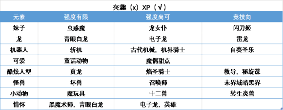

# 背景
万智牌看着是不是跟`D&D`有点关系?, 旅法师之类的. 看起来是集卡式游戏的始祖级别? 看大家的评论中, 这个的设计师考虑的比较好, 平衡性等都考虑的不错.

游戏王嘛, 动画, 漫画, 实体卡的宣传都非常广, 只不过实体卡等那部分不是官方, 而是盗版, 在国内的市场里占了很大一部分, 相当部分的人的童年基本上都看过游戏王, 至少我是这样的. 而`万智牌`我就到了大学才看到同学在玩, 才知道这个名词.

游戏王虽然宣传范畴上知道的人很多, 不过最大的诟病就是娱乐性较强, 平衡性较差吧, 新卡基本都非常强, 似乎是说每个时代的上位卡组基本都是一致的, 主流用户都玩同一套卡组, 只有玩娱乐场的时候大家能发散一点? 

不过上面这都是大佬们为了整个游戏氛围的玩耍而考虑的. 对于我这种菜鸟来说, 光是很容易进行线上入门的`ygo`的整个社区就已经很好了. 暂时先从主流卡组入手之类的.

记得大学的时候搜到过, 当时好像应该移动端还没怎么有,当时至少还是`ygopro`一代的时代. 当时玩了两把, 连机器人都打不过(虽然现在也是). 在现在偏官方的网易的<决斗链接>已经发布的现在, 至少我的个人感受是依旧是玩的远比那种闯关式要舒服的多的.

# 游戏

## 万智牌
emm. 似乎也没有线上服务, 也是需要收集实体卡的, 这样的话对于我这种就不太友好了. 暂时先不入门了.

## 游戏王
* 有`ygocore`等的在线任选卡的游戏, 相比其他的要好多的了. 基本上全平台都有`ygopro2`的游戏了, 安卓用`ygomobile`即可. 

### 名词解释
* 禁卡
  * 不允许使用的
* 限卡
  * 有卡组内数量限制的
* TCG
  * 欧美发行正版卡
* OCG
  * 亚洲发行正版卡
* OTK
  * one turn kill

## 炉石
需要肝才能收集到想用的卡, 这样还是比较耗时间的.

# 游戏王规则[^3][^4][^5]

# 游戏王卡组[^2]
* 大佬推荐B站视频<游戏王历代主流战斗力一览> 和 <游戏王OCG2015-2020竞技环境数据可视化>

## 闪刀姬Sky Striker  
## 雷龙THUNDER DRAGON

## 自奏圣乐Orcust

## 英雄(幻影英雄)

## 电子龙

## 超魔导龙骑士真红眼龙骑士(单卡超模)
* 属性实在是太强了
* 新人随意搭配禁卡, 探索一下兴趣, 在卡牌编辑里搜了几个禁卡/限卡来用用.
* 发现在人机卡组里的这个龙骑士卡组默认版本稍微有一个问题
  * 解决不了像是那个青蛙卡组, 他的特召之后效果能把免疫破坏效果的龙骑士给返回额外卡组.
    * 我就暂时放弃随机抽卡, 找了个禁卡<虚无之渊>, 在我第一步就是用`真红眼融合`把龙骑士招出来之后, 发动, 把特召给禁了.
  * 不过又出现一个`时械神`, 既不让破坏, 又不受伤害, 就跟我的在那边进入死循环了. 
    * 找了个手牌除外的卡, 趁他回到手牌的时候, 给清掉. 不过这个也太艰难了, 毕竟我都已经不洗牌了才能做到. 要是真启动. 不知道使用什么卡才能够解决掉他.

# Reference
1. [\(4 条消息\) 如何评价炉石、游戏王和万智牌这三款集换式卡牌游戏？ \- 知乎](https://www.zhihu.com/question/24614903)
2. [【图片】萌新的游戏王新手入门（缓更）【游戏王ygocore吧】\_百度贴吧](http://c.tieba.baidu.com/p/6667230310?fr=good)
3. [Welcome to ocg\-rule’s documentation\! — ocg\-rule 文档](https://ocg-rule.readthedocs.io/zh_CN/latest/)
4. [2020年游戏王《完全规则书》更新规则 \- 哔哩哔哩](https://www.bilibili.com/read/cv5440726/)
5. [游戏王集换纸牌游戏 \| 遊戲王 Wiki \| Fandom](https://yugioh.fandom.com/zh/wiki/%E9%81%8A%E6%88%B2%E7%8E%8B%E9%9B%86%E6%8F%9B%E7%B4%99%E7%89%8C%E9%81%8A%E6%88%B2)